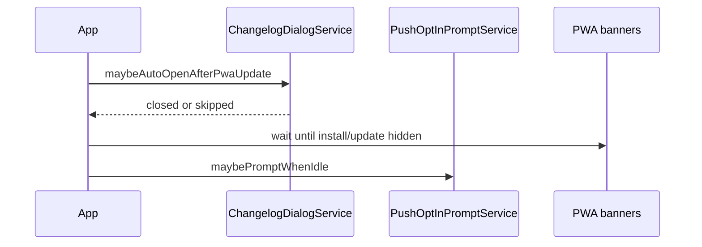

# Story 10.6: Push notification opt-in prompt (post-install / standalone)

Status: done

<!-- Ultimate context engine analysis completed - comprehensive developer guide created -->

## Story

As a **HatCast member who installed or uses the PWA in standalone mode**,
I want a **clear, timely prompt to enable browser push notifications**,
so that I **do not miss troupe alerts** without having to discover the toggle on **Mon compte** first (FR29 / FR30 ; Wave V2.0.0 SCP).

## Acceptance Criteria

1. **Given** Stories **8.1** (push opt-in API + `/compte` toggle), **10.1** (PWA install detection), and **10.4** (PWA recette gate) are **done**, **when** this story starts, **then** implementation adds **only** a contextual opt-in **dialog** and orchestration — **no** new push transport, VAPID keys, Flyway, or duplicate subscription API (reuse **`PushNotificationsService.enable()`**).
2. **Given** the user **accepts** a native PWA install (`appinstalled` event on Chromium), **when** they remain on a **member-authenticated** session (`AuthApiService.ensureHatcastSession()` succeeds), **then** show the opt-in dialog **once** after install UI settles (defer ≥ 1s so install banner/dialog can close) unless push is already **enabled** on this device (AC3).
3. **Given** the app runs in **installed / standalone** mode (`PwaInstallService.isPwaInstalled()` true) and the user is **authenticated**, **when** push is **not enabled** on this device and the prompt was never permanently completed, **then** on **first eligible app load per browser profile** (see storage keys in Dev Notes) offer the same opt-in dialog — covers manual Add-to-Home-Screen and users who installed before this story shipped.
4. **Given** the opt-in dialog is shown, **when** the user taps **« Activer les notifications »**, **then** run the **same flow as Story 8.1** (`PushNotificationsService.enable()` → `Notification.requestPermission()` → SW subscribe → `PUT /v1/me/push/subscription`) and close the dialog on success with brief **Material snackbar** confirmation in French; on failure show inline error text in the dialog (reuse 8.1 messages) without navigation.
5. **Given** the opt-in dialog is shown, **when** the user taps **« Plus tard »** or dismisses via backdrop/Escape (if enabled), **then** hide the dialog and record dismiss timestamp — do **not** re-prompt until **7 days** (`PUSH_OPT_IN_PROMPT_DISMISS_TTL_MS`) unless trigger **2** (fresh `appinstalled`) fires again in the same session.
6. **Given** the opt-in dialog is shown, **when** the user taps **« Gérer dans Mon compte »**, **then** navigate to **`/compte`** (fragment `#notifications` optional) and close the dialog — **no** automatic permission request on that path.
7. **Given** push is **unsupported** (`!PushNotificationsService.canUsePush()`), **permission denied** with no path to enable in-dialog, or **already enabled** (`loadStatus().state === 'enabled'`), **when** eligibility is evaluated, **then** **do not** open the prompt (no empty/broken dialog).
8. **Given** the user is **not** authenticated (public routes, login page), **when** install or standalone load occurs, **then** **do not** show the prompt (defer until a later authenticated navigation — optional single check after first successful `ensureHatcastSession()` on member routes).
9. **Given** **Story 10.3** auto-opens the changelog after a PWA update reload (`ChangelogDialogService.maybeAutoOpenAfterPwaUpdate()`), **when** both changelog and push prompt could show on the same load, **then** run **changelog first**; evaluate push prompt **after** changelog dialog closes (or was skipped) — never stack two modals.
10. **Given** install banner (**10.1/10.5**) or update banner (**10.2**) is visible, **when** scheduling the push prompt, **then** prefer opening the dialog **after** the user dismisses those banners or they are hidden — do not cover fixed top banners with a centered dialog in a confusing stack (delay or wait until `PwaInstallService.showBanner()` / `PwaUpdateService.showBanner()` are false).
11. **Given** implementation complete, **when** tests run, **then** Vitest covers: eligibility gating (standalone + auth + disabled push), `appinstalled` scheduling, dismiss TTL, changelog ordering mock, enable success/failure paths; `npm run test -w @hatcast/web -- --watch=false` green. Manual recette on **`./scripts/start-dev.sh --with-push`**: install or standalone + logged-in user without push → dialog → enable → notification permission granted → `/compte` shows enabled toggle.

**Product coverage:** Epic 10 / Wave V2.0.0 — [sprint-change-proposal-2026-06-02-v2.0.0-cutover-scope.md](../planning-artifacts/sprint-change-proposal-2026-06-02-v2.0.0-cutover-scope.md) § 4.2 step 4 (**10.5** + **10.6**) ; **FR29**, **FR30** (global device opt-in — not category prefs) ; [PLAN.md](../../PLAN.md) § Wave A.

**Epics gap:** Story **10.6** is **not** yet written in [`epics.md`](../planning-artifacts/epics.md) — this file and SCP are authoritative until epics are amended.

**Explicitly out of scope:** per-category notification preferences UI (**8.2** — already on `/compte`) ; email channel ; re-prompt on every standalone cold start ; V1 Firestore push token model ; orga event-monitor prompts (`legacy` `NotificationPromptModal`) ; changing **`custom-sw.js`** push handler ; install/update banner copy (**10.5**, **10.2**) ; **17.34** tabbed Mon compte layout (keep deep-link to existing Notifications section).

---

## Acceptance Criteria — Material 3 (UI)

**M3-1. Composants Material** — **Given** the prompt UI, **when** rendered, **then** use **`MatDialog`** with `mat-dialog-title`, `mat-dialog-content`, `mat-dialog-actions` ; primary **`mat-flat-button`** (« Activer les notifications »), **`mat-button`** (« Plus tard », « Gérer dans Mon compte ») ; **`mat-progress-spinner`** while `enable()` runs — no full-screen custom overlay.

**M3-2. Tokens & thème** — **Given** dialog SCSS, **when** colors apply, **then** only `var(--mat-sys-*)` / `color-mix(in srgb, var(--mat-sys-…) …)` — no hex on feature styles.

**M3-3. Mobile & tactile** — **Given** viewport ≤ 480px, **when** actions show, **then** dialog actions stack or wrap with **≥ 48×48 dp** targets ; `maxWidth: 95vw` ; French `aria-label` on icon-only controls if any.

**M3-4. Navigation membre** — **N/A** — no new global chrome ; optional navigation to existing `/compte` section only.

**M3-5. Revue** — **Given** implementation done, **when** validating, **then** walk [FRONTEND_UI.md](../../docs/v2/technical/FRONTEND_UI.md) § Checklist M3 ; note waivers in Dev Agent Record.

---

## Tasks / Subtasks

- [x] **Scope lock (AC: 1)** — Confirm zero API/Flyway changes unless a bug is found in **8.1** (fix in separate commit).

- [x] **PushOptInPromptService (AC: 2–3, 7–8, 10)**
  - [x] Create `apps/web/src/app/core/push/push-opt-in-prompt.service.ts` — eligibility: `canUsePush()`, `loadStatus()` not `enabled`, user session present, not within dismiss TTL, optional `PENDING_AFTER_INSTALL_KEY` for `appinstalled`.
  - [x] Wire `appinstalled` from [`pwa-install.service.ts`](../../apps/web/src/app/core/pwa/pwa-install.service.ts) via injected callback or shared service (avoid duplicate listeners).
  - [x] `maybePrompt()` called from [`app.ts`](../../apps/web/src/app/app.ts) after changelog flow (AC9) and when top PWA banners hidden (AC10).
  - [x] Storage keys in `apps/web/src/app/core/push/push-opt-in-prompt-keys.ts` (document TTL constants).

- [x] **PushOptInDialogComponent (AC: 4–6, M3)**
  - [x] `apps/web/src/app/shared/push/push-opt-in-dialog/` — French copy explaining value (dispos, confirmations) ; wire `PushNotificationsService.enable()` ; link to `/compte`.
  - [x] `PushOptInPromptService.openDialog()` using `MatDialog` (pattern: [`changelog-dialog.service.ts`](../../apps/web/src/app/shared/changelog/changelog-dialog.service.ts)).

- [x] **App bootstrap integration (AC: 9–10)**
  - [x] Extend `App.ngOnInit` — after `changelogDialog.maybeAutoOpenAfterPwaUpdate()`, chain `pushOptInPrompt.maybePromptWhenIdle()`.
  - [x] On member shell first load, optional re-check if user logs in post-install (AC8).

- [x] **Tests (AC: 11)**
  - [x] `push-opt-in-prompt.service.spec.ts` — mocks for auth, pwa install, push service, changelog service.
  - [x] `push-opt-in-dialog.spec.ts` — enable button calls service, « Plus tard » sets dismiss key.
  - [x] Update `app.spec.ts` if new provider needed.
  - [x] Run `npm run test -w @hatcast/web -- --watch=false`.

- [x] **Manual recette (AC: 11)** — record in Dev Agent Record:

  | Check | Environment | Pass? |
  |-------|-------------|-------|
  | `appinstalled` → dialog (Chromium, logged in) | `--with-push` | PO |
  | Standalone open, push off → dialog once | Installed PWA | PO |
  | « Activer » → permission + toggle on `/compte` | same | PO |
  | « Plus tard » → no dialog 7d | same | PO |
  | Changelog + update path does not double-modal | staging optional | PO |
  | iOS Safari standalone — dialog or graceful skip if unsupported | device | PO |

---

## Dev Notes

### Why 10.6 exists (product)

| Source | Requirement |
|--------|-------------|
| SCP V2.0.0 § 4.2 | « After PWA install or first standalone session : prompt to enable push (links to **8.1** flow) » |
| PRD FR29/FR30 | Global push opt-in is MVP-critical; discovery on `/compte` alone is easy to miss after install |
| **10.5** Dev Notes | Explicitly defers notification prompt to **10.6** |

V1 did **not** ship a dedicated post-install push dialog — it called `ensurePushNotificationsActive()` on every app mount (aggressive, FCM-specific). V2 should be **polite, explicit, and Web-Push-native** via **8.1**.

### Current code state (must read before editing)

| File | Today | Story 10.6 change |
|------|--------|-------------------|
| [`push-notifications.service.ts`](../../apps/web/src/app/core/push/push-notifications.service.ts) | `enable()`, `loadStatus()`, `disable()` | **Call** — do not fork subscription logic |
| [`push-notifications-section.ts`](../../apps/web/src/app/shared/push-notifications-section/push-notifications-section.ts) | `/compte` toggle | **Keep** as source of truth for ongoing management |
| [`pwa-install.service.ts`](../../apps/web/src/app/core/pwa/pwa-install.service.ts) | `appinstalled` → hide install banner | **Add** hook to flag push prompt pending |
| [`app.ts`](../../apps/web/src/app/app.ts) | changelog auto-open on init | **Chain** push prompt after changelog |
| [`app.html`](../../apps/web/src/app/app.html) | install + update banners | **Do not** add fourth fixed banner — use dialog |

### Recommended storage contract

```ts
// push-opt-in-prompt-keys.ts
export const PUSH_OPT_IN_PROMPT_DISMISSED_KEY = 'hatcast-push-opt-in-prompt-dismissed'; // value: epoch ms
export const PUSH_OPT_IN_PROMPT_DISMISS_TTL_MS = 7 * 24 * 60 * 60 * 1000;
export const PUSH_OPT_IN_PROMPT_AFTER_INSTALL_KEY = 'hatcast-push-opt-in-after-install'; // sessionStorage, consumed once per install event
export const PUSH_OPT_IN_PROMPT_STANDALONE_SEEN_KEY = 'hatcast-push-opt-in-standalone-offered'; // localStorage '1' after first standalone offer
```

**Eligibility sketch (normative for dev):**

```text
shouldOfferPushOptIn =
  browser && sessionOk && canUsePush() &&
  loadStatus().state in ('disabled', 'loading→disabled') &&
  !isBannerBlocking() &&
  (afterInstallFlag || (isPwaInstalled() && !standaloneSeen)) &&
  !isDismissedWithinTtl()
```

On successful `enable()` → set `standaloneSeen`, clear after-install flag, clear dismiss key.

### Dialog copy (French — product)

- **Title:** « Activer les notifications ? »
- **Body:** Short value prop — recevoir les rappels de disponibilités et les demandes de confirmation pour vos troupes.
- **Primary:** « Activer les notifications »
- **Secondary:** « Plus tard »
- **Tertiary (text button):** « Gérer dans Mon compte »

### Orchestration order (same session load)



### Architecture compliance

- **Web Push only** ([`custom-sw.js`](../../apps/web/src/custom-sw.js) `push` listener) — [ARCH.md](../../ARCH.md) § Notifications V2.
- **Session-gated API** — prompt must not call `PUT /v1/me/push/subscription` without HatCast session (same as **8.1**).
- **Production SW** — recette requires `--with-push` or staging HTTPS; `ng serve` dev without SW → dialog may show but enable fails with existing 8.1 message (acceptable).

### Testing requirements

```bash
npm run test -w @hatcast/web -- --watch=false
# Manual:
./scripts/start-dev.sh --with-push
# .env: HATCAST_WEB_PUSH_VAPID_PUBLIC_KEY + PRIVATE_KEY
```

### Dependencies

| Story | Status | Relationship |
|-------|--------|----------------|
| **8.1** | done | **Required** — `PushNotificationsService`, API, SW |
| **8.2** | done | Out of scope — category prefs stay on `/compte` |
| **10.1** | done | `isPwaInstalled()`, `appinstalled` |
| **10.2** | done | Banner coordination |
| **10.3** | done | Changelog-before-prompt ordering |
| **10.4** | done | Recette gate |
| **10.5** | ready-for-dev | **Recommend done** before dev for install UX stability ; not a hard blocker if install flow already OK |
| **10.7** | done | Icons — no change |

### Previous story intelligence (10.5, 10.4)

- **10.5** — Do not implement push prompt there ; menu/banner polish only. Sign-off « Install aids OK » is PO gate before **10.6** recette bundle.
- **10.4** — `check-pwa.sh` parameterized ; staging smoke passed ; PO opened **10.5/10.6**.
- **739ac53f** — PWA dismiss icon contrast on `pwa-system-banner` — any new UI must not regress inverse-surface tokens.

### Git intelligence

Recent commits: `739ac53f` PWA banner contrast ; `85bc6b3c` 10.4 tooling ; PWA/push patterns stable. Follow Conventional Commits: `feat(web): Add push opt-in prompt after PWA install`.

### Latest technical notes (Angular 21 / Web Push)

- **`Notification.requestPermission()`** must be called from a **user gesture** for best UX on Safari — primary button in dialog satisfies this ; do not auto-call permission on timer without click.
- **`MatDialog`** — `disableClose: false` for « Plus tard » ; consider `disableClose: true` only while `busy()` enabling.
- **iOS** — Web Push on installed PWAs (16.4+) may still fail silently — unsupported branch must hide prompt (`canUsePush()` false).

### Project context reference

- [project-context.md](../../project-context.md) — `--with-push` for SW + VAPID ; FRONTEND_UI.md mandatory.
- [8-1-opt-in-aux-notifications-navigateur-et-categories.md](./8-1-opt-in-aux-notifications-navigateur-et-categories.md) — normative enable/disable behaviour.

### Explicit non-goals

- Auto-enable push without user click (forbidden — FR30 explicit opt-in).
- Replacing `/compte` toggle with dialog-only management.
- Prompt on every browser tab visit (non-standalone) — trigger 3 is **standalone-only** for « first session »; trigger 2 is **post-`appinstalled`** only.

---

## Dev Agent Record

### Agent Model Used

Composer

### Completion Notes List

- Added `PushOptInPromptService` + `PushOptInDialog` (MatDialog, M3 tokens, mobile action stack) reusing `PushNotificationsService.enable()` — no API/Flyway changes.
- `PwaInstallService.onAppInstalled()` hook sets session flag; `ChangelogDialogService.maybeAutoOpenAfterPwaUpdate()` now resolves after close so push prompt never stacks with changelog (AC9).
- Banner wait loop (install/update `showBanner`) + 1s defer after `appinstalled` (AC2/10); auth retry once on `NavigationEnd` (AC8).
- Vitest: 896 tests green (`npm run test -w @hatcast/web -- --watch=false`). Manual recette rows left for PO on `--with-push`.
- M3 checklist: M3-1–3 validated ; M3-4 N/A ; no waivers.

### File List

- apps/web/src/app/core/push/push-opt-in-prompt-keys.ts (new)
- apps/web/src/app/core/push/push-opt-in-prompt.service.ts (new)
- apps/web/src/app/core/push/push-opt-in-prompt.service.spec.ts (new)
- apps/web/src/app/shared/push/push-opt-in-dialog/push-opt-in-dialog.ts (new)
- apps/web/src/app/shared/push/push-opt-in-dialog/push-opt-in-dialog.html (new)
- apps/web/src/app/shared/push/push-opt-in-dialog/push-opt-in-dialog.scss (new)
- apps/web/src/app/shared/push/push-opt-in-dialog/push-opt-in-dialog.spec.ts (new)
- apps/web/src/app/core/pwa/pwa-install.service.ts (modified)
- apps/web/src/app/shared/changelog/changelog-dialog.service.ts (modified)
- apps/web/src/app/shared/changelog/changelog-dialog.service.spec.ts (modified)
- apps/web/src/app/app.ts (modified)
- apps/web/src/app/app.spec.ts (modified)

### Change Log

- 2026-06-02 : Story created (`bmad-create-story` 10.6) — status `ready-for-dev`.
- 2026-06-02 : Implemented push opt-in dialog + orchestration (10.6) — status `review`.
- 2026-06-02 : Code review — patches appliqués, décision AC3/A (standalone once per profile) — status `done`.

---

### Validation create-story

- [x] AC métier numérotés et sourcés (SCP / FR29–30 / PLAN)
- [x] Section **Material 3** remplie
- [x] Tasks référencent les numéros d’AC
- [x] Liens vers fichiers code existants à réutiliser
- [x] `npm run test` mentionné
- [x] Epics gap documenté (10.6 absent de `epics.md`)

### Review Findings

- [x] [Review][Decision] AC3 « une fois par profil » vs AC5 re-prompt 7 jours (standalone) — **Option A retenue** : une seule offre standalone par profil via `STANDALONE_SEEN_KEY` ; TTL AC5 documentée pour le trigger post-install uniquement (commentaires `push-opt-in-prompt-keys.ts` + `isEligible`).

- [x] [Review][Patch] Timeout bannières PWA puis prompt quand même [push-opt-in-prompt.service.ts:215] — `waitUntilBannersHidden()` retourne `false` si bannières encore visibles après timeout ; le dialog n’est pas ouvert (test ajouté).

- [x] [Review][Patch] Test enable() en échec absent (AC11) [push-opt-in-dialog.spec.ts] — test message d’erreur inline + test `disableClose` pendant activation.

- [x] [Review][Patch] Fermeture backdrop pendant `enable()` [push-opt-in-dialog.ts:32] — `dialogRef.disableClose = true` le temps de `busy()`.
