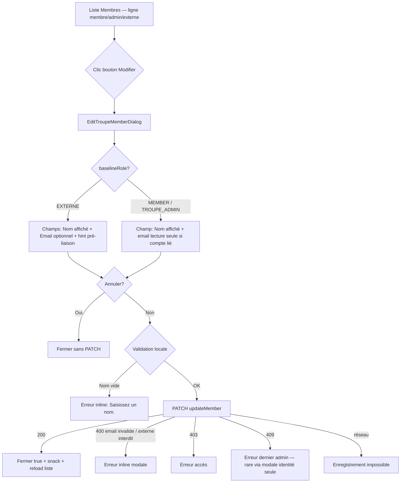

# Story 3.24 : Modale d’édition — Admin Membres

---
baseline_commit: 6b7bbc1e308dadf084de27cbfd3a746142e8637a
ux_author: Sally (bmad-agent-ux-designer)
ux_date: 2026-06-06
---

Status: done

<!-- Spec UX + story — alignement discoverability ; ne pas implémenter via ce fichier seul (bmad-dev-story). -->

## Story

En tant qu’**administrateur·ice de troupe** (ou orga autorisé·e sur l’écran Membres),  
je veux **modifier le nom affiché (et l’email carnet pour les externes) via une action explicite et une modale**,  
afin de **retrouver facilement l’édition** — notamment pour la propagation carnet → roster (story **3.23** scénario F) — **sans deviner** qu’il faut cliquer sur le nom.

## Acceptance Criteria

1. **Given** l’onglet **Membres** (`/troupes/:slug/admin/membres` ou `/saison/:troupeSlug/:seasonSlug/admin/membres`), **when** une ligne **MEMBER**, **TROUPE_ADMIN** ou **EXTERNE** est affichée, **then** le **nom affiché** n’est plus un bouton d’édition inline ; une action **`mat-icon-button`** avec icône `edit` et `aria-label` français **« Modifier le membre »** (ou **« Modifier cet externe »** si `baselineRole === EXTERNE`) ouvre une modale d’édition — **discoverability** alignée sur [`admin-participants`](../../apps/web/src/app/pages/admin-participants/admin-participants.html). [Source: story **3.23** recette scénario F ; **2.8** AC4 évolution ; **UX-DR10**]
2. **Given** la modale ouverte pour un **EXTERNE**, **when** l’admin enregistre, **then** les champs **Nom affiché** (obligatoire) et **Email** (optionnel) sont envoyés via `PATCH /v1/troupes/{id}/members/{membershipId}` (`displayName`, `email`) ; snack succès ; liste rechargée ; propagation roster saison inchangée côté API (**3.23** AC8). [Source: **ADR-0021** ; **2.21**]
3. **Given** la modale ouverte pour un **MEMBER** ou **TROUPE_ADMIN** lié à un compte, **when** l’admin modifie le nom affiché et enregistre, **then** seul `displayName` est patché (préférences compte — comportement API existant) ; l’**email n’est pas éditable** (lecture seule ou absent du formulaire avec mention *« Email géré par le compte HatCast »* si email connu). [Source: **ADR-0021** § email carnet ; `TroupeMembershipService.updateMember`]
4. **Given** la modale, **when** le nom est vide ou inchangé (aucun champ modifiable soumis), **then** validation côté dialog (*« Saisissez un nom. »*) ou fermeture sans PATCH — pas de requête inutile.
5. **Given** les contrôles **rôle** (chip + menu MEMBER ↔ TROUPE_ADMIN) et **Actif** (`mat-slide-toggle`) et **Retirer**, **when** cette story est livrée, **then** ils restent **en ligne** dans la liste (hors modale) avec les garde-fous existants (dernier admin actif, externe non promu, chip Externe statique). [Source: **2.8** AC4/6 ; **2.21** AC8]
6. **Given** une erreur API, **when** PATCH échoue, **then** message inline dans la modale (`role="alert"`) ou snack selon le pattern dialog existant : **409** → *« La troupe doit conserver au moins un administrateur actif. »* (si applicable) ; **400** email → message domaine API ; **403** → *« Vous ne pouvez pas administrer les membres de cette troupe. »* ; défaut → *« Enregistrement impossible. »* — optimistic UI de la liste **non** utilisée pour l’édition modale (submit dans dialog uniquement).
7. **Given** implémentation terminée, **when** tests web tournent, **then** specs couvrent : ouverture modale (membre + externe) ; suppression du flux inline ; submit PATCH avec payload correct ; erreur 409/400 affichée ; `npm run test -w @hatcast/web -- --run membres-tab edit-troupe-member-dialog` OK.

**Couverture produit :** **FR7**, **UX-DR10**, **ADR-0021** (carnet externes) ; dette UX **3.23** scénario F.

**Précède :** matrice de tests auto Murat (TEA) sur propagation **3.23** — recette manuelle OK, UX bloquante pour confiance tests UI.

---

## Acceptance Criteria — Material 3 (UI)

**M3-1. Composants Material** — **Given** la modale et la liste, **when** implémentées, **then** `MatDialog` + `mat-dialog-title` / `mat-dialog-content` / `mat-dialog-actions` ; champs `mat-form-field appearance="outline"` ; boutons `mat-button` (Annuler) + `mat-flat-button color="primary"` (Enregistrer) ; action ligne `mat-icon-button` + `mat-icon` `edit` — calquer le shell [`edit-participant-dialog.ts`](../../apps/web/src/app/shared/edit-participant-dialog/edit-participant-dialog.ts) et [`add-member-dialog.ts`](../../apps/web/src/app/pages/admin-membres/add-member-dialog.ts), **sans** réutiliser `EditParticipantDialog` (domaine roster). [Source: FRONTEND_UI.md ; UX-DR11]

**M3-2. Tokens & thème** — **Given** styles dialog + liste, **when** couleurs appliquées, **then** uniquement `var(--mat-sys-*)` et `color-mix(in srgb, var(--mat-sys-…) …)` ; supprimer styles `.membres-tab__name-btn` / `__name-input` devenus inutiles. [Source: FRONTEND_UI.md]

**M3-3. Mobile & tactile** — **Given** viewport **max-width: 480px**, **when** liste et modale s’affichent, **then** largeur dialog `min(100vw - 2rem, 28rem)` ; bouton `edit` **≥ 48×48 dp** (`mat-icon-button` Material par défaut) ; `aria-label` français sur le bouton éditer ; nom affiché en texte statique lisible (pas de cible trompeuse). [Source: NFR-A1 ; FRONTEND_UI.md]

**M3-4. Navigation membre** — **N/A** — écran admin uniquement ; pas de chrome membre.

**M3-5. Revue** — **Given** implémentation terminée, **when** validée, **then** checklist § « Checklist M3 HatCast » de [FRONTEND_UI.md](../../docs/v2/technical/FRONTEND_UI.md) parcourue ; écarts notés en Dev Notes.

---

## Décision UX (Sally — 1 écran)

### Pattern retenu

| Élément | Décision | Justification |
|---------|----------|---------------|
| Action liste | `mat-icon-button` `edit` à droite de la ligne (zone `membres-tab__controls`, avant toggle Actif) | Parité [`admin-participants.html`](../../apps/web/src/app/pages/admin-participants/admin-participants.html) L143–152 |
| Composant modale | **Nouveau** `EditTroupeMemberDialog` dans `pages/admin-membres/` | Domaine **adhésion troupe** (`TroupeApiService.updateMember`) ≠ participant saison/événement ; pas de genre roster |
| **Interdit** | Étendre `EditParticipantDialog` | APIs, champs (genre), titres et hints différents — risque de mélange domaines |
| Nom dans liste | Texte statique (`` ou titre typographique) | Fin du faux-lien cliquable |
| Rôle + Actif + Retirer | **Restent inline** | Actions fréquentes / binaire ; modale réservée à l’**identité** (nom, email carnet) — même séparation que roster (rôle en chip, identité en modale) |
| Dialog unique vs deux shells | **Un seul dialog** champs conditionnels selon `baselineRole` | Miroir [`add-member-dialog.ts`](../../apps/web/src/app/pages/admin-membres/add-member-dialog.ts) (titre + champs externes vs membres) ; un PATCH, une validation, moins de duplication |

### Réponse — un ou deux dialogs ?

**Recommandation : un seul `EditTroupeMemberDialog`** avec sections conditionnelles (`@if (isExterne())` / `@else`).

- **Pour :** même endpoint, même cycle Annuler/Enregistrer, même grille CSS ; le duo add-member utilise déjà ce pattern avec succès.
- **Contre deux shells :** les écarts se limitent à 1–2 champs et au titre — pas assez pour justifier deux fichiers + deux specs divergentes.
- **Exception future :** si un jour la modale inclut rôle/statut pour tous les types, réévaluer ; hors scope ici.

### Pourquoi pas réutiliser `AddMemberDialog` ?

| Critère | `AddMemberDialog` (ajout) | Édition attendue |
|---------|---------------------------|------------------|
| **API** | `POST` `addMember` / `addExterne` | `PATCH` `updateMember` |
| **CTA** | **Ajouter** | **Enregistrer** |
| **Titre** | Ajouter un membre / un externe | Modifier le membre / cet externe |
| **Email membre** | **Obligatoire** à la création | **Non éditable** (compte lié) — champ absent ou lecture seule |
| **Rôle** | `mat-select` ou bascule « Ajouter un membre à la place » | Rôle **hors modale** (chip liste) ; externe = rôle figé |
| **Identité ligne** | N/A (pas de membre existant) | Préremplissage `displayName` / `email` carnet |
| **Parité codebase** | — | Même séparation que roster : `add-participant-dialog` ≠ `edit-participant-dialog` |

**Conclusion :** réutiliser le shell d’ajout imposerait un prop `mode: 'add' | 'edit'`, des branches partout (validation, titre, endpoints, visibilité rôle/email) — **un composant, deux parcours métier**. On **réutilise le layout CSS et les patterns M3** (`mat-form-field` outline, grille `.add-member`), pas le composant dialog lui-même. Option future si duplication gênante : extraire un petit template partagé **sans** fusionner les deux flux.

---

## Wireflow

**Note :** le **409** via modale identité seule est improbable (rôle/statut hors modale) ; conserver le mapping pour robustesse si PATCH combiné futur.

---

## Matrice champs × rôle (modale vs liste)

| Champ | MEMBER | TROUPE_ADMIN | EXTERNE | Surface |
|-------|--------|--------------|---------|---------|
| **Nom affiché** | Éditable | Éditable | Éditable (requis) | **Modale** |
| **Email** | Lecture seule (compte) ou « Email indisponible » | Idem | Éditable, optionnel | **Modale** (externe) / **Liste** (lecture seule membre) |
| **Rôle** | Chip + menu → MEMBER / ADMIN | Idem | Chip statique « Externe » | **Liste** (inchangé) |
| **Statut Actif** | Toggle | Toggle | Toggle | **Liste** (inchangé) |
| **Retirer** | Icône delete + confirm | Idem | Idem (copy externe) | **Liste** (inchangé) |

---

## Tasks / Subtasks

- [x] **Périmètre :** `apps/web/` uniquement — **pas** de changement API (réutiliser PATCH existant).
- [x] **Types client** (AC: 2, 3)
  - [x] Étendre [`UpdateTroupeMemberRequest`](../../apps/web/src/app/core/troupes/troupe-api.service.ts) avec `email?: string | null` (aligné OpenAPI `seasons.yaml`).
- [x] **`EditTroupeMemberDialog`** (AC: 1–4, 6, M3-1, M3-2, M3-3)
  - [x] Créer [`edit-troupe-member-dialog.ts`](../../apps/web/src/app/pages/admin-membres/edit-troupe-member-dialog.ts) + spec.
  - [x] `MAT_DIALOG_DATA` : `troupeId`, `member: TroupeMemberAdmin`.
  - [x] Titre : *« Modifier cet externe »* / *« Modifier le membre »* selon rôle.
  - [x] Champs conditionnels (matrice ci-dessus) ; hint email externe comme add-member ; erreur `role="alert"`.
  - [x] `submit()` → `TroupeApiService.updateMember` ; fermer `true` si OK.
  - [x] Styles : réutiliser grille `.participant-form-dialog` ou `.add-member` (tokens `--mat-sys-*`).
- [x] **`membres-tab`** (AC: 1, 5, M3-2, M3-3)
  - [x] Supprimer `editingMemberId`, `editingName`, `startNameEdit`, `saveDisplayName`, `onNameKeydown`, inline input dans [`.html`](../../apps/web/src/app/pages/admin-membres/membres-tab.html).
  - [x] Afficher nom en texte statique ; ajouter `openEditMember(member)` + bouton `edit`.
  - [x] Snack succès : *« Membre mis à jour. »* / *« Externe mis à jour. »* selon rôle.
  - [x] Conserver `patchMember` pour rôle/statut inline.
- [x] **Tests** (AC: 7)
  - [x] [`membres-tab.spec.ts`](../../apps/web/src/app/pages/admin-membres/membres-tab.spec.ts) : plus de clic-nom-inline ; ouverture dialog ; mock `updateMember`.
  - [x] `edit-troupe-member-dialog.spec.ts` : validation nom ; payload externe avec email ; membre sans email dans body.
  - [x] `npm run test -w @hatcast/web -- --watch=false --include='**/membres-tab.spec.ts' --include='**/edit-troupe-member-dialog.spec.ts'` (22/22 OK)
- [x] **M3-5** — checklist FRONTEND_UI.md en fin de dev.

### Review Findings

- [x] [Review][Patch] Snack « Externe mis à jour. » non couvert par les tests [membres-tab.spec.ts]
- [x] [Review][Patch] aria-label DOM du bouton edit non asserté (AC1 discoverability) [membres-tab.spec.ts]
- [x] [Review][Defer] Test PATCH email externe vidé (`email: null`) absent [edit-troupe-member-dialog.spec.ts] — deferred, logique présente, couverture optionnelle post-3.23

---

## Dev Notes

### Product and UX rules

- **Dette 3.23 F :** propagation carnet → roster fonctionne ; l’admin doit **voir** comment éditer un externe (scénario Laetitia renommée).
- **Routes :** [`admin-membres.ts`](../../apps/web/src/app/pages/admin-membres/admin-membres.ts) sert `/troupes/:slug/admin/membres` et variante saison — un seul `MembresTab`.
- **Email membre :** API rejette `email` sur non-EXTERNE (**400**) — ne jamais l’envoyer pour MEMBER/ADMIN.
- **Dernier admin :** reste géré sur toggle rôle/statut inline (409 + tooltip) — story **2.8** AC6.
- **Externe non promu :** pas de sélecteur rôle dans modale ; chip statique (**2.21**).

### Frontend implementation guardrails

| Concern | Action |
|--------|--------|
| Material | `MatDialog`, `mat-form-field outline`, `mat-icon-button` — pas de `<input>` nu hors Material dans la modale |
| Tokens | `--mat-sys-*` uniquement |
| Réutilisation | Shell dialog = `edit-participant-dialog` / `add-member-dialog` ; **pas** `EditParticipantDialog` |
| API | `TroupeApiService.updateMember(troupeId, membershipId, { displayName, email? })` |
| Largeur dialog | `min(100vw - 2rem, 28rem)` — aligné add-member |

### Copy UI (français, verrouillé)

| Surface | Libellé |
|---------|---------|
| Bouton liste (externe) | `aria-label` : **Modifier cet externe** |
| Bouton liste (membre/admin) | `aria-label` : **Modifier le membre** |
| Titre modale externe | **Modifier cet externe** |
| Titre modale membre/admin | **Modifier le membre** |
| Champ nom | **Nom affiché** |
| Champ email externe | **Email (optionnel)** + hint *« Optionnel — pour pré-lier un compte HatCast existant. »* |
| Email membre lié | *« Email géré par le compte HatCast. »* (paragraphe, pas champ éditable) |
| Succès snack | **Membre mis à jour.** / **Externe mis à jour.** |
| Erreur validation | **Saisissez un nom.** |

### Explicit non-goals

- Pas de refonte complète de la liste (toolbar, CSV, filtres chips, import).
- Pas de typeahead carnet (**3.8d**).
- Pas de déplacement rôle/statut dans la modale (hors scope — rester inline).
- Pas de changement OpenAPI / Kotlin — PATCH déjà complet (`email` externe).
- Pas de nouveau endpoint ; pas de sync roster côté front (API **3.23**).
- Pas de modification `legacy/`.

### Dependencies

| Story | Status | Relationship |
|-------|--------|----------------|
| **2.8** | done | Écran Membres, inline edit d’origine — **remplacé** pour le nom |
| **2.21** | done | Carnet EXTERNE, add dialog — **miroir** edit |
| **3.23** | done | Scénario F propagation — dette UX **3.24** levée ; matrice TEA Murat débloquée |
| **3.8d** | backlog | Typeahead carnet — indépendant |
| **3.25** | backlog | Scope dispos — indépendant |

### Fichiers cibles (référence)

| Fichier | Action |
|---------|--------|
| `apps/web/src/app/pages/admin-membres/edit-troupe-member-dialog.ts` | **Créer** |
| `apps/web/src/app/pages/admin-membres/edit-troupe-member-dialog.spec.ts` | **Créer** |
| `apps/web/src/app/pages/admin-membres/membres-tab.ts` | Modifier |
| `apps/web/src/app/pages/admin-membres/membres-tab.html` | Modifier |
| `apps/web/src/app/pages/admin-membres/membres-tab.scss` | Nettoyer styles inline name |
| `apps/web/src/app/pages/admin-membres/membres-tab.spec.ts` | Modifier |
| `apps/web/src/app/core/troupes/troupe-api.service.ts` | Ajouter `email?` au type |

---

## Dev Agent Record

### Agent Model Used

Composer (dev-story 2026-06-06)

### Completion Notes List

- Spec UX Sally (2026-06-06) — alignement discoverability post-recette **3.23** scénario F.
- **EditTroupeMemberDialog** : modale unique avec champs conditionnels (externe : nom + email optionnel ; membre/admin : nom + paragraphe email compte). Validation locale, PATCH minimal (pas de requête si inchangé), erreurs inline 400/403/409.
- **membres-tab** : nom statique `.membres-tab__name` ; bouton `mat-icon-button` `edit` dans `__controls` (avant chip rôle) ; flux inline supprimé ; rôle/statut/retrait inchangés.
- **Tests** : 22/22 via `ng test --watch=false --include=**/membres-tab.spec.ts --include=**/edit-troupe-member-dialog.spec.ts` (patches revue : snack externe + aria-label DOM).
- **M3-5** : M3-1 à M3-3 validés (MatDialog outline, tokens `--mat-sys-*`, largeur dialog 28rem, `mat-icon-button`). M3-4 N/A. Aucun écart volontaire.

### File List

- `apps/web/src/app/core/troupes/troupe-api.service.ts`
- `apps/web/src/app/pages/admin-membres/edit-troupe-member-dialog.ts`
- `apps/web/src/app/pages/admin-membres/edit-troupe-member-dialog.spec.ts`
- `apps/web/src/app/pages/admin-membres/membres-tab.ts`
- `apps/web/src/app/pages/admin-membres/membres-tab.html`
- `apps/web/src/app/pages/admin-membres/membres-tab.scss`
- `apps/web/src/app/pages/admin-membres/membres-tab.spec.ts`
- `_bmad-output/implementation-artifacts/3-24-admin-membres-edit-dialog.md`
- `_bmad-output/implementation-artifacts/sprint-status.yaml`

### Change Log

- 2026-06-06 : Story + décision UX créées (Sally) — prêt `bmad-dev-story`.
- 2026-06-06 : Code review — 2 patch (tests snack externe + aria-label DOM) ; statut **done**.

---

### Validation create-story

- [x] AC métier numérotés et sourcés (epics / FR / 3.23)
- [x] Section **Material 3** remplie (M3-1…M3-5)
- [x] Tasks référencent les numéros d’AC et M3
- [x] Liens vers fichiers code existants
- [x] `npm run test` mentionné
- [x] Non-goals et dépendance Murat/3.23 explicites
