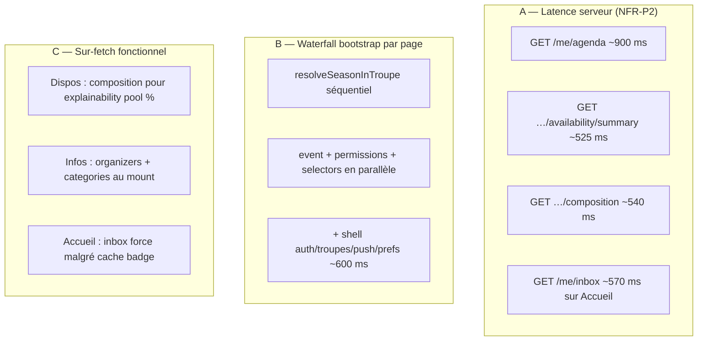

# Performance improvement plan — HatCast V2 · Vague 2 (pages à fort trafic)

**Date:** 2026-06-09 (post PERF-01…08)  
**Author:** Winston (System Architect)  
**Status:** Approved for execution  
**Prérequis:** [perf-improvement-plan-v2.md](perf-improvement-plan-v2.md) Vague 1 **done** (PERF-01…08)  
**Mesure de référence:** `.local/perf-profile/web-perf-2026-06-09T19-46-21-738Z.json` (`node scripts/v2/profile-web-performance.mjs`)

---

## 1. Bilan Vague 1 — succès mitigé

### 1.1 Pages prioritaires utilisateur — avant / après / cible

| Page | Baseline (09:15) | Post PERF-01…08 (19:46) | Δ réel | Cible V1 | Écart restant |
|------|----------------:|-------------------------:|-------:|---------:|--------------:|
| **Accueil** | 2450 ms | **1501 ms** | **−39 %** | 1200 ms | **+301 ms** |
| **Agenda** | 5850 ms | **1940 ms** | **−67 %** | 1500 ms | **+440 ms** |
| **Event Infos** | 2027 ms | **1951 ms** | −4 % | 1200 ms | **+751 ms** |
| **Event Dispos** | 2125 ms | **2231 ms** | +5 %* | 1400 ms | **+831 ms** |
| **Event Équipe** | 2452 ms | **2263 ms** | −8 % | 1500 ms | **+763 ms** |

\*Variance réseau ; structurellement Dispos charge encore **composition + summary** (~1,1 s API).

### 1.2 Ce que Vague 1 a bien résolu

| Problème | Statut |
|----------|--------|
| N+1 `GET /me/preferences` (32× agenda) | ✅ **1×** |
| Inbox badge à chaque navigation | ✅ **1×** / script (cache 60 s) |
| Double fetch composition Équipe | ✅ **1×** |
| Prefetch composition onglet Infos | ✅ **0×** composition |
| Bundle cold start | ✅ **1,44 MB** (−38 %, PERF-08) |
| Saison agenda bootstrap | ✅ BFF workspace (PERF-07) — **hors** les 5 pages cibles |

### 1.3 Pourquoi on reste au-dessus des cibles

Le script mesure surtout le **chemin critique API** (pas le ressenti navigation in-app — voir §5). Trois causes structurelles restent :



**Conclusion architecte :** Vague 1 a éliminé les **bugs front évidents** (N+1, cache inbox). Vague 2 doit attaquer **BFF par écran**, **API hot paths**, et **rendu progressif** (TTI perçu).

---

## 2. Goulots restants par page (evidence 19:46)

### Accueil (`/accueil`) — 1501 ms, 4 appels

| Endpoint | max ms | Note |
|----------|-------:|------|
| `GET /me/inbox` | **569** | Force refresh todo (PERF-02 AC2) — bloque le rendu |
| auth/me + push + prefs | ~367 | Shell / page |

**Levier :** rendu progressif (header immédiat) + réutiliser cache inbox si TTL OK pour la **liste** (refresh badge en arrière-plan).

---

### Agenda (`/agenda`) — 1940 ms, 5 appels

| Endpoint | max ms | Note |
|----------|-------:|------|
| `GET /me/agenda` | **907** | **Goulot #1** — serveur |
| `GET /troupes` | 197 | `troupeContext.load()` avant agenda |
| auth + push + prefs | ~426 | |

**Waterfall actuel :** `ensureHatcastSession` → `troupeContext.load()` → `loadViewerGender` → `loadAgenda`.

**Levier :** paralléliser session + agenda ; optimiser API agenda ; optionnel BFF `GET /me/agenda/bootstrap`.

---

### Event Infos — 1951 ms, 10 appels, **0× composition** ✓

| Endpoint | max ms | Lazy? |
|----------|-------:|-------|
| `…/organizers` | 305 | Infos tab only — **OK lazy** |
| `…/participants/selectors` | 286 | Requis header — garder |
| `…/events/by-slug` | 267 | Requis |
| `…/seasons/by-slug` | 254 | Résolution |
| `…/categories` | 243 | **Lazy** (Dispos/Equipe seulement?) |
| permissions + shell | ~700 | |

**Levier :** BFF `GET …/events/{id}/page?tab=infos` = event + permissions + selectors (+ organizers inline).

---

### Event Dispos — 2231 ms, 10 appels

| Endpoint | max ms | Note |
|----------|-------:|------|
| `…/composition` | **553** | Prefetch explainability (PERF-03 review) |
| `…/availability/summary` | **525** | Onglet enfant |
| bootstrap event | ~1,0 s | Même waterfall qu’Infos |

**Levier :** BFF tab=dispos ; **lazy composition** jusqu’au toggle explainability ou mode Tous + chances.

---

### Event Équipe — 2263 ms, 9 appels

| Endpoint | max ms | Note |
|----------|-------:|------|
| `…/composition` | **540** | Nécessaire |
| bootstrap event | ~1,5 s | Sans organizers/categories |

**Levier :** BFF tab=equipe (event + permissions + composition en 1–2 appels).

---

## 3. Cibles Vague 2 (réalistes)

| Page | Actuel | Cible V2 | Levier principal |
|------|-------:|---------:|------------------|
| Accueil | 1501 ms | **≤ 1000 ms** perçu | PERF-12 progressive UI |
| Agenda | 1940 ms | **≤ 1400 ms** | PERF-11 API agenda + PERF-09 parallèle |
| Event Infos | 1951 ms | **≤ 1200 ms** | PERF-10 BFF tab=infos |
| Event Dispos | 2231 ms | **≤ 1500 ms** | PERF-10 + PERF-13 lazy composition |
| Event Équipe | 2263 ms | **≤ 1500 ms** | PERF-10 BFF tab=equipe |

**NFR-P2 sous-jacent :** `me/agenda`, `summary`, `composition` ≤ **500 ms p95** (PERF-11, PERF-15).

---

## 4. Stories Vague 2

| ID | Titre | Pages | Effort | ROI |
|----|-------|-------|--------|-----|
| **[PERF-10](../implementation-artifacts/perf-10-event-detail-page-bff.md)** | BFF bootstrap event-detail par onglet | Event ×3 | M | **★★★** |
| **[PERF-11](../implementation-artifacts/perf-11-me-agenda-api-hot-path.md)** | Hot path `GET /me/agenda` | Agenda | M | **★★★** |
| **[PERF-12](../implementation-artifacts/perf-12-accueil-progressive-render.md)** | Accueil rendu progressif + inbox SWR liste | Accueil | S | **★★☆** |
| **[PERF-13](../implementation-artifacts/perf-13-dispos-lazy-composition-explainability.md)** | Dispos : composition lazy (explainability) | Event Dispos | S | **★★☆** |
| **[PERF-09](../implementation-artifacts/perf-09-member-shell-bootstrap-resolver.md)** | Bootstrap session/troupes au shell (Router) | Toutes | M | **★★☆** (in-app) |
| **[PERF-14](../implementation-artifacts/perf-14-profiling-script-in-app-nav.md)** | Script profilage navigation in-app | Mesure | S | **★☆☆** (gate) |
| **[PERF-15](../implementation-artifacts/perf-15-composition-summary-api-hot-path.md)** | Hot path composition + summary API | Event Dispos/Équipe | M | **★★☆** |
| **[PERF-16](../implementation-artifacts/perf-16-db-latency-observability.md)** | Observabilité latence DB (réseau vs SQL) | Mesure / API | M | **★★☆** (gate) |

### Séquencement recommandé

```text
S4a : PERF-10 (Event BFF)          → débloque Infos / Dispos / Équipe
S4b : PERF-11 (agenda API)           → débloque Agenda
S4c : PERF-12 + PERF-13 (parallèle)  → Accueil + Dispos quick wins
S4d : PERF-09 + PERF-14              → navigation réelle + mesure fiable
S4e : PERF-16 (audit DB)             → chiffres réseau/SQL avant fixes aveugles
S4f : PERF-15                        → si BFF insuffisant ; findings PERF-16 priorisent le SQL
```

**Infra Neon :** projet en **AWS eu-central-1 (Frankfurt)** ; Cloud Run **europe-west9/west1** — RTT attendu ~8–18 ms/requête (intra-EU, non bloquant seul ; multiplicatif sur N requêtes). Voir PERF-16.

---

## 5. Mesure — modes script

### Mode par défaut (`page.goto`)

`node scripts/v2/profile-web-performance.mjs` — **`page.goto` par route** → reload SPA → **PERF-04 (cache session) invisible**. Les chiffres 19:46 **sur-estiment** la navigation membre réelle (agenda → event via router).

Rapport : `.local/perf-profile/web-perf-*.json`

### Mode in-app (`--in-app`) — PERF-14

```bash
node scripts/v2/profile-web-performance.mjs --in-app
# Prérequis : stack dev local (./scripts/start-dev.sh --with-push recommandé)
# Identifiants : HATCAST_PERF_EMAIL / HATCAST_PERF_PASSWORD (défaut seed Improbots)
# Viewport : 1280×900 (rail nav desktop + onglets event visibles — requis pour reproduire les mesures)
```

Login **une fois**, puis navigation SPA sans reload :

1. Accueil — clic nav membre  
2. Agenda — clic nav membre  
3. Event Infos — clic première carte agenda  
4. Event Dispos / Équipe — clic onglets `mat-tab`

Rapport séparé : `.local/perf-profile/web-perf-inapp-*.json` (`mode: "in-app"`, `navigation: "in-app"` par step).

**Gate Vague 2 §3 :** privilégier les snapshots `--in-app` pour Accueil, Agenda et Event ×3 ; conserver le mode `goto` pour les pages hors parcours membre (troupes, saison, compte).

En complément : comparer **endpoint max ms** et **# appels** entre les deux modes pour quantifier l’écart reload vs in-app.

### Mode audit DB (`audit-db-latency.mjs`) — PERF-16

```bash
# RTT baseline (10× SELECT 1)
node scripts/v2/audit-db-latency.mjs rtt

# Top requêtes pg_stat_statements + EXPLAIN hot paths
node scripts/v2/audit-db-latency.mjs report --endpoint=/v1/me/agenda

# Prérequis : HATCAST_DATASOURCE_* (.env branche local ou staging)
# Rapport : .local/perf-profile/db-latency-*.json
```

Découpe **jdbcTotalMs** vs **serverExecMs** (EXPLAIN / pg_stat) → estime **networkEstimateMs** ; alimente PERF-11/15 avec findings classés (N+1, index, round-trips).

---

## 6. Definition of Done Vague 2

1. Tableau §3 atteint sur snapshot **19:46+** ou mode `--in-app` (PERF-14).
2. Aucune régression AC fonctionnels (dispos explainability, inbox accueil, status header event).
3. OpenAPI + test intégration pour chaque BFF/API touché.
4. **ISSUES PERF-002** : passer en *Fixed* ou *Accepted residual* avec chiffres.

---

## 7. Prompts Amelia (Vague 2)

| Ordre | Prompt |
|-------|--------|
| **1** | Voir [perf-10-event-detail-page-bff.md](../implementation-artifacts/perf-10-event-detail-page-bff.md) |
| 2 | `/bmad-dev-story dev perf-11-me-agenda-api-hot-path` |
| 3 | `/bmad-dev-story dev perf-12-accueil-progressive-render` |
| 4 | `/bmad-dev-story dev perf-13-dispos-lazy-composition-explainability` |

---

**Dernière mise à jour :** 2026-06-10 (PERF-16 ajoutée)
