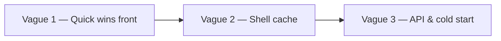

# Performance improvement plan — HatCast V2 (front + API read paths)

**Date:** 2026-06-09  
**Author:** Winston (System Architect) + profiling session Patrice  
**Status:** Vague 1 **done** (PERF-01…08) · Vague 2 **[perf-improvement-plan-v2-wave2.md](perf-improvement-plan-v2-wave2.md)** approved  
**Trigger:** Lenteur globale ressentie en dev local (peu de données) — profiling Playwright 2026-06-09  
**Normative refs:** NFR-P1, NFR-P2 ([epics.md](epics.md) § NonFunctional Requirements)

**Related:**

| Artifact | Role |
|----------|------|
| [growth-backlog.md](growth-backlog.md) **G-003** | Dispos summary perf (partiellement adressé par 5-7) |
| [ISSUES.md](../../ISSUES.md) **PERF-002** | Registre bug lenteur globale (à ouvrir à l’exécution S1) |
| `scripts/v2/profile-web-performance.mjs` | Baseline / gate mesure |
| `.local/perf-profile/web-perf-2026-06-09T15-32-52-596Z.json` | Snapshot baseline |
| Stories | `_bmad-output/implementation-artifacts/perf-*.md` |
| **Vague 2** | [perf-improvement-plan-v2-wave2.md](perf-improvement-plan-v2-wave2.md) — pages à fort trafic |

---

## 1. Context

La stack V2 (Angular 21 + Spring + base locale) affiche des temps de chargement **multi-secondes** sur la plupart des pages membre, alors que le volume de données est faible. Le profilage montre que :

- Le **shell SPA** se charge en ~50 ms (navigation chaude) — ce n’est **pas** le goulot principal en usage courant.
- La lenteur vient du **sur-fetch API** (N+1 front, prefetch onglets, coûts shell répétés) et, secondairement, de latences serveur sur quelques endpoints (`me/inbox`, `composition`, `availability/summary`).
- La passe d’optimisation **V1 Firestore** ([docs/v1/technical/PERFORMANCE_OPTIMIZATION.md](../../docs/v1/technical/PERFORMANCE_OPTIMIZATION.md)) ne s’applique pas à la V2.
- Hygiene H1 (5-7, 6-11, 12-7) a traité des cas ciblés ; le chantier global avait été repoussé (« Defer remaining web perf optimizations »).

**Environnement baseline :** `./scripts/start-dev.sh --with-push`, `https://localhost:4200`, compte seed `patrice@seed.improbots.test`, saison Apérock 2026, ~32 événements agenda.

---

## 2. Baseline « avant » (2026-06-09)

### 2.1 Temps jusqu’à contenu visible (wall clock)

| Écran | wallMs | Appels `/v1/*` | apiTotalMs* | Goulot #1 |
|-------|-------:|---------------:|------------:|-----------|
| **Agenda membre** | **5850** | **37** | 64328 | **32× `GET /me/preferences`** |
| Accueil todo | 2450 | 6 | 3024 | `GET /me/inbox` (~1,5 s cumulé) |
| Saison agenda | 2214 | 15 | 4155 | inbox + 6× preferences + bootstrap |
| Saison stats | 1875 | 11 | 3691 | inbox + statistics (~575 ms) |
| Event Infos | 2027 | 12 | 3387 | inbox + prefetch composition |
| Event Dispos | 2125 | 11 | 3233 | inbox + summary (~527 ms) + composition |
| Event Équipe | 2452 | 11 | 3587 | inbox + composition ×2 |
| Event Activité | 2328 | 13 | 3921 | inbox + composition + selectors ×2 |
| Hub troupe | 1553 | 6 | 1635 | inbox (~887 ms) |
| Compte | 1422 | 5 | 1348 | inbox (~814 ms) |

\*Somme des durées mesurées par endpoint (requêtes souvent parallèles → wall &lt; somme).

### 2.2 Coûts fixes répétés (chaque navigation membre)

| Endpoint | Latence typique | Source |
|----------|----------------:|--------|
| `GET /me/inbox` | ~850 ms | `MemberShell` → `MemberInboxBadgeService.refresh()` |
| `GET /auth/me` | ~110 ms | `ensureHatcastSession()` par page |
| `GET /troupes` | ~280 ms | `TroupeContextService.load()` / résolveur |
| `GET /me/preferences` | ~100–190 ms × **N cartes** | `AgendaParticipationStatus.ngOnInit` |

### 2.3 Architecture issues (root causes)

| ID | Cause | Fichiers clés |
|----|-------|---------------|
| RC-1 | N+1 `GET /me/preferences` (1 par carte événement) | `agenda-participation-status.ts`, `user-agenda.html`, `season-agenda.html`, `member-home-todo.html` |
| RC-2 | Inbox badge refresh systématique au mount shell | `member-shell.ts`, `member-inbox-badge.service.ts` |
| RC-3 | Prefetch composition + dispos summary hors onglet actif | `event-detail.ts` |
| RC-4 | Double fetch composition (parent + `event-equipe-tab`) | `event-detail.ts`, `event-equipe-tab.ts` |
| RC-5 | Session/context re-fetch par page | `auth-api.service.ts`, `troupe-context.service.ts`, pages `ngOnInit` |
| RC-6 | Bootstrap saison = 5+ appels + redondance shell | `season-home.ts` |
| RC-7 | Pas de lazy routes (bundle 2,33 MB — cold start) | `app.routes.ts`, [apps/web/README.md](../../apps/web/README.md) § baseline |
| RC-8 | Latence serveur `me/inbox` (~850 ms) | API `MeInboxService` (à profiler) |

---

## 3. Cible « après » (post plan complet)

### 3.1 Objectifs produit (dev local, script profilage)

| Écran | Avant | Cible | Δ |
|-------|------:|------:|--:|
| Agenda | 5,9 s | **≤ 1,5 s** | −75 % |
| Accueil | 2,5 s | **≤ 1,2 s** | −50 % |
| Saison agenda | 2,2 s | **≤ 1,3 s** | −40 % |
| Event Infos | 2,0 s | **≤ 1,0 s** | −50 % |
| Event Dispos | 2,1 s | **≤ 1,4 s** | −35 % |
| Event Équipe | 2,5 s | **≤ 1,5 s** | −40 % |
| Hub / Compte | 1,4–1,6 s | **≤ 0,8 s** | −45 % |

**NFR-P1 :** TTI ≤ 3 s p95 — marge confortable après Vague 1+2.

### 3.2 Objectifs API (NFR-P2, p95 nominal)

| Endpoint | Avant (max mesuré) | Cible |
|----------|-------------------:|------:|
| `me/inbox` | 912 ms | ≤ 300 ms |
| `availability/summary` | 527 ms | ≤ 500 ms |
| `composition` | 773 ms | ≤ 500 ms |
| `me/agenda` | 823 ms | ≤ 500 ms |

### 3.3 Consolidé post-Vague 1+2 (estimé)

| Métrique | Avant | Après V1+V2 |
|----------|------:|------------:|
| Agenda — appels API | 37 | **~6** |
| Coût inbox / navigation (cache hit) | ~850 ms | **~0 ms** |
| Event Infos — fetch composition/dispos inutiles | 2+ | **0** |

---

## 4. Vagues d’exécution



### Vague 1 — Quick wins front (**Semaine 1** — ROI maximal)

| Story | Titre | RC | Impact estimé |
|-------|-------|----|---------------|
| **[PERF-01](../implementation-artifacts/perf-01-deduplicate-me-preferences.md)** | Dédupliquer `GET /me/preferences` | RC-1 | Agenda −75 % appels |
| **[PERF-02](../implementation-artifacts/perf-02-inbox-badge-cache.md)** | Inbox badge stale-while-revalidate | RC-2 | −0,8 s / navigation |
| **[PERF-03](../implementation-artifacts/perf-03-event-detail-tab-gated-load.md)** | Chargement onglet-only event-detail | RC-3, RC-4 | Event Infos −50 % |

**Gate S1 :** re-run `node scripts/v2/profile-web-performance.mjs` — agenda ≤ 1,5 s, Event Infos ≤ 1,2 s.

### Vague 2 — Shell & contexte (**Semaine 2**)

| Story | Titre | RC | Impact estimé |
|-------|-------|----|---------------|
| **[PERF-04](../implementation-artifacts/perf-04-session-context-cache.md)** | Cache session + troupe context | RC-5 | −200–400 ms / page |
| **[PERF-05](../implementation-artifacts/perf-05-viewer-gender-props.md)** | Props `viewerGender` parent (complément 01) | RC-1 | Zéro fetch prefs sur listes |

**Gate S2 :** toutes pages membre ≤ 2 s (script profilage).

### Vague 3 — API & cold start (**Semaine 3+**, backlog structurant)

| Story | Titre | RC | Impact estimé |
|-------|-------|----|---------------|
| **[PERF-06](../implementation-artifacts/perf-06-inbox-api-profiling.md)** | Profiling serveur `GET /me/inbox` | RC-8 | NFR-P2 inbox |
| **[PERF-07](../implementation-artifacts/perf-07-season-workspace-bootstrap-bff.md)** | BFF `GET …/workspace` | RC-6 | −3 round-trips mobile |
| **[PERF-08](../implementation-artifacts/perf-08-lazy-routes-angular.md)** | Lazy routes par zone | RC-7 | Cold start −30–50 % |

---

## 5. Definition of Done (chaque story PERF)

1. Re-run `node scripts/v2/profile-web-performance.mjs` — delta chiffré noté dans **Completion Notes** de la story.
2. Tests existants verts (`npm run test -w @hatcast/web -- --watch=false` ; `./gradlew test` si API touchée).
3. Pas de nouveau `GET /v1/*` au mount sans justification dans Dev Notes.
4. UI : checklist M3 ou **UI : N/A** explicite.

---

## 6. Gouvernance

| Action | Quand |
|--------|-------|
| Ouvrir **ISSUES.md PERF-002** | Début Vague 1 (baseline JSON en pièce) |
| Lier **G-003** → PERF-01/03 | À la clôture PERF-03 |
| Mettre à jour `apps/web/README.md` baseline bundle | Après PERF-08 |
| Option CI : script profilage en job manuel / pre-release | Post S2 |

---

## 7. Séquencement multi-conversations (prompts Amelia)

| Ordre | Story file | Prompt invocation |
|-------|------------|-------------------|
| 1 | `perf-01-deduplicate-me-preferences.md` | Voir §8 ci-dessous |
| 2 | `perf-02-inbox-badge-cache.md` | `/bmad-dev-story dev perf-02-inbox-badge-cache` |
| 3 | `perf-03-event-detail-tab-gated-load.md` | `/bmad-dev-story dev perf-03-event-detail-tab-gated-load` |
| 4 | `perf-04-session-context-cache.md` | `/bmad-dev-story dev perf-04-session-context-cache` |
| 5 | `perf-05-viewer-gender-props.md` | `/bmad-dev-story dev perf-05-viewer-gender-props` |
| 6+ | PERF-06…08 | Après gate S2 |

**Plan maître :** ce document. **Ne pas** dupliquer le détail des AC dans PLAN.md — référencer ce fichier depuis une note PLAN si besoin.

---

## 8. Prompt Amelia — PERF-01 (premier candidat)

```
/bmad-dev-story dev cette story : _bmad-output/implementation-artifacts/perf-01-deduplicate-me-preferences.md

Contexte : plan perf _bmad-output/planning-artifacts/perf-improvement-plan-v2.md (Vague 1).
Baseline : agenda 5,9 s / 37 appels API dont 32× GET /me/preferences.
Gate : re-run node scripts/v2/profile-web-performance.mjs — agenda ≤ 1,5 s et ≤ 1 appel preferences par visite.
```

---

## 9. Trade-offs assumés

| Choix | Pour | Contre |
|-------|------|--------|
| Cache preferences/inbox | Gain immédiat, code simple | Données légèrement stale (TTL OK) |
| Tab-gated loading | Moins d’API | Status header peut skeleton court |
| BFF bootstrap | Moins de round-trips | Nouveau contrat API |
| Lazy routes | Cold start | Pas de gain navigation chaude |

---

**Dernière mise à jour :** 2026-06-09
