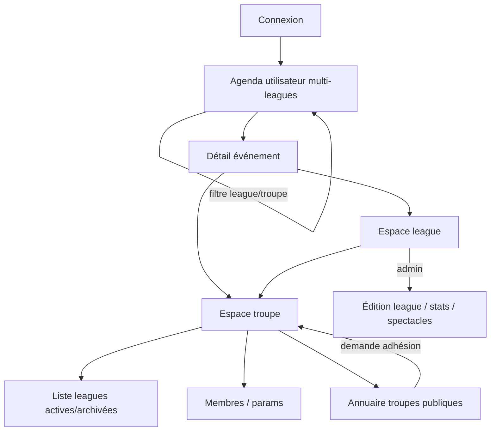

# Sprint Change Proposal — 2026-05-24 (rev. 2) — User Hub, Agenda & League Model

**Type:** Hybrid — immediate V1-parity fix **+** domain/UX discovery for League-centric navigation  
**Trigger:** Epic 2 retro + stakeholder revision (Patrice, 2026-05-24)  
**Status:** Revised — awaiting approval  
**Stakeholder:** Patrice  
**Prior revision:** v1 (connexion/troupe/saison polish only) — **superseded by this document**

---

## 1. Issue Summary

### Problem statement (revised)

Two related gaps were identified:

**A — Immediate UX debt (unchanged from retro, confirmed by stakeholder)**  
After sign-in, V2 shows a **useless `/accueil` stub** (one link to `/seasons`). V1 sent the user straight to their **last visited season**. This regression adds friction and breaks established muscle memory.

**B — Strategic product gap (stakeholder revision — scope expansion)**  
The current V2 information architecture treats **Season** (`/seasons` → `/saison/:slug` → per-season Agenda) as the primary hub. Stakeholder intent is different:

- The **member’s entry point** should be a **personal Agenda** aggregating **all events** from every **league** (working name for today’s *season*) where they are a **participant** — across troupes.
- A **troupe** may run **several concurrent leagues** (e.g. leisure vs show circuit) — **not** “at most one active season per troupe.”
- **Cross-troupe encounters** (e.g. BIM vs La Malice, same date/venue) are **one real-world match** but **two HatCast events** (one per troupe’s league), each with its own team composition; a user in both troupes sees **two clearly labelled events** in their agenda.
- Navigation should form a **graph**: **Event ↔ League ↔ Troupe ↔ Public troupe directory**, with **filters** (league, troupe) on the agenda; **pseudo** remains **troupe-scoped**; league creation chooses **all troupe members vs pick individually** (with optional email pre-link).

**Problem type:**  
- **A:** Failed UX approach (stub screen) — fixable without domain change.  
- **B:** **Strategic pivot in domain modelling and IA** — conflicts with normative **DOMAIN.md** invariant *“single active season per troupe”* and with Epic 3 Story 3.1 transactional constraint.

### Evidence

| Topic | V1 / intent | V2 today | Normative docs |
|-------|-------------|----------|----------------|
| Post-login | `lastVisitedSeason` → `/season/:slug` ([`legacy/src/services/seasonPreferences.js`](../../legacy/src/services/seasonPreferences.js)) | `/accueil` placeholder | PRD Journey 1 — low friction after auth |
| Member hub | Season grid as admin/discovery; members land in last season | `/seasons` required hop | UX-DR1 |
| Agenda scope | Per-season calendar | Per-season only (`SeasonHome`) | UX-DR2 |
| Active seasons | Effectively one “current” season per troupe in practice | **Enforced** — activating one deactivates others | **DOMAIN.md** L58; Story 3.1 AC |
| Multi-troupe events | N/A in V1 | N/A | New requirement (stakeholder) |

---

## 2. Impact Analysis

### Epic impact

| Epic | Impact | Action |
|------|--------|--------|
| **Epic 1** | Post-login redirect target | Phase A only |
| **Epic 2** | Troupe chrome, pseudo scope, `/accueil` removal | Phase A stories; troupe hub in Phase C |
| **Epic 3** | **Major** — season CRUD, activation rules, routes `/saison/:slug` | Phase B domain decision; Phase C refactor or alias “season” → “league” |
| **Epic 4** | Public troupe directory linked from troupe hub | Phase C — aligns with stakeholder “rejoindre une troupe publique” |
| **Epic 5–6** | Availability/composition stay **event-scoped**; agenda aggregation is read navigation | No API break if event still belongs to one league; cross-troupe = two events |
| **New work (proposed Epic 11 or Epic 3 extension)** | User agenda API, league roster rules, encounter linking, multi-active leagues | Phase B spec + Phase C implementation |

### Story impact — phased

#### Phase A — V1 parity (no domain change) — **approve to implement now**

| Story | Proposal | Scope |
|-------|----------|-------|
| **2.9** (revised) | Post-login → **last visited season agenda**; deprecate `/accueil` | Restore `lastVisitedSeason` (+ optional last view tab) in localStorage; validate slug via existing resolver; fallback `/seasons` |
| **2.10** (deferred) | Global troupe chrome | **Moved to Phase C** — insufficient alone once agenda is user-centric |

#### Phase B — Domain & UX discovery (PO + Architect) — **gate before Phase C**

| Deliverable | Owner | Output |
|-------------|-------|--------|
| **League product brief** | Patrice + PM | Terminology (League vs Saison in FR UI), invariants, MVP subset |
| **DOMAIN.md / SPEC.md update proposal** | Architect | Replace or relax *single active season*; define **Encounter** (optional link between two events) |
| **ADR** | Architect | Multi-active leagues; cross-troupe event pairing; participant vs member at league scope |
| **UX-DR13 + UX-DR14** | UX/PO | Navigation graph, filters, wireframes for user agenda + troupe hub |

#### Phase C — League-centric platform (new epic slice) — **after Phase B sign-off**

| Story (indicative) | Capability |
|--------------------|------------|
| **3.x / 11.1** | Remove single-active-league DB constraint; multiple `ACTIVE` leagues per troupe |
| **11.2** | League roster: all members **or** individual add (+ email pre-link) |
| **11.3** | **User agenda** API + UI — all events where user is league participant; filters by league/troupe |
| **11.4** | Event chrome: badges league + troupe; navigate to league admin or troupe admin |
| **11.5** | Troupe hub: leagues list (active/archived filter), pseudo, link to public directory |
| **11.6** *(post-MVP)* | **Encounter** entity linking paired cross-troupe events |

### Artifact conflicts — **explicit**

| Artifact | Conflict | Required action |
|----------|----------|-----------------|
| **DOMAIN.md** | *Single active season per troupe* vs **multiple concurrent leagues** | **Stakeholder approval** to change invariant before Phase C |
| **SPEC.md** | Administration capabilities assume season list per troupe | Extend for troupe hub + user agenda |
| **epics.md** | Story 3.1 AC “activate deactivates others” | Revise after Phase B |
| **architecture.md** | Season activation transaction | Schema/migration plan for multi-active |
| **ux-design-hatcast-v2.md** | Per-season agenda as primary workspace | New **user agenda** screen; season routes become league admin context |
| **PRD** | FR8 multi-troupe; no “user agenda” FR | Add FR candidate or map to Journey 1 extension |

### Technical impact summary

| Phase | Backend | Frontend | Risk |
|-------|---------|----------|------|
| **A** | Optional `GET/PATCH /v1/users/me/navigation` (or localStorage only for MVP) | Redirect + remember season on `SeasonHome` visit | **Low** |
| **B** | None | Docs only | **Low** |
| **C** | New queries (agenda by user), league roster modes, optional `encounters` table | New routes (`/agenda`?), refactor navigation | **High** — touches core IA |

---

## 3. Recommended Approach

**Selected: Hybrid — Phase A now + Phase B discovery + Phase C as new epic (Option 1 + Option 3 lite)**

| Option | Viable? | Rationale |
|--------|---------|-----------|
| **1. Direct adjustment (original 2.9/2.10 only)** | ✗ **Insufficient** | Does not address league vision or multi-season agenda |
| **2. Rollback** | ✗ | Backend sound |
| **3. MVP / domain review** | ✓ **Required for Phase B–C** | Stakeholder revision **is** a domain review |
| **Hybrid (recommended)** | ✓ | Ship **V1 parity** immediately; **do not** implement multi-league until DOMAIN/SPEC/ADR approved |

**Rationale:**  
Patrice’s revision is coherent and maps to real troupe behaviour (multi-circuit, inter-troupe matches, dual membership). Implementing it inside the original “surgical UX” timbox would **silently violate** DOMAIN and create rework. Splitting phases preserves retro momentum (kill `/accueil`, restore last season) while giving the League model proper governance.

**Effort estimates:**

| Phase | Effort | Timeline |
|-------|--------|----------|
| **A** | Low — 2–3 dev days | This sprint slice |
| **B** | Medium — 3–5 days workshops + docs | Before any Phase C story |
| **C** | High — multi-sprint epic | After Phase B sign-off; **blocks** claiming “MVP journey complete” |

**Risk:** Phase C **high** (migration, permission matrix, Epic 5/6 regression). Phase A **low**.

---

## 4. Stakeholder Vision Capture (League model)

*Normative status: **product intent** — not yet SPEC/DOMAIN until Phase B approval.*

### Terminology

| Concept | Stakeholder term | Current V2 | Notes |
|---------|------------------|--------------|-------|
| Season container | **League** | `seasons` table | UI label TBD (*ligue* vs keep *saison* during transition) |
| Troupe | Troupe | unchanged | Identity + membership + pseudo |
| Event | Event | unchanged | **Always** attached to exactly one league |
| Cross-troupe match | Same encounter, two events | N/A | BIM event in BIM league + Malice event in Malice league |

### Navigation graph (target)



### League creation & roster

- On create: **include all troupe members** **OR** **add one-by-one** (existing user or name + optional email for later link-on-sign-in — aligns with FR45 pattern at league scope).

### User agenda rules

- Shows **all spectacle dates** for leagues where user is **participant** (season/event participant model from Story 3.8 — league-level roster TBD in Phase B).
- User in **two troupes** for same real-world match → **two events** in agenda, each tagged with **troupe + league** (no merging into one row in MVP).

### Troupe-level UX

- **Pseudo** editable at troupe scope (FR9 — unchanged).
- **Leagues** list with active/archived filter.
- **Upward navigation** to public troupe directory + join request (Epic 4 dependency).

### OPEN QUESTIONS (Phase B must resolve)

1. **French UI label:** *Ligue*, *League*, or retain *Saison* with broader semantics?
2. **League “active” flag:** Boolean per league vs lifecycle enum — still allow **many active** per troupe?
3. **Participant scope:** League participant = auto all members **or** explicit roster — relationship to Story 3.8 season/event participants?
4. **Encounter linking:** MVP need or Phase 2 — metadata only (same date/title) vs shared `encounter_id`?
5. **User agenda API:** Single endpoint `GET /v1/me/agenda` vs client-side merge of per-league event lists?
6. **Route strategy:** Keep `/saison/:slug` as alias during migration?
7. **Last-visited (Phase A):** Remember **season slug only** (V1) or **season + view tab** (Agenda/Historique)?

---

## 5. Detailed Change Proposals

### 5.1 Phase A — Story 2.9 (revised): Post-login & last visited season (V1 parity)

**Title:** Post-login routing and last visited season (V1 parity)

**User story:**  
As a **signed-in member**,  
I want to **land on my last visited season agenda** after login,  
so that **I resume where I left off** without a useless intermediate screen.

**Acceptance criteria:**

1. **Given** valid session after sign-in, **when** routing completes, **then** user is **not** shown `/accueil` placeholder.
2. **Given** stored `lastVisitedSeason` slug valid for an active membership, **when** user signs in, **then** redirect to `/saison/:slug` (agenda view — default tab per UX-DR2).
3. **Given** user opens a season route, **when** season loads successfully, **then** app persists `lastVisitedSeason` (localStorage minimum; server preference optional).
4. **Given** user intentionally opens `/seasons`, **when** page loads, **then** clear or override last-visited preference (V1 behaviour — [`SeasonsPage.vue`](../../legacy/src/views/SeasonsPage.vue) clears on visit).
5. **Given** invalid or inaccessible stored slug, **when** user signs in, **then** fallback to `/seasons` (or demo join empty state).
6. **Given** `/accueil` bookmark, **when** accessed authenticated, **then** redirect using same logic as (2)/(5).
7. **Tests:** redirect matrix, persistence, fallback, no regression on Story 2.4 slug resolution.

**Out of scope (Phase A):** Multi-league agenda, troupe hub, league rename, encounter linking.

**Dependencies:** Stories 1.x, 2.4, 3.3 (agenda view exists).

---

### 5.2 Phase A — Deprecate `/accueil`

| Current | Target |
|---------|--------|
| `AuthRedirect` → `/accueil` | → last season or `/seasons` |
| `Login` success → `/accueil` | Same |
| `home-signed-in` component | Remove from primary flow; keep redirect shim temporarily |
| `seasons-list` back → `/accueil` | → marketing landing **or** remove back (PO pick in Phase B UX-DR13) |

---

### 5.3 Phase B deliverables (no code until approved)

**Files to create/update:**

| File | Action |
|------|--------|
| `_bmad-output/planning-artifacts/product-brief-league-model.md` | **NEW** — stakeholder vision + MVP cut |
| `DOMAIN.md` | Proposed diff — multi-active leagues, encounter optional |
| `docs/adr/00XX-league-model-and-user-agenda.md` | **NEW ADR** |
| `_bmad-output/planning-artifacts/ux-design-journey-league-agenda.md` | **NEW** — UX-DR13/14: user agenda, navigation graph, filters |
| `epics.md` | New epic or extend Epic 3/11 with Phase C stories |

---

### 5.4 Phase C — Indicative epic (draft — not in sprint until Phase B done)

**Epic 11 (proposed): User agenda & league-centric navigation**

| Story | Summary |
|-------|---------|
| 11.1 | Domain: multiple active leagues per troupe (migration + API) |
| 11.2 | League roster modes (all members / pick individuals) |
| 11.3 | User agenda (multi-league, filters) |
| 11.4 | Event ↔ league ↔ troupe navigation chrome |
| 11.5 | Troupe hub (leagues, pseudo, directory link) |
| 11.6 | Encounter linking (optional / post-MVP) |

**Original Story 2.10** (global troupe switcher) → **subsumed** by 11.3/11.5 filter UX rather than page-body switcher alone.

**Original Story 2.11** (Admin Membres polish) → remains optional, independent.

---

### 5.5 sprint-status.yaml (Phase A only — if approved)

```yaml
  2-9-post-login-et-derniere-saison-visitee-v1-parity: backlog
  # 2-10 deferred to Phase C (epic 11)
  # Phase B: tracking via planning artifact, not dev story yet
```

Epic 2 remains `in-progress` until 2.9 done; Epic 11 `backlog` after Phase B.

---

## 6. Implementation Handoff

### Scope classification

| Phase | Classification | Handoff |
|-------|----------------|---------|
| **A** | **Minor** | Developer agent — implement 2.9 immediately |
| **B** | **Major (planning)** | PM + Architect + PO — DOMAIN/SPEC/ADR/UX |
| **C** | **Major (implementation)** | Re-sprint after Phase B; PO reorders backlog |

### Success criteria

**Phase A (this approval):**

- [ ] No authenticated user sees useless `/accueil` after login
- [ ] Last visited season restored (V1 parity)
- [ ] Story 2.4 slug resolution still passes tests

**Phase B:**

- [ ] DOMAIN invariant conflict **explicitly resolved** (approve change or defer league model)
- [ ] UX wireframes for user agenda + navigation graph signed off
- [ ] MVP cut defined (what ships before Epic 6 composition vs what waits)

**Phase C:**

- [ ] User agenda shows cross-league events with troupe/league labels
- [ ] Multiple active leagues per troupe operational
- [ ] Cross-troupe scenario (BIM/Malice) demonstrable with two events

### Suggested sequence

1. **Approve Phase A** of this proposal → implement Story 2.9  
2. **Kick off Phase B** workshop (League brief + OPEN QUESTIONS) — **parallel** with 2.9 dev  
3. Complete retro prep in parallel: 3.6, AC10, RFC 7807, seed  
4. **After Phase B sign-off** — create Epic 11 stories, pause conflating “season” UX with final IA  
5. Resume Epic 5.4+ / 6.4+ with clear navigation target

---

## Checklist (Correct Course) — rev. 2

### Section 1 — Trigger

- [x] **1.1** Epic 2 retro + stakeholder revision  
- [x] **1.2** Problem: UX stub **+** domain/IA mismatch with league vision  
- [x] **1.3** Evidence: V1 `seasonPreferences.js`, `/accueil` stub, DOMAIN single-active conflict

### Section 2 — Epic impact

- [x] **2.1** Epic 2 completable with Phase A; full vision needs new epic  
- [x] **2.2** Add 2.9 revised; defer 2.10; draft Epic 11  
- [x] **2.3** Epics 3–6 materially affected in Phase C  
- [x] **2.4** No epic obsolete; **new epic required**  
- [x] **2.5** **Resequence:** Phase A now → Phase B gate → Phase C before “journey complete”

### Section 3 — Artifacts

- [!] **3.1** PRD — Phase C needs Journey 1 extension / new FRs  
- [!] **3.2** Architecture — Phase C schema/API changes  
- [!] **3.3** UX — new user agenda spec (Phase B)  
- [x] **3.4** Phase A tests only

### Section 4 — Path forward

- [x] **4.1** Direct adjustment — **viable for Phase A only**  
- [x] **4.2** Rollback — not viable  
- [x] **4.3** MVP/domain review — **required for Phase B–C**  
- [x] **4.4** Selected: **Hybrid**

### Section 5–6

- [x] **5.1–5.5** Documented  
- [ ] **6.3** User approval — **pending**  
- [ ] **6.4** sprint-status — **pending Phase A approval only**  
- [ ] **6.5** Handoff — Dev 2.9 + PO/Architect Phase B

---

**Prepared by:** Correct Course workflow (BMad)  
**Stakeholder:** Patrice  
**Date:** 2026-05-24 (revision 2)
