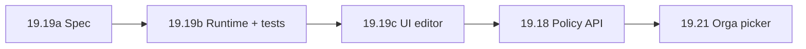

# Sprint Change Proposal — Draw formula factor coefficients (admin tunable params)

**Date:** 2026-06-16  
**Author:** Correct Course (BMad)  
**Approver:** Patrice (product) — **approved in chat** (« faisons l'ajustement maintenant »)  
**Trigger:** Pre-dev review of story **19.19** + UX mockups — admin must tune **coefficient / intensity per criterion** and understand **malus vs bonus** before Wave D Demo 1  
**Change scope:** **Moderate** — amend normative spec; split story **19.19**; extend engine + golden tests; redo UX; **no rollback** of **19.16/19.17** persistence/API

---

## 1. Issue Summary

### Problem statement

Wave D planned an admin **formula editor** (story **19.19**, `ready-for-dev`) with factor **on/off** toggles and a single param (`immediate_replay.mode`). Product review (2026-06-16) identifies a gap:

1. **Troupe admins** need to set **how strongly** each criterion affects draw weights (coefficient / intensity), not only whether it is enabled.
2. The editor must make **malus vs bonus** legible (direction + plain-language effect), aligned with orga explainability (**19.7**).
3. **Epic 19.19 AC2** mentions « seuils, coefficients » but **normative spec**, **runtime**, **tests**, and **UX Sally (2026-06-16)** implement toggles only — constants remain hardcoded in Kotlin (`RoleRequestFactor.BONUS_PER_UNFULFILLED`, `ImmediateReplayFactor.MALUS_MULTIPLIER`, V1 past-participation curve).

### Triggering artifact

| Item | Status | Role |
|------|--------|------|
| **19-19-ui-admin-editeur-formules** | `ready-for-dev` (paused) | UI scope too narrow |
| **19-17** API CRUD | done | `factorConfig[].params` JSON already persisted — **keep** |
| **ux-design-draw-formulas-19-19.md** | draft | No coefficient controls |

### Issue type

**New requirement emerged from stakeholders** — epic intent (facteurs + paramètres) was partially deferred to code constants; pre-dev UX review surfaced the mismatch **before** implementation waste.

### Evidence

- Epic **19.19 AC2**: « champs paramètres (**seuils, coefficients**) »
- [`draw-formulas-policies-spec.md`](../../docs/v2/technical/draw-formulas-policies-spec.md) § Factor catalogue: MVP editor = toggles + `immediate_replay.mode` only
- [`RoleRequestFactor.kt`](../../services/api/src/main/kotlin/com/hatcast/api/availability/draw/RoleRequestFactor.kt): `BONUS_PER_UNFULFILLED = 1.0`, `MAX_BONUS_MULTIPLIER = 10.0` — not in `params`
- Story **19.10** Dev Notes: « tunable via **19.16+** » — not delivered
- Patrice (2026-06-16): prefers redo **spec, tests, stories, design** before `dev-story`

---

## 2. Impact Analysis

### Epic impact

| Epic | Impact |
|------|--------|
| **19** (draw engine Wave D) | **Extend** — insert **19.19a/b** before UI; amend **19.19 → 19.19c**; Wave D Demo 1 gate shifts |
| **6** (composition) | **Low** — DEFAULT pipeline unchanged until policies wire formulas (**19.18**) |
| **19.7** (explainability) | **Medium** — breakdown labels should reflect tuned params when formula active (**19.18+**); optional label tweak in **19.19b** |
| **19.11–19.14** (parked factors) | **Future** — same `params` pattern when shipped |

Epic **19** remains viable; Demo 1 = **catalogue + tunable params + admin UI**, not policies/runtime (**19.18/19.21**).

### Story impact

| Story | Action |
|-------|--------|
| **19-19-ui-admin-editeur-formules** | **Superseded** → split into **19.19a**, **19.19b**, **19.19c** |
| **19-17** | **Keep** — extend validation only in **19.19b** (no API shape break) |
| **19-16** | **Keep** — `factorConfig` JSON column sufficient |
| **19-18** | **Reorder** — still after catalogue UI; blocked by **19.19c** (unchanged dependency intent) |
| **19-20** | **No change** |
| **19-21** | **No change** |
| **19-22** | **Benefits** — snapshot should store resolved `params` (note for 19.22 AC) |

### Artifact conflicts

| Artifact | Conflict | Update |
|----------|----------|--------|
| [`draw-formulas-policies-spec.md`](../../docs/v2/technical/draw-formulas-policies-spec.md) | § Factor catalogue lacks param schemas | **Amend** in **19.19a** |
| [`draw-weight-engine-v1-spec.md`](../../docs/v2/technical/draw-weight-engine-v1-spec.md) | Formulas hardcoded | **Amend** § parameterized factors |
| [`docs/adr/0019-draw-weight-engine.md`](../../docs/adr/0019-draw-weight-engine.md) | Params mention deferred | **Amend** Wave D params |
| [`epics.md`](epics.md) § 19.19 | AC2 vs implementation | **Amend** + add **19.19a/b**, rename **19.19c** |
| [`ux-design-draw-formulas-19-19.md`](ux-design-draw-formulas-19-19.md) | No coefficients | **Amend** in **19.19c** (F2 editor) |
| [`19-19-ui-admin-editeur-formules.md`](../implementation-artifacts/19-19-ui-admin-editeur-formules.md) | Superseded | Banner → SCP; do not dev |
| [`validation.json`](../../services/api/src/test/resources/draw/golden/policies/validation.json) | No param range cases | **Extend** in **19.19b** |
| [`pipelines.json`](../../services/api/src/test/resources/draw/golden/formulas/pipelines.json) | Default params only | **Extend** REF-F* with param variants |
| **PRD / SPEC** | FR19/FR20 — formulas with parameters | **Minor amend** — admin tunable params (SPEC § draw formulas) |

### Technical impact

**Keep (no rollback):**

- Tables `draw_formulas`, `draw_policies` (Flyway V64/V65)
- `DrawFormulaController` / CRUD (**19.17**)
- Factor pipeline architecture (**19.5–19.10**)
- System V1 seed formula

**Change:**

| Layer | Change |
|-------|--------|
| **Spec** | Normative **`params` schema per `factorId`** (types, ranges, defaults, direction malus/bonus/neutral) |
| **Kotlin factors** | Read `params` from assembled pipeline context (not only `ImmediateReplayFactor`) |
| **`DrawFormulaPipelineAssembler`** | Pass params into factor instances (factory pattern per factor) |
| **`DrawFormulaValidator`** | Validate param keys/ranges on save/publish |
| **Golden tests** | New fixtures: default (=V1 parity), tuned coefficients, invalid params → 400 |
| **Web** | Editor: direction badge + numeric fields + helper « effet à strength=1 » |
| **Explainability** | Optional: include param summary in breakdown label when non-default |

**Not in this change:**

- Preview % endpoint (**19.17** AC3) — still optional; recommend **19.19c** waivable or thin follow-up **19.19d**
- Runtime draw wiring to persisted formulas — remains **19.18**

---

## 3. Recommended Approach

**Selected: Option 1 — Direct adjustment (Hybrid split)**

| Option | Verdict |
|--------|---------|
| **1 Direct adjustment** | **Selected** — split **19.19**; extend spec/engine/tests/UI |
| **2 Rollback 19.17** | **Not viable** — API already correct (`params` JSON) |
| **3 MVP scope cut** | **Rejected** — Patrice explicitly wants coefficients in admin editor |

**Rationale:**

- Persistence and CRUD are done; gap is **spec + runtime + UI**, not data model.
- Splitting reduces risk: **19.19b** proves math + goldens before Angular work.
- Wave D Demo 1 slips ~1 sprint slice but avoids throwaway UI.

**Effort:** Medium · **Risk:** Medium (golden parity) · **Timeline:** +1–2 stories before **19.18**

---

## 4. Normative params catalogue (proposal for 19.19a)

**Semantics:** Each factor exposes admin **`params`** when enabled. UI shows **direction** (read-only from catalogue). At **`strength = 1`** (or omitted params), runtime **MUST** match current hardcoded behavior (V1 parity gate).

| factorId | Direction (UI) | Param keys | Type / range | Default | Effect (plain FR) |
|----------|----------------|------------|--------------|---------|-------------------|
| `equity_tag` | Neutre (compartiment) | — | — | — | Sépare l'historique par catégorie ; pas de coefficient MVP |
| `past_participation` | Malus | `strength` | number `0.0–2.0` | `1.0` | `mult = (1/(1+n))^strength` — à 1.0 = V1 ; &lt;1 adoucit, &gt;1 accentue |
| `immediate_replay` | Malus | `mode` | `EXCLUDE` \| `MALUS` | `EXCLUDE` | Exclure ou pénaliser rejouer au spectacle précédent |
| | | `malusMultiplier` | number `0.0–1.0` | `0.25` | Si `mode=MALUS`, poids × cette valeur |
| `role_request` | Bonus | `bonusPerUnfulfilled` | number `0.0–5.0` | `1.0` | +k par demande non satisfaite |
| | | `maxBonusMultiplier` | number `1.0–20.0` | `10.0` | Plafond du bonus |
| `gender_parity` … | *(réservé)* | — | — | — | Bientôt — schema stub in spec only |

**Validation (19.19b):** unknown keys → 400; out of range → 400; publish with enabled factor + invalid params → 400.

**Open questions (PO lock in 19.19a):**

| ID | Question | Recommendation |
|----|----------|----------------|
| OQ-P1 | `past_participation.strength` curve formula | `(1/(1+n))^strength` — preserves n=0 → 100% |
| OQ-P2 | Single « intensity » slider vs per-param fields | **Per-param** for replay/role_request; **one strength** for past_participation |
| OQ-P3 | Show live preview in editor | Defer preview API; static helper text + link **19.7** breakdown doc |

---

## 5. Detailed change proposals

### 5.1 Sprint backlog (`sprint-status.yaml`)

**OLD:**

```yaml
19-19-ui-admin-editeur-formules: ready-for-dev  # sprint Wave D S4 — Demo 1
```

**NEW:**

```yaml
19-19a-spec-factor-params-draw: backlog          # Wave D S4a — normative params + amend spec/ADR
19-19b-factor-params-runtime-tests: backlog    # Wave D S4b — engine + validator + golden (blocks UI)
19-19c-ui-admin-editeur-formules: backlog      # Wave D S4c — admin UI (ex-19.19, depends 19.19b)
# superseded: 19-19-ui-admin-editeur-formules → see SCP 2026-06-16
```

### 5.2 Epics.md — Story 19.19 → split

**OLD (19.19 AC2 excerpt):**

> toggles + champs paramètres (seuils, coefficients) avec aide contextuelle

**NEW stories (add to Epic 19):**

#### Story 19.19a : Spec — factor params & malus/bonus catalogue

- Amend `draw-formulas-policies-spec.md`, ADR 0019, validation matrix REF-P*
- Lock param schemas table (§4 above) + defaults = V1 parity
- **UI : N/A**

#### Story 19.19b : Runtime — parameterized factors + golden tests

- Factors read `params`; assembler passes config; validator ranges
- Extend `pipelines.json`, `validation.json`; `./gradlew test` green; DEFAULT unchanged
- **Depends:** 19.19a, 19.17 · **Blocks:** 19.19c

#### Story 19.19c : UI admin — formula editor (coefficients)

- Replaces superseded 19.19; implements F1/F2/F3 from UX spec **with coefficient fields**
- Direction badges (Malus/Bonus/Neutre); inline validation from API 400
- **Depends:** 19.19b, 17.40 · **Blocks:** 19.18 (Demo 2 prep)

### 5.3 UX — `ux-design-draw-formulas-19-19.md`

**F2 editor — ADD per factor row:**

```
Participations passées          [ Malus ]
  Intensité  [====●====] 1.0    (0 = désactivé effet · 1 = V1 · 2 = fort)
  ℹ Plus la valeur est haute, plus l'effet des participations passées pèse.

Aspirations de rôle             [ Bonus ]
  Bonus par demande   [ 1.0 ]
  Plafond             [ 10  ]
```

Update mockup HTML + canvas after **19.19a** PO locks OQ-P1–P3.

### 5.4 Story file `19-19-ui-admin-editeur-formules.md`

Add frontmatter banner:

> **SUPERSEDED** by SCP 2026-06-16 — use **19-19a/b/c**; do not implement.

---

## 6. Implementation handoff

### Scope classification: **Moderate**

| Role | Responsibility |
|------|----------------|
| **PO (Patrice)** | Lock OQ-P1–P3 in **19.19a** review |
| **Dev agent** | **19.19a** docs → **19.19b** Kotlin/tests → **19.19c** Angular |
| **Sally (UX)** | Amend F2 mockups after **19.19a** param table frozen |
| **TEA** | Extend test design `19-17` → param validation REF-P* |

### Recommended sequence



### Success criteria

1. At default params, golden REF-F* unchanged vs baseline commit `81d2b5f8`.
2. Admin can save formula with `past_participation.strength = 1.5` and see it in GET API.
3. UI shows malus/bonus/neutral per factor; invalid coefficient → inline error.
4. **19-19-ui-admin-editeur-formules** not implemented as-is.

### Checklist summary

| Section | Status |
|---------|--------|
| 1 Trigger & context | [x] Done |
| 2 Epic impact | [x] Done |
| 3 Artifact conflicts | [x] Done |
| 4 Path forward | [x] Option 1 selected |
| 5 Proposal components | [x] Done |
| 6 Approval | [x] Patrice — adjust now |
| 6.4 sprint-status | [x] Updated in this change |
| 6.5 Handoff | [x] This section |

---

## 7. Next BMad steps

1. **`/bmad-create-story 19.19a`** — spec + param catalogue (fresh context)
2. **`dev-story`** on **19.19a** → **19.19b** → **19.19c**
3. Amend **`epics.md`** + **`PLAN.md`** when PO confirms (or bundle in 19.19a PR)
4. Do **not** run `dev-story` on old **19-19** file

---

*Correct Course workflow complete — coefficients per criterion routed through 19.19a → 19.19b → 19.19c.*
