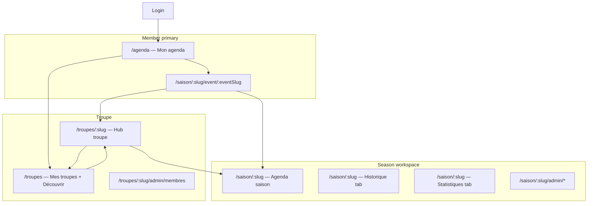

# UX Design — Troupe & saison journey, user agenda

**Author:** Sally (UX Designer)  
**Product input:** Patrice + John (PM challenge)  
**Status:** **Approved** 2026-05-24 — **Amended** 2026-05-25 per [ADR 0013](../../docs/adr/0013-troupe-navigation-equity-tags-event-slugs.md) and Design Thinking session  
**Scope:** Member entry, user agenda, troupe directory & hub, season workspace, event navigation — screen by screen

> **Amendment note (2026-06-10):** Hub troupe = dashboard collectif **Ma troupe** (nav 4ᵉ onglet) ; event detail sans breadcrumb troupe/saison — voir [ux-design-ma-troupe-hub.md](./ux-design-ma-troupe-hub.md). Supersedes Screen 4 grid-first layout and Screen 6 breadcrumb E8.

---

## Design principles (locked for this pass)

1. **Member lands in action** — no stub home; agenda or last deep link.
2. **One row per HatCast event** — inter-troupe matches never merge in the agenda.
3. **Troupe + Saison always visible** where context could confuse (agenda rows, breadcrumb on deep screens). **[ADR-0013]**
4. **Pseudo = troupe scope only** — on troupe hub via **Préférences** (secondary), not primary chrome. **[ADR-0013]**
5. **Admin density vs member clarity** — admin actions via **scope gear menu** inline in view toolbar (not breadcrumb-row ⚙, not full-width strip); member agenda keeps V1 “spectacle” mood where feasible (UX-DR11).

---

## Shared chrome **[ADR-0013]**

> **Screen-level detail (gear placement, menu entries):** [ux-design-scope-admin-menu-epic17.md](./ux-design-scope-admin-menu-epic17.md) — approved 2026-05-25.

### `app-context-breadcrumb`

| Viewport | Left chrome |
|----------|-------------|
| **Desktop** | `[logo] Troupe › Saison › Spectacle` — troupe logo+name links to hub; current leaf not linked |
| **Mobile** | **Troupe logo only** (tap → `/troupes/:slug`); saison + spectacle titles in page body below |

- User avatar menu stays **top-right** (Compte, Déconnexion).
- **No ⚙** in global header.

### `app-scope-admin-menu` (inline in view chrome, role-gated)

One gear control per screen; **`mat-menu`** when multiple entries. **Not** a full-width row below the header.

| Screen | Placement | Typical menu entries |
|--------|-----------|----------------------|
| Troupe hub | Hero / top actions row | Membres, … |
| Season workspace | **Right of** Agenda \| Historique toggles | Participants, Organisateur·ices, … |
| Event detail | Right of tab bar (or actions cluster) | Season-level links + event-scoped actions |

Hidden when user lacks permissions (`items.length === 0`). Optional `aria-label` includes scope (e.g. « Administration de la saison »).

---

## Information architecture (target) **[ADR-0013]**



**Route aliases (transition only):**

- `/ligue/:slug` → `/saison/:slug` (and event paths)
- `/seasons` → `/troupes` (default: Mes troupes)
- `/troupe/:slug` → `/troupes/:slug` if encountered
- `/accueil` → `/agenda`

---

## Screen 1 — Connexion (`/connexion`)

**Persona:** Léa, returning member on phone.

**Purpose:** Authenticate; **no product chrome** beyond brand + form.

| Zone | Behaviour |
|------|-----------|
| Form | Google + email/password (unchanged Epic 1) |
| Success | **Never** `/accueil`. Router decides next screen (Screen 2 rules) |

**Post-login routing (UX-DR13):**

| Condition | Destination |
|-----------|-------------|
| Valid stored deep link (e.g. event URL) | That URL |
| Valid `lastVisitedSeason` slug + optional tab | `/saison/:slug` (agenda tab) |
| Else | `/agenda` |

**Acceptance hints:**

- [ ] Zero intermediate “Bienvenue” card
- [ ] Deep links from notifications still work (slug URLs when 17.6 shipped)

---

## Screen 2 — Mon agenda (`/agenda`) — **primary member hub**

**Persona:** Léa — “Qu’est-ce que j’ai bientôt, toutes troupes confondues ?”

**Purpose:** Unified upcoming events for all **season participations** across troupes.

### Chrome

| Zone | Content |
|------|---------|
| **Title** | **Mon agenda** |
| **Breadcrumb** | Optional desktop: `Mon agenda` (root — no parent) |
| **Top-right** | User avatar menu (Compte, Déconnexion) |
| **No back** | This is root for signed-in members |

### Filters (header / toolbar — amended 2026-05-31)

> **Superseded inline bar:** [ux-design-unified-filter-panel.md](./ux-design-unified-filter-panel.md) (UX-DR22). Icon trigger + bottom sheet + active chips — no sticky pulldown row.

**Visibility (RES-001 — locked):**

| User context | Filter chrome |
|--------------|---------------|
| **1 troupe** + **1 saison** (participant) | **Hidden** (no icon) |
| **>1 troupe** and/or **>1 saison** | **`filter_list` icon only**; badge + chips when active |

When icon shown: tap opens panel (Troupe + Saison sections). Season filter scoped to selected troupe; lists seasons where user is participant.

When hidden: troupe + saison remain on **each event row** (badges).

### Event list (UX-DR14)

- **Grouped by month** (UX-DR2 language).
- **Each row = one HatCast event** — never merged.

**Row content (top → bottom):**

```
┌─────────────────────────────────────────────────────────────┐
│ 30 mai · 20h30                                              │
│ Match La BIM vs La Malice                                   │
│ 🏷 La BIM · Saison 2025-26                    [dépl.] [Dispo]│
└─────────────────────────────────────────────────────────────┘
```

- **Line 3:** **Troupe · Saison** (required badges); optional **equity tag** badge when set (e.g. `dépl.`, `apérock`) — Epic 17.8
- **Right column:** participation status cell — see **Status cell interactions** below
- **Tap row body** → Event detail (Screen 6)

### Status cell interactions (amended 2026-06-07)

Applies to **Mon agenda** (`/agenda`) and **league workspace Agenda** (upcoming only). Component: `app-agenda-participation-status`.

| `participantFocus` state | Cell | Tap on cell |
|------------------------|------|-------------|
| Not in team, dispo unknown/available/unavailable | Dispo / Pas dispo / Non renseigné | **Availability dialog** |
| In team, pending or confirmed | Role + ⏳ or violet | **Participation confirmation** dialog |
| Declined (`slotParticipationStatus: declined`, role kept) | Decline gradient + role | **Read-only** (no dispo, no modal) |

- Cell tap uses `stopPropagation` — does not open event detail.
- After successful participation update, row refreshes; **declined** must stay visible (not revert to dispo).
- **Historique:** cells read-only.

**Normative:** SPEC § Agenda participation status cell; DOMAIN § Participant focus summary.

### Empty states

| Case | Message + CTA |
|------|----------------|
| No participations | “Tu n’es inscrit·e à aucune saison pour l’instant.” + **Découvrir les troupes** → `/troupes#decouvrir` |
| No upcoming events | “Aucun spectacle à venir.” + hint to check filters |

### Secondary entry

- Link **Mes troupes** → `/troupes` (Screen 2b) — admin / multi-troupe, not daily member path.

**Acceptance hints:**

- [ ] Agenda loads without visiting `/seasons` first
- [ ] Filters + RES-001 unchanged in behaviour
- [ ] Row badges show troupe + saison (and tag when present)

---

## Screen 2b — Mes troupes & Découvrir (`/troupes`) **[ADR-0013] [Epic 17.3]**

**Persona:** Amira or Léa — “Mes collectifs” vs exploration.

**Purpose:** Replace `/seasons` as hub; separate **memberships** from **discovery**.

### Chrome

| Zone | Content |
|------|---------|
| **Breadcrumb** | `Mon agenda › Troupes` (desktop) or page title |
| **Top-right** | Avatar menu |

### Section — Mes troupes

Card grid (responsive):

```
┌─────────────────────┐
│ [logo] La Malice    │
│ 34 membres          │
│ 5 spectacles à venir│
│ [ Ouvrir ]          │
└─────────────────────┘
```

- **Ouvrir** → `/troupes/:slug` (Screen 4)
- Data: `listMyTroupes` + aggregated upcoming event count per troupe

### Section — Découvrir (below Mes troupes)

- Same card layout for **other** troupes (directory / Epic 4 partial)
- **OPEN (post-MVP):** non-member actions — read-only browse, join request, etc.

**Acceptance hints:**

- [ ] No “Administration troupe” block on this page (lives on hub Screen 4)
- [ ] `/seasons` redirects here

---

## Screen 3 — Workspace saison (`/saison/:slug` — agenda tab)

**Persona:** Léa returning after login when `lastVisitedSeason` is set, or drill-down from hub/agenda.

**Purpose:** **Season-scoped** agenda, historique, statistiques (ADR 0012 views in shell).

### Chrome **[ADR-0013]**

| Zone | Content |
|------|---------|
| **Breadcrumb** | Desktop: `[logo] Troupe › Saison title` — Mobile: logo only → body title |
| **Top-right** | Avatar menu only |
| **Toolbar right** | `app-scope-admin-menu` — gear + menu (when permitted), beside Agenda \| Historique |

**Removed vs 2026-05-24:** back chevron to `/seasons`; ⚙ in breadcrumb header row; full-width admin strip (rejected 2026-05-25).

**View switcher tabs:** Agenda | Historique | Statistiques | *(admin: Spectacles, Participants)*

**Difference from Screen 2:** Only events **in this season**; filters for participants/events within season.

---

## Screen 4 — Hub troupe (`/troupes/:slug`) **[ADR-0013] [Epic 17.4] [amended 2026-06-10]**

> **Normative (2026-06-10):** [ux-design-ma-troupe-hub.md](./ux-design-ma-troupe-hub.md).

**Persona:** Amira or Léa — collective home (J2/J3).

**Purpose:** Dashboard **Ma troupe** — saison courante, participants, teaser agenda. Entry : nav 4ᵉ onglet **Ma troupe**.

### Chrome (cible 2026-06-10)

| Zone | Content |
|------|---------|
| **Hero** | Logo + name + gear — **no** breadcrumb |
| **Section 1** | `h2` = season title ; metrics ; **Ouvrir la saison** ; switcher if >1 active season |
| **Section 2** | **Participant·es** |
| **Section 3** | **Prochains spectacles** (max 3) |
| **Footer** | **Voir les autres troupes** if ≥2 memberships |

**Acceptance hints:**

- [ ] Nav **Ma troupe** lands here
- [ ] Distinct from **Mon agenda**
- [ ] Event Infos › Contexte links here or workspace

---

## Screen 5 — Création saison (modal or `/troupes/:slug/saisons/nouvelle`)

**Persona:** Amira.

**Fields:**

- Title, description (optional), date range (optional)
- **Participants initiaux** (Story 13.3):
  - ◉ **Tous les membres actifs de la troupe**
  - ○ **Liste vide — j’ajoute ensuite**

**On save:** Navigate to `/saison/:slug`; roster sync if “all members”.

**Note [ADR-0013]:** Do **not** create a separate “saison déplacements” for away shows — use **equity tags** on events (Screen 6b). Multi-season troupes (loisir + spectacle) remain valid.

---

## Screen 6 — Détail événement (`/saison/:slug/event/:eventSlug`) **[ADR-0013] [amended 2026-06-10]**

**Persona:** Léa — dispos, compo, confirmation.

**Purpose:** Functional tabs unchanged (UX-DR4–6 in `ux-design-hatcast-v2.md`); **navigation chrome** per [ux-design-ma-troupe-hub.md](./ux-design-ma-troupe-hub.md) ED1–ED4 + [ux-design-event-detail-title-row-2026-06-06.md](./ux-design-event-detail-title-row-2026-06-06.md) E7–E12.

### Chrome

> **2026-06-10 (approved):** [ux-design-ma-troupe-hub.md](./ux-design-ma-troupe-hub.md) — **no breadcrumb** on event detail ; chevron back (history + fallback) ; **Contexte** section on Infos tab (troupe · saison + links). Title row above tabs unchanged (E7–E9).

| Zone | Content |
|------|---------|
| **Header left** | **Chevron Retour** — `history.back()` ; fallback `/agenda` or `lastMemberEntryPath` |
| **Header right** | `app-scope-admin-menu` (when permitted) |
| **Title row** | `h1` event title + composition status badge (E7–E9) |
| **Tabs** | Infos \| Dispos \| Équipe \| … |
| **Infos tab** | **Contexte** (troupe · saison + Ouvrir la saison / Voir la troupe) then Date, Lieu, Format… |
| **Removed** | `app-context-breadcrumb` troupe › saison on event detail (supersedes E8 2026-06-06) |

**Acceptance hints:**

- [ ] Event title readable line 1 (title row)
- [ ] Troupe + saison discoverable in Infos › Contexte
- [ ] Shareable slug URL (17.6)

---

## Screen 6b — Catégorie (onglet Infos) **[ADR-0013] [Epic 17.7–17.8]**

> **2026-05-25 (SCP) :** Saisie sur l’onglet **Infos** du détail spectacle (`event-infos-tab`), **pas** dans `EventFormDialog`. Voir [sprint-change-proposal-2026-05-25-epic17-event-form-ux.md](sprint-change-proposal-2026-05-25-epic17-event-form-ux.md).  
> **Libellé UI (DOMAIN / ADR 0013) :** section **Catégorie** (champ API `category` ; ex-`equityTag` / « Groupe de spectacles » en UX 2026-05-25).  
> **2026-06-08 :** phrase d’aide **inline** sur l’onglet Infos (même copy que la modale) — le libellé seul était trop cryptique en bas de fiche.  
> **2026-06-08 (rev. 2) :** section **toujours visible** ; défaut affiché **Spectacle ordinaire** (plus de CTA « Choisir une catégorie ») ; copy d’aide révisée (voir § 6c–6d pour Format et Organisateur·ices).

**Context:** Event detail → tab **Infos** — not a separate route; not in create/edit dialog.

| Field | Behaviour |
|-------|-----------|
| **Section label** | **Catégorie** (small caps, same pattern as other Infos fields) |
| **Inline help** | Toujours visible. Texte secondaire sous le libellé, `on-surface-variant`, ~0.8125rem ; `aria-describedby` sur la section. **Même copy** que dialog hint (single constant `CATEGORY_HELP`). |
| **Help copy (FR)** | *« Choisis la catégorie dans laquelle ce spectacle comptera pour les statistiques et les tirages. »* |
| **Empty / default state** | Chip **Spectacle ordinaire** (`DEFAULT_CATEGORY_DISPLAY_LABEL`) — pool principal implicite ; pas de CTA « Choisir » ; chip cliquable si `canManageEvents` pour ouvrir la modale |
| **Set state** | Chip avec libellé glossaire ; `×` retire la catégorie → retour **Spectacle ordinaire** ; chip click rouvre dialog |
| **Dialog** | Title **Catégorie**; field **Catégorie (optionnelle)**; autocomplete against troupe glossary; type unknown → create category |
| **Help (dialog)** | `mat-hint` — **identical** copy to inline help on tab |
| **Rule** | **At most one** category per event — chip click (orga) opens dialog to assign/switch ; **×** clears custom category → **Spectacle ordinaire** |

**Not in UI:** « Principal » as selectable option in dialog ; category field in `EventFormDialog`. **Format** (`templateType`: match, cabaret…) — on Infos via modales (**17.14**).

**List surfaces:** optional small badge on agenda rows when category set.

**Stats/draw:** Epic 17.9–17.10 — DEPLACEMENT column driven by category `deplacements`, not travel season.

---

## Screen 6c — Format et besoins (onglet Infos) **[Epic 17.14]**

> **2026-06-08 :** phrase d’aide **inline** sur l’onglet Infos — même pattern que Catégorie (§ 6b).

| Field | Behaviour |
|-------|-----------|
| **Section label** | **Format et besoins** |
| **Inline help** | Toujours visible (section affichée pour tous). Texte secondaire sous le libellé, `on-surface-variant`, ~0.8125rem ; `aria-describedby` sur la section. **Même copy** que la modale (`FORMAT_AND_ROLES_HELP`). |
| **Help copy (FR)** | *« Format du spectacle et effectifs par rôle nécessaires pour composer l’équipe. »* |
| **Dialog** | Titre **Format et besoins** ; intro identique au help inline |

---

## Screen 6d — Organisateur·ices (onglet Infos) **[Epic 17.15]**

> **2026-06-08 :** phrase d’aide **inline** — complète la modale d’ajout (intro actionnelle distincte).

| Field | Behaviour |
|-------|-----------|
| **Section label** | **Organisateur·ices** |
| **Inline help** | Visible quand la section est affichée (`canManageEventOrganizers` ou au moins un organisateur). Texte secondaire, `aria-describedby`. Constante `ORGANIZERS_HELP`. |
| **Help copy (FR)** | *« Personnes spécifiquement désignées pour gérer l’organisation et la composition du spectacle. »* |
| **Dialog ajout** | Intro actionnelle inchangée (*« Cette personne pourra gérer… »*) — complémentaire, pas identique |

---

## Screen 7 — Admin Membres (`/troupes/:slug/admin/membres`)

**Status:** Shipped (Story 17.11) — breadcrumb aligned with 17.1

- From troupe hub **scope gear menu** → Membres
- Redirect legacy `/troupe/:slug/admin/membres` → `/troupes/:slug/admin/membres`
- **Chrome:** `[logo] Troupe › Membres` (troupe hub route) or `Troupe › Saison › Membres` (legacy `/saison/:slug/admin/membres`); no chevron back; account menu top-right

No layout redesign in MVP; optional polish Story 2.11.

---

## Screen 8 — Participants saison (`/saison/:slug/admin/participants`)

**Status:** Shipped (Story 17.11) — breadcrumb aligned with 17.1

- UI labels: **Saison** / Participants (not Ligue)
- Entry: season `app-scope-admin-menu` (toolbar gear)
- **Chrome:** `Troupe › Saison (link) › Participants` (leaf); no chevron back; mobile title below header
- Event-only participant admin: route `/saison/:slug/event/:eventSlug/admin/participants` (`AdminEventParticipants`) — story **17.16**; supersedes dialog from **17.15**

---

## Screen 9 — Découvrir (public directory) — Epic 4

**Entry:** `/troupes` section **Découvrir**; troupe hub “Explorer”; marketing.

**Card →** public troupe page → **Demander à rejoindre** *(future)*.

**Distinct from Screen 2b Mes troupes** — same route `/troupes`, different section.

---

## Screen 10 — Compte (`/compte`)

**Updates:**

- Pseudo **per troupe** blocks (or link to troupe hub Préférences)
- **Preferred roles** (AC10)
- No season-specific settings here

---

## Deprecated / removed

| Screen / pattern | Fate |
|------------------|------|
| `/accueil` | Redirect `/agenda` |
| `/seasons` as hub | Redirect `/troupes` |
| `/ligue/:slug` as canonical | Redirect `/saison/:slug` |
| **UX-DR15** context strip | Replaced by **UX-DR19** breadcrumb |
| Header ⚙ for admin | Replaced by **UX-DR20** scope bar |
| Travel league for déplacements | Replaced by **UX-DR21** equity tags |
| `/troupe/:slug` hub path | Use `/troupes/:slug` |

---

## UX-DR register

| ID | Summary | Status |
|----|---------|--------|
| **UX-DR13** | Post-login routing; no stub home; last season + deep links | Active |
| **UX-DR14** | User agenda — multi-season, filters when >1 troupe or saison, one row per event | Active |
| **UX-DR15** | Event context strip — troupe + ligue + nav links | **Deprecated** → UX-DR19 |
| **UX-DR16** | Troupe hub — seasons list, prefs, admin, directory | **Amended** (routes, chrome) |
| **UX-DR17** | Season creation — roster mode (all members vs manual) | Active |
| **UX-DR18** | Multi-active seasons — several active cards on troupe hub | Active |
| **UX-DR19** | Breadcrumb — desktop full path; mobile troupe logo only; links to hub | **New** ADR 0013 |
| **UX-DR20** | Scope admin bar below header (troupe / saison / spectacle) | **New** ADR 0013 |
| **UX-DR21** | **Catégorie** on Infos tab — **always visible** ; chip **Spectacle ordinaire** when `category` null ; inline help ; chip click (orga) → category dialog ; **×** → ordinaire ; one category max | **Amended** 2026-06-08 |
| **UX-DR22** | **Format et besoins** on Infos — inline help under label ; same copy in type/roles dialog (**17.14**) | **New** 2026-06-08 |
| **UX-DR23** | **Organisateur·ices** on Infos — inline help when section visible (`canManageEventOrganizers` or ≥1 organizer) ; distinct from add-dialog intro (**17.15**) | **New** 2026-06-08 |

---

## Sally → Patrice: edge cases to feel in review

1. **Same slug, two troupes** — agenda shows two rows; event detail never cross-loads wrong troupe.
2. **Season participant but not troupe member** — row in agenda; troupe hub may 403; event detail works in season scope.
3. **Archived season** — events leave member agenda; visible on historique with admin filter.
4. **Filter bar hidden (single troupe + single saison)** — badges on rows sufficient.
5. **[ADR-0013] Mobile breadcrumb** — logo-only sufficient? saison name in H1 below.
6. **[ADR-0013] Tag mid-season** — adding `apérock` tag does not retro-change past draws; forward-only for new events unless migration policy defined.

---

## Implementation order

- **Epic 17.1–17.5** — navigation (this document Screens 2b, 3, 4, 6 chrome + shared components)
- **Epic 17.11** — admin back-office breadcrumb (Screens 7–8; closes LIMIT-002)
- **Epic 17.6** — event slugs (Screen 6 URLs)
- **Epic 17.7–17.8** — Screen 6b
- **Epic 17.9–17.10** — draw/stats (see ADR 0013; `ux-design-hatcast-v2` for composition tabs)

*Approved 2026-05-24 by Patrice (RES-001). Amended 2026-05-25 for ADR 0013 / Epic 17.*
