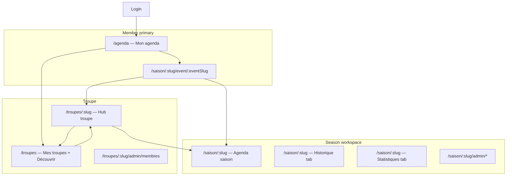

# UX Design — Troupe & saison journey, user agenda

**Author:** Sally (UX Designer)  
**Product input:** Patrice + John (PM challenge)  
**Status:** **Approved** 2026-05-24 — **Amended** 2026-05-25 per [ADR 0013](../../docs/adr/0013-troupe-navigation-equity-tags-event-slugs.md) and Design Thinking session  
**Scope:** Member entry, user agenda, troupe directory & hub, season workspace, event navigation — screen by screen

> **Amendment note (2026-05-25):** French UI uses **Saison** (not Ligue) for the `season` entity. Canonical routes: `/saison/:slug`, `/troupes`, `/troupes/:slug`, `/saison/:slug/event/:eventSlug`. `/ligue/*` redirects to `/saison/*`. Sections marked **[ADR-0013]** supersede the 2026-05-24 text. Equity **tags** replace travel leagues for déplacements (ADR 0012 §3 superseded). Implementation: **Epic 17**.

---

## Design principles (locked for this pass)

1. **Member lands in action** — no stub home; agenda or last deep link.
2. **One row per HatCast event** — inter-troupe matches never merge in the agenda.
3. **Troupe + Saison always visible** where context could confuse (agenda rows, breadcrumb on deep screens). **[ADR-0013]**
4. **Pseudo = troupe scope only** — on troupe hub via **Préférences** (secondary), not primary chrome. **[ADR-0013]**
5. **Admin density vs member clarity** — admin actions via **scope gear menu** inline in view toolbar (not breadcrumb-row ⚙, not full-width strip); member agenda keeps V1 “spectacle” mood where feasible (UX-DR11).

---

## Shared chrome **[ADR-0013]**

> **Screen-level detail (gear placement, menu entries):** [ux-design-scope-admin-menu-epic17.md](./ux-design-scope-admin-menu-epic17.md) — approved 2026-05-25.

### `app-context-breadcrumb`

| Viewport | Left chrome |
|----------|-------------|
| **Desktop** | `[logo] Troupe › Saison › Spectacle` — troupe logo+name links to hub; current leaf not linked |
| **Mobile** | **Troupe logo only** (tap → `/troupes/:slug`); saison + spectacle titles in page body below |

- User avatar menu stays **top-right** (Compte, Déconnexion).
- **No ⚙** in global header.

### `app-scope-admin-menu` (inline in view chrome, role-gated)

One gear control per screen; **`mat-menu`** when multiple entries. **Not** a full-width row below the header.

| Screen | Placement | Typical menu entries |
|--------|-----------|----------------------|
| Troupe hub | Hero / top actions row | Membres, … |
| Season workspace | **Right of** Agenda \| Historique toggles | Participants, Organisateur·ices, … |
| Event detail | Right of tab bar (or actions cluster) | Season-level links + event-scoped actions |

Hidden when user lacks permissions (`items.length === 0`). Optional `aria-label` includes scope (e.g. « Administration de la saison »).

---

## Information architecture (target) **[ADR-0013]**



**Route aliases (transition only):**

- `/ligue/:slug` → `/saison/:slug` (and event paths)
- `/seasons` → `/troupes` (default: Mes troupes)
- `/troupe/:slug` → `/troupes/:slug` if encountered
- `/accueil` → `/agenda`

---

## Screen 1 — Connexion (`/connexion`)

**Persona:** Léa, returning member on phone.

**Purpose:** Authenticate; **no product chrome** beyond brand + form.

| Zone | Behaviour |
|------|-----------|
| Form | Google + email/password (unchanged Epic 1) |
| Success | **Never** `/accueil`. Router decides next screen (Screen 2 rules) |

**Post-login routing (UX-DR13):**

| Condition | Destination |
|-----------|-------------|
| Valid stored deep link (e.g. event URL) | That URL |
| Valid `lastVisitedSeason` slug + optional tab | `/saison/:slug` (agenda tab) |
| Else | `/agenda` |

**Acceptance hints:**

- [ ] Zero intermediate “Bienvenue” card
- [ ] Deep links from notifications still work (slug URLs when 17.6 shipped)

---

## Screen 2 — Mon agenda (`/agenda`) — **primary member hub**

**Persona:** Léa — “Qu’est-ce que j’ai bientôt, toutes troupes confondues ?”

**Purpose:** Unified upcoming events for all **season participations** across troupes.

### Chrome

| Zone | Content |
|------|---------|
| **Title** | **Mon agenda** |
| **Breadcrumb** | Optional desktop: `Mon agenda` (root — no parent) |
| **Top-right** | User avatar menu (Compte, Déconnexion) |
| **No back** | This is root for signed-in members |

### Filters (sticky below title)

**Visibility (RES-001 — locked):**

| User context | Filter bar |
|--------------|------------|
| **1 troupe** + **1 saison** (participant) | **Hidden** |
| **>1 troupe** and/or **>1 saison** | **Shown** |

When shown:

```
[ Toutes les troupes ▾ ]  [ Toutes les saisons ▾ ]     [ Effacer filtres ]
```

- Season filter: scoped to selected troupe(s); lists seasons where user is participant.
- When hidden: troupe + saison remain on **each event row** (badges).

### Event list (UX-DR14)

- **Grouped by month** (UX-DR2 language).
- **Each row = one HatCast event** — never merged.

**Row content (top → bottom):**

```
┌─────────────────────────────────────────────────────────────┐
│ 30 mai · 20h30                                              │
│ Match La BIM vs La Malice                                   │
│ 🏷 La BIM · Saison 2025-26                    [dépl.] [Dispo]│
└─────────────────────────────────────────────────────────────┘
```

- **Line 3:** **Troupe · Saison** (required badges); optional **equity tag** badge when set (e.g. `dépl.`, `apérock`) — Epic 17.8
- **Tap row** → Event detail (Screen 6)

### Empty states

| Case | Message + CTA |
|------|----------------|
| No participations | “Tu n’es inscrit·e à aucune saison pour l’instant.” + **Découvrir les troupes** → `/troupes#decouvrir` |
| No upcoming events | “Aucun spectacle à venir.” + hint to check filters |

### Secondary entry

- Link **Mes troupes** → `/troupes` (Screen 2b) — admin / multi-troupe, not daily member path.

**Acceptance hints:**

- [ ] Agenda loads without visiting `/seasons` first
- [ ] Filters + RES-001 unchanged in behaviour
- [ ] Row badges show troupe + saison (and tag when present)

---

## Screen 2b — Mes troupes & Découvrir (`/troupes`) **[ADR-0013] [Epic 17.3]**

**Persona:** Amira or Léa — “Mes collectifs” vs exploration.

**Purpose:** Replace `/seasons` as hub; separate **memberships** from **discovery**.

### Chrome

| Zone | Content |
|------|---------|
| **Breadcrumb** | `Mon agenda › Troupes` (desktop) or page title |
| **Top-right** | Avatar menu |

### Section — Mes troupes

Card grid (responsive):

```
┌─────────────────────┐
│ [logo] La Malice    │
│ 34 membres          │
│ 5 spectacles à venir│
│ [ Ouvrir ]          │
└─────────────────────┘
```

- **Ouvrir** → `/troupes/:slug` (Screen 4)
- Data: `listMyTroupes` + aggregated upcoming event count per troupe

### Section — Découvrir (below Mes troupes)

- Same card layout for **other** troupes (directory / Epic 4 partial)
- **OPEN (post-MVP):** non-member actions — read-only browse, join request, etc.

**Acceptance hints:**

- [ ] No “Administration troupe” block on this page (lives on hub Screen 4)
- [ ] `/seasons` redirects here

---

## Screen 3 — Workspace saison (`/saison/:slug` — agenda tab)

**Persona:** Léa returning after login when `lastVisitedSeason` is set, or drill-down from hub/agenda.

**Purpose:** **Season-scoped** agenda, historique, statistiques (ADR 0012 views in shell).

### Chrome **[ADR-0013]**

| Zone | Content |
|------|---------|
| **Breadcrumb** | Desktop: `[logo] Troupe › Saison title` — Mobile: logo only → body title |
| **Top-right** | Avatar menu only |
| **Toolbar right** | `app-scope-admin-menu` — gear + menu (when permitted), beside Agenda \| Historique |

**Removed vs 2026-05-24:** back chevron to `/seasons`; ⚙ in breadcrumb header row; full-width admin strip (rejected 2026-05-25).

**View switcher tabs:** Agenda | Historique | Statistiques | *(admin: Spectacles, Participants)*

**Difference from Screen 2:** Only events **in this season**; filters for participants/events within season.

---

## Screen 4 — Hub troupe (`/troupes/:slug`) **[ADR-0013] [Epic 17.4]**

**Persona:** Amira — “Tout ce qui concerne La Malice.”

**Purpose:** Troupe identity, **seasons** list, admin entry, low-priority member prefs.

### Chrome

| Zone | Content |
|------|---------|
| **Breadcrumb** | `Troupes › La Malice` (desktop) / logo slot (mobile) |
| **Hero** | Large **logo + name** (centred or left per layout) |
| **Hero / actions row** | `app-scope-admin-menu` — gear (TROUPE_ADMIN) |
| **Top-right** | Avatar menu |

### Block — Saisons **[ADR-0013]**

```
Saisons                           [ + Nouvelle saison ]  (admin only)

┌──────────────────────────────────────┐
│ Saison 2025-26 · active              │
│ 12 événements · 18 participants      │
└──────────────────────────────────────┘

[ Afficher les saisons archivées ]
```

- Card tap → `/saison/:slug`
- Admin: create season (Screen 5) — Story 13.3 roster modes when multi-season epic ships

### Block — Préférences (secondary) **[ADR-0013]**

- Icon control **Préférences dans cette troupe** → drawer/sheet:
  - **Pseudo** troupe (FR9)
  - **Rôles préférés** (AC10)
- Not inline in hero (low prominence)

### Block — Découverte

- **Explorer d’autres troupes** → `/troupes#decouvrir`

**Acceptance hints:**

- [ ] Multiple active seasons visible when applicable (ADR 0011)
- [ ] Membres admin via scope gear menu, not `/seasons`
- [ ] Event detail troupe link lands here (not admin membres)

---

## Screen 5 — Création saison (modal or `/troupes/:slug/saisons/nouvelle`)

**Persona:** Amira.

**Fields:**

- Title, description (optional), date range (optional)
- **Participants initiaux** (Story 13.3):
  - ◉ **Tous les membres actifs de la troupe**
  - ○ **Liste vide — j’ajoute ensuite**

**On save:** Navigate to `/saison/:slug`; roster sync if “all members”.

**Note [ADR-0013]:** Do **not** create a separate “saison déplacements” for away shows — use **equity tags** on events (Screen 6b). Multi-season troupes (loisir + spectacle) remain valid.

---

## Screen 6 — Détail événement (`/saison/:slug/event/:eventSlug`) **[ADR-0013]**

**Persona:** Léa — dispos, compo, confirmation.

**Purpose:** Functional tabs unchanged (UX-DR4–6 in `ux-design-hatcast-v2.md`); **navigation chrome** per ADR 0013.

### Chrome

| Zone | Content |
|------|---------|
| **Breadcrumb** | `[logo] Troupe › Saison › Event title` (mobile: logo + titles in body) |
| **Top-right** | Avatar; event overflow ⋮ if needed (not global ⚙) |
| **Infos tab** (top-right) | Single `app-scope-admin-menu` — gear merges season admin + Modifier/Archiver (no ⋮ kebab) |

**Removed vs 2026-05-24:** chevron back; **context strip** (`La Malice · Ligue…`) — redundant with breadcrumb.

**Acceptance hints:**

- [ ] User always knows troupe + saison (breadcrumb + aria)
- [ ] Shareable slug URL (17.6)
- [ ] Inter-troupe event never cross-loads wrong troupe

---

## Screen 6b — Tag d’équité (event form) **[ADR-0013] [Epic 17.7–17.8]**

**Context:** Create/edit spectacle dialog (`EventFormDialog`) — not a separate route.

| Field | Behaviour |
|-------|-----------|
| **Tag (optionnel)** | Autocomplete against troupe glossary; type unknown → create tag |
| **Clear** | `×` removes tag → **principal** equity (default, **not shown** as option) |
| **Help** | Inline: participations count toward separate chance/draw/stat pool when tagged |
| **Rule** | **At most one** tag per event |

**Not in UI:** “Principal” radio; `templateType` (match, cabaret…) remains separate field.

**List surfaces:** optional small badge on agenda rows when tag set.

**Stats/draw:** Epic 17.9–17.10 — DEPLACEMENT column driven by tag `deplacements`, not travel season.

---

## Screen 7 — Admin Membres (`/troupes/:slug/admin/membres`)

**Status:** Shipped (Story 2.8) — **chrome alignment → Story 17.11** (LIMIT-002)

- From troupe hub **scope gear menu** → Membres
- Redirect legacy `/troupe/:slug/admin/membres` → `/troupes/:slug/admin/membres`
- **Gap:** chevron back, no breadcrumb (align with 17.1 — follow-up doc § Follow-up)

No layout redesign in MVP; optional polish Story 2.11.

---

## Screen 8 — Participants saison (`/saison/:slug/admin/participants`)

**Status:** Exists (Story 3.8) — **chrome alignment → Story 17.11** (LIMIT-002)

- UI labels: **Saison** / Participants (not Ligue)
- Entry: season `app-scope-admin-menu` (toolbar gear)
- **Planned (17.11):** replace chevron header with breadcrumb per [17-11-breadcrumb-pages-admin-back-office.md](../implementation-artifacts/17-11-breadcrumb-pages-admin-back-office.md)

---

## Screen 9 — Découvrir (public directory) — Epic 4

**Entry:** `/troupes` section **Découvrir**; troupe hub “Explorer”; marketing.

**Card →** public troupe page → **Demander à rejoindre** *(future)*.

**Distinct from Screen 2b Mes troupes** — same route `/troupes`, different section.

---

## Screen 10 — Compte (`/compte`)

**Updates:**

- Pseudo **per troupe** blocks (or link to troupe hub Préférences)
- **Preferred roles** (AC10)
- No season-specific settings here

---

## Deprecated / removed

| Screen / pattern | Fate |
|------------------|------|
| `/accueil` | Redirect `/agenda` |
| `/seasons` as hub | Redirect `/troupes` |
| `/ligue/:slug` as canonical | Redirect `/saison/:slug` |
| **UX-DR15** context strip | Replaced by **UX-DR19** breadcrumb |
| Header ⚙ for admin | Replaced by **UX-DR20** scope bar |
| Travel league for déplacements | Replaced by **UX-DR21** equity tags |
| `/troupe/:slug` hub path | Use `/troupes/:slug` |

---

## UX-DR register

| ID | Summary | Status |
|----|---------|--------|
| **UX-DR13** | Post-login routing; no stub home; last season + deep links | Active |
| **UX-DR14** | User agenda — multi-season, filters when >1 troupe or saison, one row per event | Active |
| **UX-DR15** | Event context strip — troupe + ligue + nav links | **Deprecated** → UX-DR19 |
| **UX-DR16** | Troupe hub — seasons list, prefs, admin, directory | **Amended** (routes, chrome) |
| **UX-DR17** | Season creation — roster mode (all members vs manual) | Active |
| **UX-DR18** | Multi-active seasons — several active cards on troupe hub | Active |
| **UX-DR19** | Breadcrumb — desktop full path; mobile troupe logo only; links to hub | **New** ADR 0013 |
| **UX-DR20** | Scope admin bar below header (troupe / saison / spectacle) | **New** ADR 0013 |
| **UX-DR21** | Equity tag on event — optional autocomplete; principal implicit | **New** ADR 0013 |

---

## Sally → Patrice: edge cases to feel in review

1. **Same slug, two troupes** — agenda shows two rows; event detail never cross-loads wrong troupe.
2. **Season participant but not troupe member** — row in agenda; troupe hub may 403; event detail works in season scope.
3. **Archived season** — events leave member agenda; visible on historique with admin filter.
4. **Filter bar hidden (single troupe + single saison)** — badges on rows sufficient.
5. **[ADR-0013] Mobile breadcrumb** — logo-only sufficient? saison name in H1 below.
6. **[ADR-0013] Tag mid-season** — adding `apérock` tag does not retro-change past draws; forward-only for new events unless migration policy defined.

---

## Implementation order

- **Epic 17.1–17.5** — navigation (this document Screens 2b, 3, 4, 6 chrome + shared components)
- **Epic 17.11** — admin back-office breadcrumb (Screens 7–8; closes LIMIT-002)
- **Epic 17.6** — event slugs (Screen 6 URLs)
- **Epic 17.7–17.8** — Screen 6b
- **Epic 17.9–17.10** — draw/stats (see ADR 0013; `ux-design-hatcast-v2` for composition tabs)

*Approved 2026-05-24 by Patrice (RES-001). Amended 2026-05-25 for ADR 0013 / Epic 17.*
