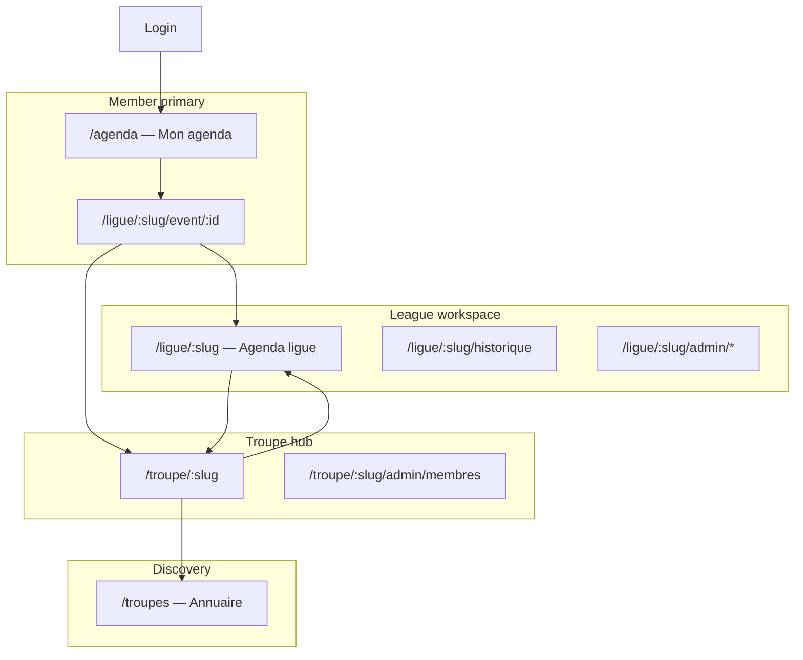

# UX Design — League journey & user agenda

**Author:** Sally (UX Designer)  
**Product input:** Patrice + John (PM challenge)  
**Status:** **Approved** — Patrice, 2026-05-24 (reserve RES-001: filtres agenda masqués si une seule troupe et une seule ligue)  
**Scope:** Member entry, user agenda, troupe hub, league workspace, event navigation — screen by screen

---

## Design principles (locked for this pass)

1. **Member lands in action** — no stub home; agenda or last deep link.
2. **One row per HatCast event** — inter-troupe matches never merge in the agenda.
3. **Troupe + Ligue always visible** where context could confuse (agenda rows, event header).
4. **Pseudo = troupe scope only** — never on account or league screens.
5. **Admin density vs member clarity** — troupe/league admin can stay Material-clinical; member agenda keeps V1 “spectacle” mood where feasible (UX-DR11).

---

## Information architecture (target)



**Route aliases (transition):** `/saison/:slug` → `/ligue/:slug`; `/seasons` → troupe hub or legacy redirect.

---

## Screen 1 — Connexion (`/connexion`)

**Persona:** Léa, returning member on phone.

**Purpose:** Authenticate; **no product chrome** beyond brand + form.

| Zone | Behaviour |
|------|-----------|
| Form | Google + email/password (unchanged Epic 1) |
| Success | **Never** `/accueil`. Router decides next screen (Screen 2 rules) |

**Post-login routing (UX-DR13):**

| Condition | Destination |
|-----------|-------------|
| Valid stored deep link (e.g. event URL) | That URL |
| Valid `lastVisitedLeague` + optional tab | `/ligue/:slug` (agenda tab) |
| Else | `/agenda` |

**Acceptance hints:**

- [ ] Zero intermediate “Bienvenue” card
- [ ] Deep links from notifications still work

---

## Screen 2 — Mon agenda (`/agenda`) — **NEW primary hub**

**Persona:** Léa — “Qu’est-ce que j’ai bientôt, toutes troupes confondues ?”

**Purpose:** Unified upcoming events for all **league participations** across troupes.

### Chrome

| Zone | Content |
|------|---------|
| **Title** | **Mon agenda** |
| **Top-right** | User avatar menu (Compte, Déconnexion) |
| **No back** | This is root for signed-in members |

### Filters (sticky below title)

**Visibility (RES-001 — locked):**

| User context | Filter bar |
|--------------|------------|
| **1 troupe** + **1 ligue** (participant) | **Hidden** — filtres superflus ; pas de chrome inutile |
| **>1 troupe** and/or **>1 ligue** | **Shown** — barre ci-dessous |
| User gains a 2nd troupe or ligue later | Barre apparaît au prochain chargement (ou après refresh contexte) |

When shown:

```
[ Toutes les troupes ▾ ]  [ Toutes les ligues ▾ ]     [ Effacer filtres ]
```

- Troupe filter: dropdown or chips when `activeTroupes.length > 1`.
- League filter: scoped to selected troupe(s); lists only leagues where user is participant; default = all.
- Filters persist in session (optional localStorage) **only when bar is visible**.

When hidden: troupe + ligue remain visible **on each event row** (badges) so context is never lost.

### Event list (UX-DR14)

- **Grouped by month** (same visual language as UX-DR2).
- **Each row = one HatCast event** — never merged.

**Row content (top → bottom):**

```
┌─────────────────────────────────────────────────────────────┐
│ 30 mai · 20h30                                              │
│ Match La BIM vs La Malice                                   │
│ 🏷 La BIM · Ligue Compétition 2026:26          [Dispo ●]   │
└─────────────────────────────────────────────────────────────┘
```

- **Line 1:** Date/time
- **Line 2:** Event title
- **Line 3:** **Troupe · Ligue** (required badges); user dispo pill if participant
- **Tap row** → Event detail (Screen 6)

**Cross-troupe scenario (BIM + Malice member):** Two rows, same date/title pattern, different troupe badge — user instantly sees which team they’re planning for.

### Empty states

| Case | Message + CTA |
|------|----------------|
| No participations | “Tu n’es inscrit·e à aucune ligue pour l’instant.” + link **Découvrir les troupes** |
| No upcoming events | “Aucun spectacle à venir.” + muted hint to check filters |

### Secondary entry

- Link **Mes troupes** → Troupe picker or list (Screen 4) — for admin tasks, not daily member path.

**Acceptance hints:**

- [ ] Agenda loads without visiting `/seasons` first
- [ ] Two troupes → two rows for inter-troupe match
- [ ] Filters reduce list when bar visible; **bar hidden** when single troupe + single league
- [ ] With bar hidden, row badges still show troupe + ligue

---

## Screen 3 — Dernière ligue visitée (`/ligue/:slug` — agenda tab)

**Persona:** Léa returning after login when `lastVisitedLeague` is set.

**Purpose:** **League-scoped workspace** — same as today’s season-home Agenda, but entered from habit/V1 parity until user adopts global agenda.

**Chrome (UX-DR2, updated):**

| Left | Centre | Right |
|------|--------|-------|
| Back → **`/agenda`** (not `/seasons`) | Troupe logo + **League title** | ⚙ settings + avatar |

**View switcher tabs:** Agenda | Historique | *(admin: Spectacles, Participants)*

**Difference from Screen 2:** Only events **in this league**; filters for participants/events within league.

---

## Screen 4 — Hub troupe (`/troupe/:slug`) — **NEW**

**Persona:** Amira — “Tout ce qui concerne La Malice.”

**Purpose:** Troupe identity, leagues, admin entry, discovery upward.

### Header

- Troupe **logo + name**
- User menu (top-right)
- Back → **`/agenda`** or annuaire if arrived from discovery

### Block A — Mon profil dans cette troupe

- **Pseudo** (editable inline or link → compte section troupe) — FR9
- Avatar (account-level, display only here)

### Block B — Ligues

```
Ligues actives                    [ + Nouvelle ligue ]  (admin only)

┌──────────────────────────────────────┐
│ 🎭 Ligue Spectacle 2025-26           │
│ 12 événements · 18 participants      │
└──────────────────────────────────────┘
┌──────────────────────────────────────┐
│ 🎯 Ligue Loisir                      │
│ 4 événements · 22 participants       │
└──────────────────────────────────────┘

[ Afficher les ligues archivées ]
```

- Card tap → `/ligue/:slug`
- Admin: create league (Screen 5)

### Block C — Administration (role-gated)

- **Membres** → existing admin route
- **Paramètres troupe** *(future)*

### Block D — Découverte

- **Explorer d’autres troupes** → `/troupes` (Epic 4)

**Acceptance hints:**

- [ ] Multiple active leagues visible simultaneously
- [ ] Archived leagues hidden until toggle
- [ ] Non-admin sees Block B read-only, no create

---

## Screen 5 — Création ligue (modal or `/troupe/:slug/ligues/nouvelle`)

**Persona:** Amira.

**Fields:**

- Title, description (optional), date range (optional)
- **Participants initiaux:**
  - ◉ **Tous les membres actifs de la troupe**
  - ○ **Liste vide — j’ajoute ensuite**

**On save:** Navigate to new league workspace; if “all members”, roster sync job runs (Story 13.3).

---

## Screen 6 — Détail événement (`/ligue/:slug/event/:id`)

**Persona:** Léa — dispos, compo, confirmation.

**Purpose:** Unchanged functional tabs (UX-DR4–6); **navigation chrome updated**.

### Header (UX-DR15)

| Left | Centre | Right |
|------|--------|-------|
| Back → **league agenda** or **user agenda** (stack-aware) | Type icon + title + date | ⋮ + avatar |

### Context strip (NEW — below header)

```
La Malice · Ligue Compétition 2025-26
[ Voir la ligue ]  [ Voir la troupe ]
```

- **Voir la ligue** → `/ligue/:slug`
- **Voir la troupe** → `/troupe/:troupeSlug`

**Acceptance hints:**

- [ ] User always knows which troupe’s team they’re planning
- [ ] Inter-troupe event never shows other troupe’s composition

---

## Screen 7 — Admin Membres (`/troupe/:slug/admin/membres`)

**Status:** Shipped (Story 2.8) — **entry paths updated only**

- From troupe hub Block C
- From league ⚙ if season-organizer-only edge case (legacy alias)

No layout redesign in MVP; optional polish Story 2.11.

---

## Screen 8 — Participants ligue (`/ligue/:slug/admin/participants`)

**Status:** Exists (Story 3.8) — rename labels Saison → Ligue in UI.

---

## Screen 9 — Annuaire troupes (`/troupes`) — Epic 4

**Entry:** Troupe hub Block D; marketing site.

**Card →** public troupe page → **Demander à rejoindre** *(future story)*.

---

## Screen 10 — Compte (`/compte`)

**Updates:**

- Pseudo **per troupe** blocks (already partial)
- **Preferred roles** (AC10 fix — retro)
- No league-specific settings here

---

## Deprecated / removed

| Screen | Fate |
|--------|------|
| `/accueil` | **Remove** — redirect to `/agenda` |
| `/seasons` as member hub | **Demote** — redirect admins to troupe hub; members rarely land here |

---

## UX-DR register (new)

| ID | Summary |
|----|---------|
| **UX-DR13** | Post-login routing; no stub home; last league + deep links |
| **UX-DR14** | User agenda — multi-league, filters **when >1 troupe or >1 ligue**, one row per event |
| **UX-DR15** | Event context strip — troupe + ligue + nav links |
| **UX-DR16** | Troupe hub — leagues list, pseudo, admin, directory |
| **UX-DR17** | League creation — roster mode (all members vs manual) |
| **UX-DR18** | Multi-active leagues — several active cards on troupe hub |

---

## Sally → Patrice: edge cases to feel in review

1. **Same slug, two troupes** — agenda shows two rows; event detail never cross-loads wrong troupe (Story 2.4 rules preserved).
2. **League participant but not troupe member** — row appears in agenda; troupe hub may 403; event detail still works in scope.
3. **Archived league** — events disappear from member agenda; visible on historique with admin filter.
4. **Filter bar hidden (single troupe + single league)** — full-width list, no empty filter row; badges on rows sufficient.

---

*Approved 2026-05-24 by Patrice (reserve RES-001). Implementation order: see PLAN.md V2 delivery track.*
