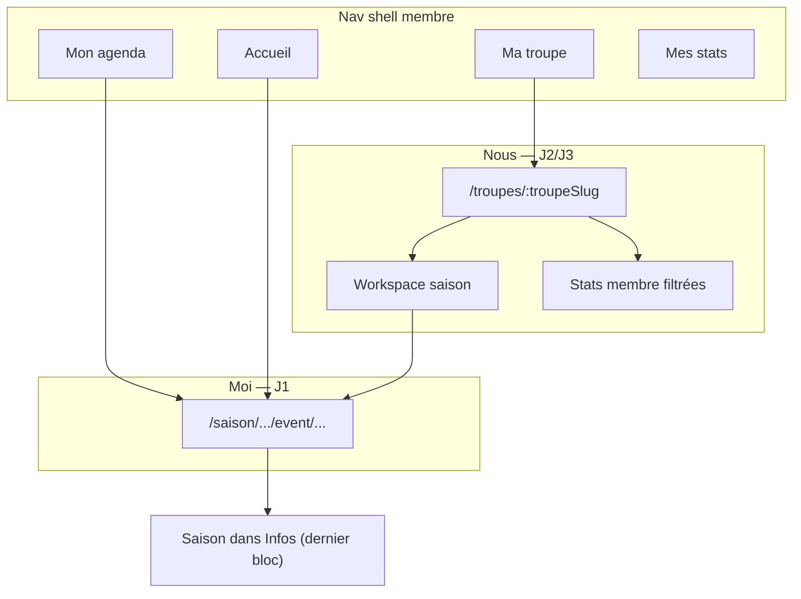

# UX — Univers Ma Troupe (hub collectif + chrome événement)

**Purpose:** Remettre l’**univers collectif** (troupe + saison en cours) au **premier niveau** de navigation, clarifier la distinction **Mon agenda** (moi, cross-troupes) vs **Ma troupe** (nous, cette saison), et alléger le **détail événement** (retrait breadcrumb troupe/saison du header).

**Trigger:** Retour terrain — deux agendas visuellement proches ; breadcrumb troupe › saison sur l’événement peu utilisé et consomme de la place mobile ; hub troupe actuel = grille de saisons sans valeur quotidienne (gens, stats, teaser).

**Méthode :** Jobs To Be Done — troupe = ancrage identitaire (J3) ; saison = contexte opérationnel (J2/J4) ; événement / Mon agenda = engagements personnels (J1).

---

## User stories

### Hub Ma Troupe

> As a member, I want a **collective home** for my troupe that highlights **who we are**, **how the current season is going**, and **what’s coming next** — without duplicating my personal agenda — so I feel part of the group without getting lost in season administration.

### Détail événement

> As a member opening a spectacle, I want the **event title** immediately readable and a **simple way back** to where I came from — with troupe/season context available when I need it, not as permanent header chrome.

---

## Décisions produit

### Navigation shell

| ID | Décision |
|----|----------|
| **MT1** | Ajouter un **4ᵉ onglet nav membre** : **Ma troupe** (`groups`) → `/troupes/{lastVisitedTroupeSlug}` ; fallback `/troupes` si aucune troupe mémorisée ou membership vide. |
| **MT2** | Mémoriser **`lastVisitedTroupeSlug`** (mise à jour à chaque visite hub troupe ou workspace saison de la troupe) — parallèle à `lastVisitedSeason`. |
| **MT3** | Nav membre cible : **Accueil · Mon agenda · Mes stats · Ma troupe** (libellés UI ; routes `/accueil`, `/agenda`, `/membre/:userSlug`, `/troupes/:slug`). Amendement PO 2026-07-12 (ex : Ma troupe · Mes stats). |
| **MT4** | **Mon agenda** reste la chronologie **personnelle cross-troupes** ; **Ma troupe** est le **tableau de bord collectif** — pas un second agenda complet. |
| **MT5** | Workspace saison (`/saison/:troupeSlug/:seasonSlug`) reste le **drill-down orga** (Agenda \| Historique \| Statistiques \| admin). Depuis le hub : **Voir tous les spectacles**, lien **+N** (section Personnes), tap carte teaser — **pas** de CTA primaire « Ouvrir la saison » sur la carte métriques (amend. 2026-06-12). L’onglet Infos événement : chips **Saison** / troupe (ED4). |

### Hub troupe (`/troupes/:slug`)

| ID | Décision |
|----|----------|
| **MT6** | Le hub n’est **plus** une grille « Saisons » en première intention ; c’est un **dashboard collectif** centré sur la **saison active par défaut**. |
| **MT7** | **Titre de la première section** = **intitulé de la saison** (ex. `Saison 2025-26`) — **pas** de label générique « Saison en cours » au-dessus. |
| **MT8** | **Carte saison unique** (section 1) : titre saison + **3 tuiles métriques** inline — **sans** CTA primaire sous les tuiles (amend. 2026-06-12) ; **switcher `[▾]`** à droite du titre **uniquement** si l’utilisateur est inscrit·e dans **>1 saison active** de la troupe. |
| **MT9** | Sous la carte : lien texte discret **Saisons archivées (N)** si `N > 0` — expand inline ou sheet ; **pas** de lien permanent « Historique » (déjà dans le workspace). |
| **MT10** | Section **Personnes** (libellé UI ; amend. 2026-06-12) : bandeau d’avatars **cliquables** (`3.5rem` / 56 dp), **retour à la ligne** (`flex-wrap`, pas de scroll horizontal) ; cap **12** visibles mobile, **36** desktop (6 lignes × 6 colonnes, breakpoint grille hub **≥ 840 px**) ; **+N** seul overflow → workspace agenda ; tap avatar → `/membre/{userSlug}` ; **pas** de CTA texte « Voir tout le roster / le monde ». |
| **MT11** | Section **Prochains spectacles** : **max 3** cartes `agenda-card` compact ; CTA **Voir tous les spectacles** → workspace onglet Agenda, **centré** dans la colonne (desktop 2 colonnes). Empty : *Aucun spectacle à venir cette saison.* |
| **MT12** | Lien bas de page **Voir les autres troupes** → `/troupes` — **visible uniquement** si `myTroupes.length >= 2` ; **absent** en mono-troupe (pas de placeholder). |
| **MT13** | **Retirer** le fil d’Ariane `Troupes › …` du header hub (escape via nav **Ma troupe** + lien MT12). Hero : logo + nom troupe + **admin orga** à droite (`.troupe-hub__hero-admin`) — bouton **`Gérer la troupe`** (`mat-stroked-button` + icône `settings`, `app-scope-admin-menu` `triggerVariant="stroked"`) ; visible **iff** `TROUPE_ADMIN`. **≤ 839 px** (shell fixe) : libellé masqué, icône seule + `aria-label="Gérer la troupe"` ; menu inchangé (Modifier, Nouvelle saison, Membres, Paramètres, Journal d’audit). Amend. 2026-06-14 — [spec hub-troupe-admin-trigger](../specs/spec-hub-troupe-admin-trigger/SPEC.md). |
| **MT14** | **Préférences membre** : inchangé vs [ux-design-troupe-hub.md](./ux-design-troupe-hub.md) T5/T6 — **Mon compte** uniquement ; pas de lien Préférences sur le hub. |
| **MT15** | **Phase 2** : mini-chart **mois par mois** dans la carte saison (grammaire visuelle `member-profile-panel` ; données stats saison) — spec détaillée [ux-design-hub-mini-chart-17-44.md](./ux-design-hub-mini-chart-17-44.md) ; résumé § Phase 2. |

### Détail événement

| ID | Décision |
|----|----------|
| **ED1** | **Retirer** `app-context-breadcrumb` du header événement (plus de `Troupe › Saison` en chrome). |
| **ED2** | Header **une seule ligne** : **chevron retour** (gauche) + **`h1` titre** (ellipsis si besoin) + **gear** (droite si admin) ; avatar compte shell à droite. **Pas** de badge statut composition dans le header (amend. 2026-06-12). |
| **ED3** | Chevron : `history.back()` si historique interne ; **fallback** `/agenda` ; si `lastMemberEntryPath` valide et interne → fallback vers cette route (ex. workspace saison, hub troupe). `aria-label` : **Retour** (pas « Mon agenda » en dur). |
| **ED4** | Onglet **Infos** — section **Saison** (**dernier** bloc, après Catégorie) : deux **chips cliquables** centrés — `{troupeName}` → hub troupe, `{seasonTitle}` → workspace saison (`mat-chip` + `routerLink`). **Pas** de libellé « Contexte » ; **pas** de ligne résumé « troupe · saison » ni boutons « Ouvrir la saison » / « Voir la troupe » (amend. 2026-06-12). |
| **ED5** | Badge statut composition + aide **`?`** : **onglet Équipe uniquement** (haut du contenu tab), **pas** dans le header ni au-dessus des onglets (amend. 2026-06-12 — pertinence contextuelle + lisibilité titre). |

---

## Architecture d’information (cible)



| Destination | Job | Question utilisateur |
|-------------|-----|---------------------|
| `/accueil` | J1 actions | Qu’est-ce que je dois faire ? |
| `/agenda` | J1 chronologie | Qu’est-ce que **j’ai** bientôt ? |
| `/troupes/:slug` | J2 + J3 collectif | Comment va **notre** saison ? Qui est avec moi ? |
| `/membre/:slug` | J1 + J3 perso | Comment **je** participe ? |
| Workspace saison | J2 complet + J4 orga | Tout voir / organiser cette saison |
| Event detail | J1 action | Ce spectacle — dispos, équipe, infos |

---

## Wireframe — Hub Ma Troupe (mobile)

```text
┌─────────────────────────────────────┐
│                            [👤]     │  ← shell avatar compte
├─────────────────────────────────────┤
│  [logo]  Les Improbots         [⚙]  │  ← hero identité ; admin orga (icône seule ≤839 px ; aria-label « Gérer la troupe »)
├─────────────────────────────────────┤
│  Saison 2025-26              [▾]?   │  ← h2 = intitulé ; [▾] si multi-saisons
│  ┌─────────────────────────────┐   │
│  │ ┌────┐ ┌────┐ ┌────┐        │   │  ← métriques (amend. 2026-06-12)
│  │ │ 45 │ │ 11 │ │ 37 │        │   │  Spectacles · Compos · Personnes
│  │ └────┘ └────┘ └────┘        │   │
│  └─────────────────────────────┘   │  ← pas de CTA « Ouvrir la saison »
│  Saisons archivées (2)              │  ← mat-button texte ; si N > 0
├─────────────────────────────────────┤
│  PERSONNES                          │
│  [avatars wrap, max 12] [+N]        │  ← +N → workspace ; pas de CTA texte
├─────────────────────────────────────┤
│  PROCHAINS SPECTACLES               │
│  [ carte ] [ carte ] [ carte ]      │
│      [ Voir tous les spectacles ]   │  ← centré en colonne (desktop)
├─────────────────────────────────────┤
│  Voir les autres troupes →          │  ← si ≥ 2 troupes seulement
├─────────────────────────────────────┤
│ Accueil │ Agenda │ Troupe │ Stats   │
└─────────────────────────────────────┘
```

### Desktop (≥ 840 px)

- Rail : 4 entrées (MT3).
- Hero : logo + nom troupe + bouton **`Gérer la troupe`** à droite (MT13) — pas d’icône seule sur desktop.
- **Personnes** + **Prochains spectacles** en **2 colonnes** (`grid` 2×1).
- Bandeau avatars : grille `auto-fill` sur **6 lignes max** (cap 36) ; pas de scroll horizontal.
- CTA teaser **Voir tous les spectacles** : **centré** horizontalement dans la colonne droite.
- Même contenu ; pas de breadcrumb header.

```text
┌──────────────────────────────────────────────────────────┐
│  [logo]  Les Improbots              [ ⚙ Gérer la troupe ] │  ← hero (orga)
├──────────────────────────────────────────────────────────┤
│  Saison 2025-26                                    [▾]?  │
│  … (carte métriques · Personnes | Prochains spectacles)  │
└──────────────────────────────────────────────────────────┘
```

---

## Section 1 — Carte saison (fusion bandeau + coup d’œil)

| Élément | Règle |
|---------|-------|
| **Titre section** | `h2` = `{season.title}` (ex. Saison 2025-26) |
| **Switcher** | `mat-menu` (desktop) / bottom sheet (mobile) ; visible si **>1 saison active** où user est participant·e |
| **Métriques** | 3 tuiles (libellés exacts UI) : **Spectacles** (`season.eventCount`, total non archivé), **Compos** (`confirmedCompositionsCount` — spectacles dont l’équipe est au cycle **Confirmé** / `CompositionLifecycle.COMPLETE`), **Personnes** (`season.participantCount`, roster actif). Spinner ou `—` si stats indisponibles pour **Compos** uniquement. |
| **CTA carte** | **Aucun** sur la carte métriques (amend. 2026-06-12). Drill-down workspace via teaser + **+N** + nav. |
| **Saisons archivées** | Lien sous la carte ; toggle liste `season-card` archivées ou sheet |

### Sélection saison par défaut

| Condition | Saison affichée |
|-----------|-----------------|
| `lastVisitedSeason` appartient à cette troupe | Cette saison (si active) |
| Sinon | Saison active la plus récente (`startDate` desc) |
| Aucune active | Empty state + lien archivées |

### Empty — aucune saison active

```text
Saison
  Aucune saison en cours pour l’instant.
  [ Saisons archivées (N) ]
  (orga) menu hero « Gérer la troupe » → Nouvelle saison
```

---

## Section 2 — Personnes

| Élément | Règle |
|---------|-------|
| Label section | **Personnes** ([ux-design-hub-section-headers.md](./ux-design-hub-section-headers.md) L2) — remplace « Participant·es » (amend. 2026-06-12) |
| Tuile métrique (carte saison) | Même libellé **Personnes** ; valeur = `participantCount` |
| Avatars | `app-user-avatar` **3.5rem** (56 dp) ; rangée `flex-wrap` / grille desktop — **pas** de scroll horizontal |
| Cap visible | **12** (mobile / colonne étroite) ; **36** (desktop ≥ 840 px, 6 lignes × 6 avatars) puis **+N** |
| Tap avatar | Bouton parent ; `/membre/{userSlug}?troupeId=…&seasonId=…` si `userSlug` ; sinon avatar non cliquable |
| Overflow **+N** | Lien circulaire même taille qu’un avatar → `saisonWorkspacePath` (agenda par défaut) ; seul CTA de section |
| CTA texte roster | **Absent** — pas de « Voir tout le roster / le monde » (amend. 2026-06-12) |
| Empty / erreur | *Aucune personne pour l'instant.* / *Impossible de charger les personnes.* |
| Invité·e | Lecture seule ; hint sous hero si `EXTERNE` |

---

## Section 3 — Prochains spectacles (teaser)

| Règle | Valeur |
|-------|--------|
| Max cartes | **3** |
| Composant | `agenda-card` compact (réutilisation) |
| Cellule droite | Dispo / confirmation si viewer participant (identique Mon agenda) |
| Tap carte | Event detail |
| CTA | **Voir tous les spectacles** (`mat-stroked-button`) → workspace onglet Agenda ; **centré** dans la colonne (amend. 2026-06-12) |
| Distinction | **Ne pas** dupliquer Mon agenda ; pas de filtres troupe/saison ici |

---

## Lien bas de page

| Libellé | Destination | Visibilité |
|---------|-------------|------------|
| **Voir les autres troupes** | `/troupes` | `myTroupes.length >= 2` |

**Explicitement absent du hub :**

| Lien écarté | Raison | Accès alternatif |
|-------------|--------|------------------|
| Historique spectacles | Drill-down workspace | Workspace › Historique |
| Préférences troupe | Config perso rare | Mon compte |
| Explorer / Découvrir | Hub d’une troupe ≠ annuaire | `/troupes#decouvrir` |

---

## Wireframe — Détail événement (amendement ED1–ED5)

```text
┌─────────────────────────────────────┐
│ [←] Format long : Science-fi… [⚙]  │  ← une ligne : retour + titre + gear
├─────────────────────────────────────┤
│     [ Infos | Dispos | Équipe ]     │
├─────────────────────────────────────┤
│ Infos : Date · Lieu · Format · …    │
│   Catégorie                         │
│   Saison                            │
│     [ Les Improbots ] [ Saison 26 ] │  ← chips cliquables, centrés
├─────────────────────────────────────┤
│ Équipe :                            │
│   [ À composer ] [ ? ]              │  ← badge statut (ED5), haut d’onglet
│   (grille composition…)             │
└─────────────────────────────────────┘
```

| Zone | Supprimé vs 2026-06-06 | Conservé / ajouté |
|------|------------------------|-------------------|
| Header | `app-context-breadcrumb` ; badge statut dans le header | Chevron ED3, titre inline ED2, gear E1–E2 |
| Infos | — | Section **Saison** ED4 (dernier bloc, chips) ; reste E10 |
| Équipe | — | Badge statut composition ED5 (haut du tab) |

---

## Phase 2 — Mini-chart mois (MT15)

**Objectif :** visualisation collective de l’année dans la carte saison — même grammaire que Mes Stats (`member-profile-panel`).

**Spec normative (Story 17.44) :** [ux-design-hub-mini-chart-17-44.md](./ux-design-hub-mini-chart-17-44.md) — décisions **MC1–MC16**, wireframes mobile/desktop, états, MT15-AC, sign-off 2026-06-14 (amend. couleurs statut + CTA stats).

| Aspect | Stats individuelles | Stats saison (hub) |
|--------|---------------------|---------------------|
| Bloc | 1 participation, couleur rôle | 1 spectacle, **couleur statut Équipe** (badges agenda) |
| Tooltip | Titre + rôle | Titre + **statut Équipe** + nb participations |
| Tap | Event detail | Event detail |
| CTA sous bandeau | — | **Voir toutes les stats** → `?view=stats` |
| Affichage | Pleine page | Bandeau compact sous tuiles ; scroll horizontal si >12 mois |
| Seuil | — | Afficher seulement si ≥ 3 spectacles passés dans la saison |

**Hors scope phase 1** — nécessite chargement stats saison sur le hub (livré **17.42**).

---

## Variantes

| Cas | Comportement |
|-----|--------------|
| Mono-troupe · mono-saison | Switcher masqué ; pas de lien « Voir les autres troupes » |
| Multi-saison active | Switcher change contenu sections 2–3 |
| Multi-troupe | Nav Ma troupe → dernière troupe ; lien MT12 |
| Invité·e | Métriques/stats collectives selon permissions ; hint saisons invitées |
| Orga | Bouton **Gérer la troupe** hero (desktop) / icône seule (≤839 px) ; hub reste membre-first |

---

## Critères d’acceptation

### Nav shell (MT1–MT3)

- [ ] **MT-AC1** : Rail / bottom bar affiche 4 entrées : Accueil, Mon agenda, Mes stats, Ma troupe.
- [ ] **MT-AC2** : Tap **Ma troupe** → `/troupes/{lastVisitedTroupeSlug}` ou `/troupes` si indéterminé.
- [ ] **MT-AC3** : `lastVisitedTroupeSlug` mis à jour à la visite hub ou workspace d’une troupe.

### Hub (MT6–MT14)

- [ ] **MT-AC4** : Première section titrée avec `{season.title}` — pas de label « Saison en cours ».
- [ ] **MT-AC5** : Switcher visible **iff** >1 saison active avec participation user.
- [ ] **MT-AC6** : Carte saison : 3 tuiles **Spectacles / Compos / Personnes** ; **pas** de CTA « Ouvrir la saison » ; pas de grille saisons active en page principale.
- [ ] **MT-AC7** : Personnes : avatars wrap (cap 12 mobile / 36 desktop) + **+N** vers workspace ; pas de CTA texte roster.
- [ ] **MT-AC8** : Prochains spectacles : ≤3 cartes + **Voir tous les spectacles** centré en colonne.
- [ ] **MT-AC9** : **Voir les autres troupes** visible **iff** ≥2 troupes ; libellé exact.
- [ ] **MT-AC10** : Pas de breadcrumb `Troupes ›` ; pas de footer Historique · Préférences.
- [ ] **MT-AC11** : Mon agenda et hub troupe : listes distinctes (teaser vs chronologie complète).
- [ ] **MT-AC12** : Orga : hero affiche **`Gérer la troupe`** (`mat-stroked-button` + `settings`) à droite du nom ; menu admin inchangé ; ≤839 px libellé masqué + `aria-label` ; absent pour non-admin.

### Event detail (ED1–ED5)

- [ ] **ED-AC1** : Pas de `app-context-breadcrumb` sur event detail.
- [ ] **ED-AC2** : Chevron retour avec fallback intelligent (ED3).
- [ ] **ED-AC3** : Infos › section **Saison** (dernier bloc) : chips `{troupeName}` + `{seasonTitle}` cliquables vers hub / workspace.
- [ ] **ED-AC4** : Header une ligne : chevron + titre + gear ; **pas** de badge statut dans le header.
- [ ] **ED-AC5** : Badge statut composition + aide **`?`** visibles **uniquement** sur l’onglet **Équipe** (ED5).

### Material 3

- [ ] **M3-1** : Composants Material ; réutilisation `agenda-card`, `scope-admin-menu`.
- [ ] **M3-2** : Tokens `--mat-sys-*`.
- [ ] **M3-3** : Mobile-first ; cibles ≥ 48 dp ; bandeau Personnes en **wrap** (pas de scroll horizontal obligatoire).
- [ ] **M3-4** : Libellés FR ; `aria-label` chevron « Retour ».

---

## Implémentation — notes dev

| Zone | Fichiers / action |
|------|-------------------|
| Nav 4 onglets | `member-shell-nav*.ts`, `member-shell-nav-visibility.ts`, icône `groups` |
| lastVisitedTroupe | Service parallèle `lastVisitedSeason` ; post-login optionnel troupe-first si mono-troupe |
| Hub | Refonte `troupe-hub.html/ts` — API : saisons + `getSeasonWorkspace` teaser + `loadStatistics` (`confirmedCompositionsCount` + rows roster) ; admin hero : `app-scope-admin-menu` `triggerVariant="stroked"` + `triggerLabel="Gérer la troupe"` |
| Participants view | Workspace `season-home` onglet ou query `view=participants` |
| Event header | Retirer breadcrumb ; chevron + titre inline ; `lastMemberEntryPath` (+ `/troupes/:slug`) |
| Event Infos | `event-infos-tab` — section **Saison** (chips, dernier bloc) |
| Event Équipe | `event-equipe-tab` — `app-composition-equipe-status-header` en tête d’onglet |
| Tests | `troupe-hub.spec.ts`, `event-detail.spec.ts`, nav shell specs |

---

## Conflits résolus avec specs antérieures

| Spec antérieure | Avant | Après (ce doc) |
|-----------------|-------|----------------|
| [ux-design-troupe-hub.md](./ux-design-troupe-hub.md) T12 | Pas de lien autres troupes depuis hub | **Voir les autres troupes** si multi-troupe (MT12) |
| [ux-design-troupe-hub.md](./ux-design-troupe-hub.md) M3-5 | Pas de 4ᵉ onglet nav | **Ma troupe** 4ᵉ onglet (MT1) |
| [ux-design-hub-a-faire.md](./ux-design-hub-a-faire.md) | Workspace hors nav | Workspace drill-down ; **Ma troupe** en nav (MT1) |
| [ux-design-event-detail-title-row](./ux-design-event-detail-title-row-2026-06-06.md) E7–E9 | Title row + badge au-dessus des onglets | **Titre inline header** (ED2) ; badge **Équipe tab** (ED5) |
| [ux-design-event-detail-title-row](./ux-design-event-detail-title-row-2026-06-06.md) E8 | Breadcrumb troupe › saison | **Supprimé** ; chips Saison Infos (ED1, ED4) |
| [ADR 0013](../../docs/adr/0013-troupe-navigation-equity-tags-event-slugs.md) §2 | Breadcrumb event detail | Chevron + section Saison Infos ; pas de breadcrumb event |

---

## Stories suggérées (Epic 17)

| ID | Titre | Scope |
|----|-------|-------|
| **17.41** ✅ | Nav shell — onglet Ma troupe + `lastVisitedTroupe` | MT1–MT3 — **done** — [17-41-nav-shell-ma-troupe.md](../implementation-artifacts/17-41-nav-shell-ma-troupe.md) |
| **17.42** | Hub troupe — dashboard collectif (phase 1) | MT6–MT14 |
| **17.43** ✅ | Event detail — retrait breadcrumb + Saison Infos + badge Équipe | ED1–ED5 |
| **17.44** | Hub troupe — mini-chart mois saison (phase 2) | MT15 |

*(17.38–17.40 = category glossary slice — already shipped.)*

---

## Sign-off

| Question | Réponse |
|----------|---------|
| Entrée nav **Ma troupe** (4 onglets) ? | Oui (MT1–MT3) |
| Hub = dashboard saison courante, pas grille saisons ? | Oui (MT6–MT8) |
| Titre section = intitulé saison ? | Oui (MT7) |
| Bas de page = **Voir les autres troupes** (conditionnel) uniquement ? | Oui (MT12) |
| Event detail sans breadcrumb ; Saison Infos + badge Équipe ? | Oui (ED1–ED5) |
| Mini-chart mois en phase 2 ? | Oui (MT15) |

**Statut :** `approved` (2026-06-10 — Patrice).

---

## Amendement 2026-06-12 — Rétro-doc hub 17.42 (Patrice)

Ajustements validés en recette après implémentation initiale ; la spec ci-dessus est **mise à jour** (pas de nouvelle story).

| Sujet | Avant (spec 2026-06-10) | Après (shipped) |
|-------|---------------------------|-----------------|
| Métrique centrale | **Participations** (somme sélections jeu) | **Compos** — nombre de spectacles **équipe confirmée** (`confirmedCompositionsCount`) |
| Métrique roster | **Participant·es** | **Personnes** (tuile + section) |
| CTA carte saison | **Ouvrir la saison** | **Retiré** — redondant avec teaser, +N, nav |
| Section Personnes | 6 avatars + scroll horizontal + CTA roster | Wrap ; cap **12** / **36** ; **+N** seul CTA ; avatars **56 dp** cliquables |
| Teaser CTA | **Voir tout l'agenda** | **Voir tous les spectacles**, centré en colonne |
| Donnée Compos | — | Champ API stats saison ; règle métier = badge **Confirmé** (lifecycle `complete`) |

**Non modifié :** MT12 footer multi-troupe, switcher saison, saisons archivées, parité dispo/participation sur cartes teaser.

---

## Amendement 2026-06-14 — Bouton admin hero (Patrice)

Remplace l’engrenage seul (MT13 initial) par un déclencheur **explicite** validé en mockup PO. Spec machine : [spec-hub-troupe-admin-trigger](../specs/spec-hub-troupe-admin-trigger/SPEC.md).

| Sujet | Avant (MT13 / wireframe 2026-06-10) | Après (shipped) |
|-------|--------------------------------------|-----------------|
| Déclencheur admin hero | `mat-icon-button` + icône `settings` seule | **`Gérer la troupe`** — `mat-stroked-button` + icône + libellé (desktop) |
| Placement | `.troupe-hub__hero-admin` à droite logo + nom | Inchangé |
| Mobile ≤839 px | Icône seule (slot fixe shell) | Inchangé visuellement ; `aria-label="Gérer la troupe"` |
| Menu / routes | Modifier, Nouvelle saison, Membres, Paramètres, Audit | Inchangé |
| Saison / événement | Gear seul (`scope-admin-menu` défaut) | Inchangé — variante `stroked` réservée au hub troupe |

**Non modifié :** visibilité `TROUPE_ADMIN` uniquement ; pas d’admin dans le footer ni sous la carte saison.

---

## Amendement 2026-06-12 — Rétro-doc event detail 17.43 (Patrice)

Ajustements validés en recette après implémentation initiale ; ED2–ED5 ci-dessus **mis à jour** (story **17.43** shipped).

| Sujet | Spec initiale (2026-06-10) | Après (shipped) |
|-------|-----------------------------|-----------------|
| Header | Ligne 1 : chevron + gear ; ligne 2 : titre + badge statut | **Une ligne** : chevron + titre (ellipsis) + gear |
| Badge statut composition | Title row au-dessus des onglets (E7–E9) | **Onglet Équipe uniquement** (ED5) — lisibilité titre |
| Infos — contexte troupe/saison | Section **Contexte** (1er bloc) ; ligne résumé + boutons | Section **Saison** (**dernier** bloc) ; **chips** cliquables centrés |
| Navigation retour hub | `lastMemberEntryPath` sans `/troupes/:slug` | Allowlist étendue à `/troupes/:slug` pour retour depuis hub |
