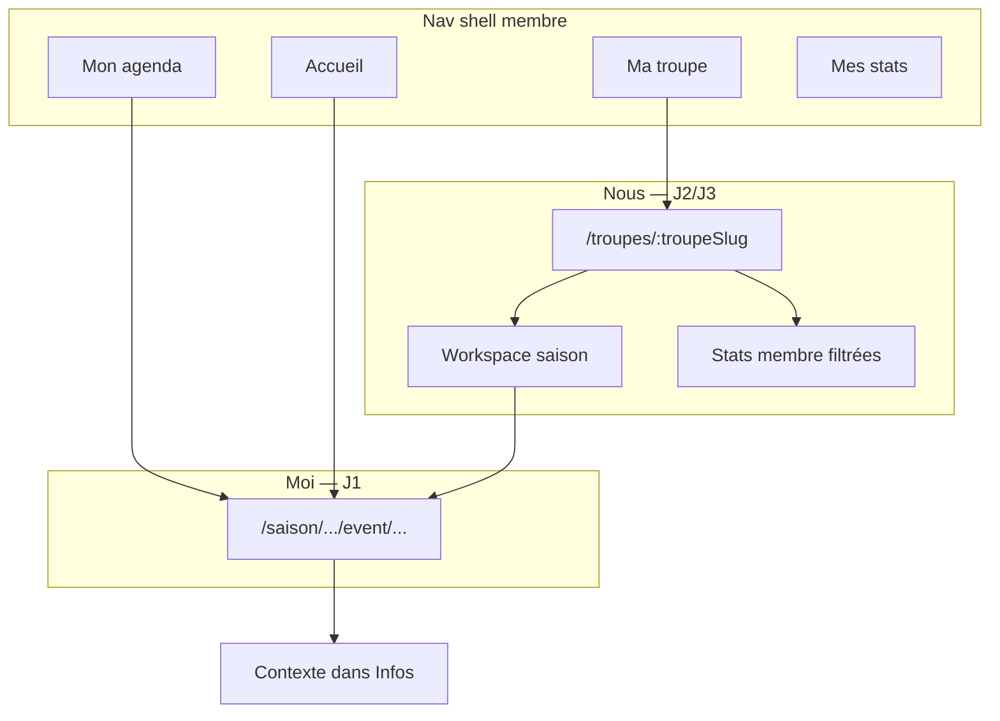

# UX — Univers Ma Troupe (hub collectif + chrome événement)

**Purpose:** Remettre l’**univers collectif** (troupe + saison en cours) au **premier niveau** de navigation, clarifier la distinction **Mon agenda** (moi, cross-troupes) vs **Ma troupe** (nous, cette saison), et alléger le **détail événement** (retrait breadcrumb troupe/saison du header).

**Trigger:** Retour terrain — deux agendas visuellement proches ; breadcrumb troupe › saison sur l’événement peu utilisé et consomme de la place mobile ; hub troupe actuel = grille de saisons sans valeur quotidienne (gens, stats, teaser).

**Méthode :** Jobs To Be Done — troupe = ancrage identitaire (J3) ; saison = contexte opérationnel (J2/J4) ; événement / Mon agenda = engagements personnels (J1).

---

## User stories

### Hub Ma Troupe

> As a member, I want a **collective home** for my troupe that highlights **who we are**, **how the current season is going**, and **what’s coming next** — without duplicating my personal agenda — so I feel part of the group without getting lost in season administration.

### Détail événement

> As a member opening a spectacle, I want the **event title** immediately readable and a **simple way back** to where I came from — with troupe/season context available when I need it, not as permanent header chrome.

---

## Décisions produit

### Navigation shell

| ID | Décision |
|----|----------|
| **MT1** | Ajouter un **4ᵉ onglet nav membre** : **Ma troupe** (`groups`) → `/troupes/{lastVisitedTroupeSlug}` ; fallback `/troupes` si aucune troupe mémorisée ou membership vide. |
| **MT2** | Mémoriser **`lastVisitedTroupeSlug`** (mise à jour à chaque visite hub troupe ou workspace saison de la troupe) — parallèle à `lastVisitedSeason`. |
| **MT3** | Nav membre cible : **Accueil · Mon agenda · Ma troupe · Mes stats** (libellés UI ; routes `/accueil`, `/agenda`, `/troupes/:slug`, `/membre/:userSlug`). |
| **MT4** | **Mon agenda** reste la chronologie **personnelle cross-troupes** ; **Ma troupe** est le **tableau de bord collectif** — pas un second agenda complet. |
| **MT5** | Workspace saison (`/saison/:troupeSlug/:seasonSlug`) reste le **drill-down orga** (Agenda \| Historique \| Statistiques \| admin) ; accessible depuis le hub via **Ouvrir la saison**. |

### Hub troupe (`/troupes/:slug`)

| ID | Décision |
|----|----------|
| **MT6** | Le hub n’est **plus** une grille « Saisons » en première intention ; c’est un **dashboard collectif** centré sur la **saison active par défaut**. |
| **MT7** | **Titre de la première section** = **intitulé de la saison** (ex. `Saison 2025-26`) — **pas** de label générique « Saison en cours » au-dessus. |
| **MT8** | **Carte saison unique** (section 1) : titre saison + métriques inline + CTA **Ouvrir la saison** ; **switcher `[▾]`** à droite du titre **uniquement** si l’utilisateur est inscrit·e dans **>1 saison active** de la troupe. |
| **MT9** | Sous la carte : lien texte discret **Saisons archivées (N)** si `N > 0` — expand inline ou sheet ; **pas** de lien permanent « Historique » (déjà dans le workspace). |
| **MT10** | Section **Participant·es** : avatars (max 6 + compteur), tap → stats individuelles ; **Voir tout le roster** → workspace `?view=participants` (ou onglet Participants quand livré). |
| **MT11** | Section **Prochains spectacles** : **max 3** cartes `agenda-card` compact ; CTA **Voir tout l'agenda** → workspace onglet Agenda. Empty : *Aucun spectacle à venir cette saison.* |
| **MT12** | Lien bas de page **Voir les autres troupes** → `/troupes` — **visible uniquement** si `myTroupes.length >= 2` ; **absent** en mono-troupe (pas de placeholder). |
| **MT13** | **Retirer** le fil d’Ariane `Troupes › …` du header hub (escape via nav **Ma troupe** + lien MT12). Hero : logo + nom troupe + gear admin. |
| **MT14** | **Préférences membre** : inchangé vs [ux-design-troupe-hub.md](./ux-design-troupe-hub.md) T5/T6 — **Mon compte** uniquement ; pas de lien Préférences sur le hub. |
| **MT15** | **Phase 2** : mini-chart **mois par mois** dans la carte saison (grammaire visuelle `member-profile-panel` ; données `monthSummary` stats saison) — voir § Phase 2. |

### Détail événement

| ID | Décision |
|----|----------|
| **ED1** | **Retirer** `app-context-breadcrumb` du header événement (plus de `Troupe › Saison` en chrome). |
| **ED2** | Header minimal : **chevron retour** (gauche) + **gear** (droite si admin) ; **title row** + onglets inchangés (E7–E12 title row spec). |
| **ED3** | Chevron : `history.back()` si historique interne ; **fallback** `/agenda` ; si `lastMemberEntryPath` valide et interne → fallback vers cette route (ex. workspace saison). `aria-label` : **Retour** (pas « Mon agenda » en dur). |
| **ED4** | Onglet **Infos** — nouvelle section **Contexte** (premier bloc) : `{troupeName} · {seasonTitle}` + actions **Ouvrir la saison** · **Voir la troupe** (`mat-stroked-button` ou liens texte). |

---

## Architecture d’information (cible)



| Destination | Job | Question utilisateur |
|-------------|-----|---------------------|
| `/accueil` | J1 actions | Qu’est-ce que je dois faire ? |
| `/agenda` | J1 chronologie | Qu’est-ce que **j’ai** bientôt ? |
| `/troupes/:slug` | J2 + J3 collectif | Comment va **notre** saison ? Qui est avec moi ? |
| `/membre/:slug` | J1 + J3 perso | Comment **je** participe ? |
| Workspace saison | J2 complet + J4 orga | Tout voir / organiser cette saison |
| Event detail | J1 action | Ce spectacle — dispos, équipe, infos |

---

## Wireframe — Hub Ma Troupe (mobile)

```text
┌─────────────────────────────────────┐
│                            [👤]     │  ← shell avatar compte
├─────────────────────────────────────┤
│  [logo]  Les Improbots         [⚙]  │  ← hero identité + gear orga
├─────────────────────────────────────┤
│  Saison 2025-26              [▾]?   │  ← h2 = intitulé ; [▾] si multi-saisons
│  ┌─────────────────────────────┐   │
│  │ ┌────┐ ┌────┐ ┌────┐        │   │  ← métriques MVP (phase 1)
│  │ │ 24 │ │156 │ │ 12 │        │   │
│  │ └────┘ └────┘ └────┘        │   │
│  │ [ Ouvrir la saison → ]      │   │
│  └─────────────────────────────┘   │
│  Saisons archivées (2)              │  ← mat-button texte ; si N > 0
├─────────────────────────────────────┤
│  PARTICIPANT·ES                     │
│  [avatars scroll]  [ Voir tout → ]  │
├─────────────────────────────────────┤
│  PROCHAINS SPECTACLES               │
│  [ carte ] [ carte ] [ carte ]      │
│  [ Voir tout l'agenda → ]           │
├─────────────────────────────────────┤
│  Voir les autres troupes →          │  ← si ≥ 2 troupes seulement
├─────────────────────────────────────┤
│ Accueil │ Agenda │ Troupe │ Stats   │
└─────────────────────────────────────┘
```

### Desktop (≥ 840 px)

- Rail : 4 entrées (MT3).
- Participants + Prochains spectacles en **2 colonnes** si largeur suffisante.
- Même contenu ; pas de breadcrumb header.

---

## Section 1 — Carte saison (fusion bandeau + coup d’œil)

| Élément | Règle |
|---------|-------|
| **Titre section** | `h2` = `{season.title}` (ex. Saison 2025-26) |
| **Switcher** | `mat-menu` (desktop) / bottom sheet (mobile) ; visible si **>1 saison active** où user est participant·e |
| **Métriques MVP** | 3 tuiles : spectacles (à venir ou total saison — à figer en impl.), participations, participant·es actifs·ves |
| **CTA** | **Ouvrir la saison** → `/saison/:troupeSlug/:seasonSlug` (onglet agenda par défaut) |
| **Saisons archivées** | Lien sous la carte ; toggle liste `season-card` archivées ou sheet |

### Sélection saison par défaut

| Condition | Saison affichée |
|-----------|-----------------|
| `lastVisitedSeason` appartient à cette troupe | Cette saison (si active) |
| Sinon | Saison active la plus récente (`startDate` desc) |
| Aucune active | Empty state + lien archivées |

### Empty — aucune saison active

```text
Saison
  Aucune saison en cours pour l’instant.
  [ Saisons archivées (N) ]
  (orga) gear → Nouvelle saison
```

---

## Section 2 — Participant·es

| Élément | Règle |
|---------|-------|
| Label section | **Participant·es** ([ux-design-hub-section-headers.md](./ux-design-hub-section-headers.md) L2) |
| Avatars | Max 6 + « +N » ; scroll horizontal mobile ; 40–48 dp |
| Tap avatar | `/membre/{userSlug}?troupeId=…&seasonId=…` (stats filtrées) |
| CTA | **Voir tout le roster** → workspace participants |
| Invité·e | Lecture seule ; hint sous hero si `EXTERNE` |

---

## Section 3 — Prochains spectacles (teaser)

| Règle | Valeur |
|-------|--------|
| Max cartes | **3** |
| Composant | `agenda-card` compact (réutilisation) |
| Cellule droite | Dispo / confirmation si viewer participant (identique Mon agenda) |
| Tap carte | Event detail |
| CTA | **Voir tout l'agenda** → workspace onglet Agenda |
| Distinction | **Ne pas** dupliquer Mon agenda ; pas de filtres troupe/saison ici |

---

## Lien bas de page

| Libellé | Destination | Visibilité |
|---------|-------------|------------|
| **Voir les autres troupes** | `/troupes` | `myTroupes.length >= 2` |

**Explicitement absent du hub :**

| Lien écarté | Raison | Accès alternatif |
|-------------|--------|------------------|
| Historique spectacles | Drill-down workspace | Workspace › Historique |
| Préférences troupe | Config perso rare | Mon compte |
| Explorer / Découvrir | Hub d’une troupe ≠ annuaire | `/troupes#decouvrir` |

---

## Wireframe — Détail événement (amendement ED1–ED4)

```text
┌─────────────────────────────────────┐
│ [←]                        [⚙]     │
├─────────────────────────────────────┤
│ Cabaret d'été           [ Confirmé ]│  ← title row (E7–E9)
├─────────────────────────────────────┤
│     [ Infos | Dispos | Équipe ]     │
├─────────────────────────────────────┤
│ Infos                               │
│   Contexte                          │
│     Les Improbots · Saison 2025-26  │
│     [ Ouvrir la saison ] [ Troupe ]   │
│   Date · Lieu · Format · …          │
└─────────────────────────────────────┘
```

| Zone | Supprimé vs 2026-06-06 | Conservé |
|------|------------------------|----------|
| Header | `app-context-breadcrumb` | Chevron ED3, gear E1–E2, title row E7–E9 |
| Infos | — | + section Contexte ED4 ; reste E10 |

---

## Phase 2 — Mini-chart mois (MT15)

**Objectif :** visualisation collective de l’année dans la carte saison — même grammaire que Mes Stats (`member-profile-panel`).

| Aspect | Stats individuelles | Stats saison (hub) |
|--------|---------------------|---------------------|
| Bloc | 1 participation, couleur rôle | 1 spectacle |
| Tooltip | Titre + rôle | Titre + nb participations |
| Tap | Event detail | Event detail |
| Affichage | Pleine page | Bandeau compact sous tuiles ; scroll horizontal si >12 mois |
| Seuil | — | Afficher seulement si ≥ 3 spectacles passés dans la saison |

**Hors scope phase 1** — nécessite chargement stats saison sur le hub.

---

## Variantes

| Cas | Comportement |
|-----|--------------|
| Mono-troupe · mono-saison | Switcher masqué ; pas de lien « Voir les autres troupes » |
| Multi-saison active | Switcher change contenu sections 2–3 |
| Multi-troupe | Nav Ma troupe → dernière troupe ; lien MT12 |
| Invité·e | Métriques/stats collectives selon permissions ; hint saisons invitées |
| Orga | Gear hero ; hub reste membre-first |

---

## Critères d’acceptation

### Nav shell (MT1–MT3)

- [ ] **MT-AC1** : Rail / bottom bar affiche 4 entrées : Accueil, Mon agenda, Ma troupe, Mes stats.
- [ ] **MT-AC2** : Tap **Ma troupe** → `/troupes/{lastVisitedTroupeSlug}` ou `/troupes` si indéterminé.
- [ ] **MT-AC3** : `lastVisitedTroupeSlug` mis à jour à la visite hub ou workspace d’une troupe.

### Hub (MT6–MT14)

- [ ] **MT-AC4** : Première section titrée avec `{season.title}` — pas de label « Saison en cours ».
- [ ] **MT-AC5** : Switcher visible **iff** >1 saison active avec participation user.
- [ ] **MT-AC6** : Carte saison : métriques + **Ouvrir la saison** ; pas de grille saisons active en page principale.
- [ ] **MT-AC7** : Participants : avatars + **Voir tout le roster**.
- [ ] **MT-AC8** : Prochains spectacles : ≤3 cartes + **Voir tout l'agenda**.
- [ ] **MT-AC9** : **Voir les autres troupes** visible **iff** ≥2 troupes ; libellé exact.
- [ ] **MT-AC10** : Pas de breadcrumb `Troupes ›` ; pas de footer Historique · Préférences.
- [ ] **MT-AC11** : Mon agenda et hub troupe : listes distinctes (teaser vs chronologie complète).

### Event detail (ED1–ED4)

- [ ] **ED-AC1** : Pas de `app-context-breadcrumb` sur event detail.
- [ ] **ED-AC2** : Chevron retour avec fallback intelligent (ED3).
- [ ] **ED-AC3** : Infos › Contexte avec troupe · saison + liens saison/troupe.
- [ ] **ED-AC4** : Title row et gear inchangés (E7–E9, E1–E2).

### Material 3

- [ ] **M3-1** : Composants Material ; réutilisation `agenda-card`, `scope-admin-menu`.
- [ ] **M3-2** : Tokens `--mat-sys-*`.
- [ ] **M3-3** : Mobile-first ; cibles ≥ 48 dp.
- [ ] **M3-4** : Libellés FR ; `aria-label` chevron « Retour ».

---

## Implémentation — notes dev

| Zone | Fichiers / action |
|------|-------------------|
| Nav 4 onglets | `member-shell-nav*.ts`, `member-shell-nav-visibility.ts`, icône `groups` |
| lastVisitedTroupe | Service parallèle `lastVisitedSeason` ; post-login optionnel troupe-first si mono-troupe |
| Hub | Refonte `troupe-hub.html/ts` — API : saisons + events teaser + stats summary + roster preview |
| Participants view | Workspace `season-home` onglet ou query `view=participants` |
| Event header | Retirer breadcrumb de `event-detail-header` ; chevron + `NavigationHistoryService` ou `lastMemberEntryPath` |
| Event Infos | `event-infos-tab` — section Contexte |
| Tests | `troupe-hub.spec.ts`, `event-detail.spec.ts`, nav shell specs |

---

## Conflits résolus avec specs antérieures

| Spec antérieure | Avant | Après (ce doc) |
|-----------------|-------|----------------|
| [ux-design-troupe-hub.md](./ux-design-troupe-hub.md) T12 | Pas de lien autres troupes depuis hub | **Voir les autres troupes** si multi-troupe (MT12) |
| [ux-design-troupe-hub.md](./ux-design-troupe-hub.md) M3-5 | Pas de 4ᵉ onglet nav | **Ma troupe** 4ᵉ onglet (MT1) |
| [ux-design-hub-a-faire.md](./ux-design-hub-a-faire.md) | Workspace hors nav | Workspace drill-down ; **Ma troupe** en nav (MT1) |
| [ux-design-event-detail-title-row](./ux-design-event-detail-title-row-2026-06-06.md) E8 | Breadcrumb troupe › saison | **Supprimé** ; contexte Infos (ED1, ED4) |
| [ADR 0013](../../docs/adr/0013-troupe-navigation-equity-tags-event-slugs.md) §2 | Breadcrumb event detail | Amender : chevron + Infos contexte |

---

## Stories suggérées (Epic 17)

| ID | Titre | Scope |
|----|-------|-------|
| **17.41** ✅ | Nav shell — onglet Ma troupe + `lastVisitedTroupe` | MT1–MT3 — **done** — [17-41-nav-shell-ma-troupe.md](../implementation-artifacts/17-41-nav-shell-ma-troupe.md) |
| **17.42** | Hub troupe — dashboard collectif (phase 1) | MT6–MT14 |
| **17.43** | Event detail — retrait breadcrumb + contexte Infos | ED1–ED4 |
| **17.44** | Hub troupe — mini-chart mois saison (phase 2) | MT15 |

*(17.38–17.40 = category glossary slice — already shipped.)*

---

## Sign-off

| Question | Réponse |
|----------|---------|
| Entrée nav **Ma troupe** (4 onglets) ? | Oui (MT1–MT3) |
| Hub = dashboard saison courante, pas grille saisons ? | Oui (MT6–MT8) |
| Titre section = intitulé saison ? | Oui (MT7) |
| Bas de page = **Voir les autres troupes** (conditionnel) uniquement ? | Oui (MT12) |
| Event detail sans breadcrumb ; contexte Infos ? | Oui (ED1–ED4) |
| Mini-chart mois en phase 2 ? | Oui (MT15) |

**Statut :** `approved` (2026-06-10 — Patrice).
