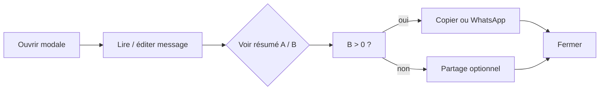

# UX Design — Partager / Annoncer : politique manuelle unifiée

**Purpose :** Aligner les quatre intents de `ShareAnnounceDialog` sur une **même politique** : l’orga **compose un message personnalisé** et **prévient elle-même** les personnes qui n’ont pas encore reçu l’information pertinente — **sans envoi bulk via l’appli**.

**Principe directeur :** *« Qui a déjà été notifié automatiquement par HatCast ? Qui reste à prévenir ? Je m’occupe du reste avec Copier ou WhatsApp. »*

---

## Problème

| Point | Constat |
|-------|---------|
| **Fausse affordance** | Le bouton **Notifier X personnes** suggère un envoi massif ; pour `composition` / `draw` c’est un **stub** (`notifiedCount = 0`). |
| **Opt-out ignoré en preview** | `notifiableCount` compte surtout la **présence** d’un email, pas les préférences membre. |
| **Risque spam** | À la validation, `CONFIRMATION_REQUEST` part déjà ; à la publication, `AVAILABILITY_OPENED` part déjà ; les rappels auto (`AVAILABILITY_PENDING_REMINDER`) tournent aussi. Un second envoi manuel bulk duplique le message. |
| **Message custom** | Le textarea est un texte **édité par l’orga** (ton WhatsApp, emojis, rôles) — différent des templates système. L’envoi applicatif ne porte pas ce message tel quel pour la compo ; pour `event` / nudge il le porte, mais au prix des tensions ci-dessus. |
| **Incohérence catalogue** | `NOTIFICATIONS_CATALOG.md` classe déjà `draw` / `composition` en **manuel hors dispatcher** ; `event` / `availability_nudge` y sont encore en **manuel via dispatcher** — à harmoniser. |

---

## Décisions produit

| ID | Sujet | Décision |
|----|--------|----------|
| **M1** | **Politique unique** | **Tous** les intents dialog (`draw`, `composition`, `event`, `availability_nudge`) : **aucun** envoi automatique depuis la modale. Actions de partage = **Copier** + **WhatsApp** uniquement. |
| **M2** | **Retrait Notifier** | Supprimer le bouton **Notifier X personnes**, le spinner POST, `ConfirmDialog` anti-spam au clic Notifier, et les snacks post-envoi liés à Notifier. Footer inchangé : **Fermer** seul. |
| **M3** | **Une seule ligne** | Bloc destinataires = **une ligne** (wrap autorisé) : *« **[A personnes]** déjà notifiées automatiquement. Reste à prévenir : [chips…] »* — voir § Bloc destinataires. |
| **M4** | **Chips à prévenir** | Sur la **même ligne** après *Reste à prévenir :* — `mat-chip` par nom, **prénom/nom seul**, pas de canal. |
| **M4b** | **Compteur = lien + tooltip clic** | Le segment **{A} personne(s)** est un **bouton style lien** (`color="primary"`, apparence texte) ; **clic** (et focus clavier) ouvre un **tooltip** listant les noms (virgules). Pas de liste dépliée ni bouton `info` séparé. |
| **M5** | **Sémantique « déjà notifié »** | Une personne est **déjà notifiée** si au moins un canal (email ou push) a un log `SENT` / `PARTIAL` pour un intent mappé (voir **M6**). Sinon elle est **à prévenir**. |
| **M6** | **Mapping intents → logs** | Étendre le mapping GET `share-recipients` (remplace stubs compo/draw et enrichit nudge) — voir tableau § Mapping. |
| **M7** | **Contact sans canal app** | Compte dans **à prévenir** comme les autres — **même rendu** (nom seul). Pas de badge canal ; l’orga contacte via Copier/WhatsApp comme pour tout le monde. |
| **M8** | **Hint message** | Remplacer *« WhatsApp et les notifications utilisent le texte ci-dessus. »* par *« Copier et WhatsApp utilisent le texte ci-dessus. »* |
| **M9** | **POST notify** | Hors UI : endpoint conservé temporairement (compat API) mais **non appelé** par le front ; story implémentation pourra le déprécier ou le no-op documenté. |
| **M10** | **Entrées inchangées** | Points d’entrée, titres dialog, templates par défaut, intents API : **inchangés** (gear **Annoncer**, **Relance dispos**, Équipe **Annoncer la compo**, etc.). |
| **M11** | **Hauteur modale** | Réduire `cdkAutosizeMinRows` du textarea de **14 → 8** (max ~20 inchangé) ; supprimer `mat-expansion-panel`, légende canal et section *Notifications* volumineuse — objectif : modale tenable sur mobile sans scroll excessif. |

---

## Mapping notification → « déjà notifié »

Source : `notification_delivery_log` — statuts `SENT`, `PARTIAL` — par `(event_id, user_id, channel)`.

| Intent dialog | Audience (inchangée) | Intents log consultés | Notes |
|---------------|----------------------|------------------------|-------|
| `composition` | Assignés compo validée | `CONFIRMATION_REQUEST`, `RECONFIRMATION_REQUEST` | Envoi auto à la validation / revalidation. |
| `draw` | Assignés brouillon | `COMPOSITION_SHARED` *(orga seulement — rare côté assignés)* | En pratique **A ≈ 0** souvent ; mapping documenté pour cohérence future. |
| `event` | Roster saison actif | `AVAILABILITY_OPENED`, `MANUAL_AVAILABILITY_ANNOUNCE` | Publication dispos = notif auto principale. |
| `availability_nudge` | Dispos `unknown` | `AVAILABILITY_OPENED`, `MANUAL_AVAILABILITY_NUDGE`, `MANUAL_AVAILABILITY_ANNOUNCE`, `AVAILABILITY_PENDING_REMINDER` | Famille dispos + rappels auto 5 jours (8.7). |

**Règle agrégée par personne :** `alreadyNotified = ∃ canal où notified == true` sur le mapping de l’intent dialog.

**Champs API :** le GET conserve `channels.*` pour le calcul `alreadyNotified` côté front (ou champs dérivés API) — **aucun canal affiché** dans la modale.

---

## Structure du dialog (cible — compacte)

```
┌─────────────────────────────────────────────────────────┐
│ [mat-dialog-title]  Annoncer la compo              [×] │
│   La flaka — vendredi 26 juin 2026 à 18:30             │
├─────────────────────────────────────────────────────────┤
│ [mat-dialog-content]                                    │
│                                                         │
│  Annonce la compo avec ce message :                     │
│  ┌─────────────────────────────────────────────────┐   │
│  │ textarea autosize min 8 rows (outline)           │   │
│  └─────────────────────────────────────────────────┘   │
│  hint: Copier et WhatsApp utilisent le texte ci-dessus.│
│                                                         │
│  [ Copier ]  [ WhatsApp ]                               │
│                                                         │
│  [3 personnes] déjà notifiées automatiquement.          │
│  Reste à prévenir : [Bruno] [Angie]                     │
│       └─ clic sur [3 personnes] → tooltip noms          │
│                                                         │
├─────────────────────────────────────────────────────────┤
│ [mat-dialog-actions]                          [ Fermer ]│
└─────────────────────────────────────────────────────────┘
```

**Ordre vertical :** message → actions → **une ligne destinataires** (compteur lien + chips sur la même ligne, wrap si besoin).

### Rangée d’actions (M1, M2)

| Contrôle | Comportement |
|----------|----------------|
| **Copier** | `mat-stroked-button` ; label **Copier** ; `aria-label="Copier le message"` ; snack *Message copié.* |
| **WhatsApp** | `mat-stroked-button` ; `whatsapp://send?text=` ; tooltip *Ouvre WhatsApp avec ce message* |

**Ordre :** Copier · WhatsApp (égalité visuelle — **pas** de `mat-flat-button primary` dans la modale).

**Mobile (≤ 480px) :** colonne, pleine largeur, cibles ≥ 48dp.

### Bloc destinataires — une ligne (M3, M4, M4b, M11)

**Template complet** (`alreadyCount > 0` et `toReachCount > 0`) :

```
[ {alreadyCount} personne(s) ] déjà notifiées automatiquement. Reste à prévenir : {chips}
```

**Variantes :**

| Cas | Rendu |
|-----|--------|
| `alreadyCount > 0`, `toReachCount > 0` | Ligne complète ci-dessus. |
| `alreadyCount === 0` | *Reste à prévenir :* `{chips}` uniquement (pas de segment lien). |
| `toReachCount === 0` | `[{alreadyCount} personne(s)]` déjà notifiées automatiquement. *(pas de « Reste à prévenir »)* |
| Les deux à 0 | Ligne absente (cas edge — audience vide gérée en amont). |

**Segment lien `{alreadyCount} personne(s)`** (M4b) :

- Contrôle : `button` `mat-button` (ou `mat-mdc-button`), apparence **lien** — `color="primary"`, pas de fond, soulignement au survol/focus.
- Libellé : *1 personne* / *3 personnes* (pluriel correct).
- **Clic** ou **focus + Entrée/Espace** : affiche tooltip avec la liste des noms déjà notifiés, séparés par des virgules, ordre alphabétique.
- **Fermeture tooltip :** clic ailleurs, Échap, ou second clic sur le lien.
- **Implémentation :** `matTooltip` avec déclenchement au **clic** (pas seulement survol) — si le tooltip Material natif est insuffisant sur touch, utiliser un **`mat-menu`** panneau compact (une colonne de noms, pas d’actions) déclenché par le même bouton-lien ; comportement perçu = tooltip.
- `aria-label` : *« 3 personnes déjà notifiées — afficher les noms »* ; contenu du tooltip lu par les SR quand ouvert.

**Segment *Reste à prévenir :*** + chips (M4) :

- Texte fixe *Reste à prévenir :* puis `mat-chip-set` inline (flex wrap sur la même ligne logique).
- Un `mat-chip` par personne `alreadyNotified === false` — `displayName` seul.
- Chips et texte partagent le **même flux** (`display: flex; flex-wrap: wrap; gap`) pour tenir sur une ou deux lignes max en mobile.
- **Si > ~8 chips :** les chips peuvent passer sur une 2ᵉ ligne de wrap — **pas** de scroll dédié (la ligne reste compacte visuellement).

**Style global :** corps `14px` / `--mat-sys-on-surface-variant` ; ligne placée directement sous la rangée Copier / WhatsApp.

**Pendant chargement :** `mat-progress-bar` indeterminate à la place de la ligne (pas de chips fantômes).

**Erreur GET :** message court + **Réessayer** ; ligne absente ; Copier / WhatsApp OK.

### Pied

- **Fermer** seul (`mat-dialog-actions`).

---

## Copy par intent

| Intent | Titre (inchangé) | Label textarea | Segment lien (`alreadyCount === 0`) |
|--------|------------------|----------------|--------------------------------------|
| `composition` | Annoncer la compo | Annonce la compo avec ce message : | Omis — *Reste à prévenir :* + chips seuls. |
| `draw` | Partager le tirage | Message à partager (modifiable) : | Omis — cas fréquent. |
| `event` | Annonce de spectacle | Message pour inviter à indiquer les dispos : | Omis — avant publication auto. |
| `availability_nudge` | Rappel disponibilité | Message de rappel (modifiable) : | Omis — si aucun rappel loggé. |

---

## Parcours cognitif cible



L’orga n’a **jamais** à choisir entre « envoi app » et « envoi manuel » — un seul chemin de diffusion humaine.

---

## Implications techniques (pour story d’implémentation)

| Zone | Changement |
|------|------------|
| **Front** | Retirer Notifier / POST ; une ligne flex-wrap : bouton-lien compteur + tooltip au clic + chips inline ; `minRows` 8 ; hint M8. |
| **API GET** | Étendre `resolveDeliveryLogIntents` pour `composition`, `draw` ; ajouter `AVAILABILITY_PENDING_REMINDER` pour `availability_nudge`. Optionnel : champs dérivés `alreadyNotifiedCount` / `toReachCount` côté API (évite divergence). |
| **API POST** | Non appelé par le front ; documenter dépréciation dans OpenAPI / catalogue. |
| **Tests** | Mettre à jour `share-announce-dialog.spec.ts` ; intégration mapping compo + nudge. |
| **Docs** | Mettre à jour `NOTIFICATIONS_CATALOG.md` § Types de déclenchement : tous les share intents → **manuel hors dispatcher**. |

---

## Acceptance Criteria — Material 3 (UI)

**M3-1.** **Given** la modale share-announce, **when** les actions de partage sont affichées, **then** uniquement `mat-stroked-button` **Copier** et **WhatsApp** — pas de `mat-flat-button` primaire Notifier.

**M3-2.** **Given** les styles de la modale, **when** couleurs appliquées, **then** tokens `--mat-sys-*` uniquement.

**M3-3.** **Given** viewport ≤ 480px, **when** Copier / WhatsApp affichés, **then** cibles ≥ 48dp, colonne pleine largeur.

**M3-4.** **Given** `alreadyCount > 0`, **when** l’orga clique le segment *N personne(s)* (style lien), **then** un tooltip (ou menu compact équivalent) affiche la liste des noms ; le contrôle a un `aria-label` explicite.

**M3-5.** Checklist FRONTEND_UI.md parcourue en fin de story ; écarts notés.

---

## Hors scope

- Envoi WhatsApp / email **intégré** depuis HatCast (canal auto WhatsApp).
- Dates de dernière notif dans la modale (restent en API seulement).
- Bouton *Copier la liste des noms* (legacy V1) — peut être une story ultérieure si demandé.
- Inbox membre / accusé de lecture.

---

## Ce qui change par rapport à 6.15 / 6.17

| Avant (6.15 / 6.17) | Après (cette spec) |
|---------------------|-------------------|
| Notifier premier, Copier/WhatsApp secondaires | Copier / WhatsApp seuls, égaux |
| Résumé X notifiables / Y manuels | **Une ligne** : lien compteur + *Reste à prévenir :* + chips |
| Liste détaillée + pastilles canal | Compteur **style lien** → tooltip **au clic** ; chips noms seuls |
| Textarea min 14 lignes | **Min 8 lignes** (M11) |
| POST dispatch réel `event` / nudge | Pas d’appel POST depuis l’UI |
| Garde anti-spam ConfirmDialog | Retirée (plus de bulk send) |

---

## Story d'implémentation

[**6-23-modales-partager-annoncer-manuel-compact.md**](../implementation-artifacts/6-23-modales-partager-annoncer-manuel-compact.md) — backlog Epic 6.
