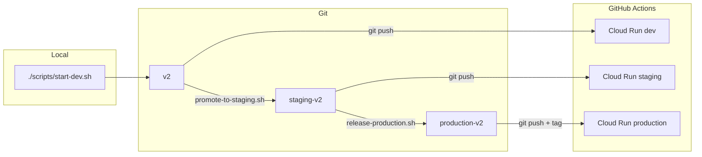

# Workflow Git / déploiement HatCast V2

Guide opérationnel pour le flux **développement local → `v2` (dev Cloud Run) → `staging-v2` (recette) → `production-v2` (prod V2)**. La configuration infra (Neon, secrets GitHub, OAuth) reste dans [DEPLOY_V2_CLOUD_RUN.md](DEPLOY_V2_CLOUD_RUN.md).

## Schéma



| Étape | Branche git | Action | CI / service |
|-------|-------------|--------|----------------|
| Dev local | — | `./scripts/start-dev.sh` | Neon branche **`local`** (`.env`), pas de push requis |
| Dev cloud | `v2` | `git push origin v2` | Env GitHub `development` → `hatcast-v2-dev` |
| Staging | `staging-v2` | `./scripts/v2/promote-to-staging.sh` | Env `staging` → `hatcast-v2-staging` ; **gate E2E smoke** avant deploy (pas sur `v2` dev cloud) |
| Production | `production-v2` | `./scripts/v2/release-production.sh` | Env `production` → `hatcast-v2` |

## Configuration des branches

Fichier central (scripts) : [`scripts/v2/branches.env`](../../../scripts/v2/branches.env) (modèle : [`branches.env.example`](../../../scripts/v2/branches.env.example)).

| Variable | Défaut |
|----------|--------|
| `HATCAST_V2_BRANCH_DEV` | `v2` |
| `HATCAST_V2_BRANCH_STAGING` | `staging-v2` |
| `HATCAST_V2_BRANCH_PRODUCTION` | `production-v2` |

**Renommer une branche** (cutover futur) :

1. Éditer `scripts/v2/branches.env`
2. Mettre à jour `branches:` dans [`.github/workflows/deploy-v2-cloud-run.yml`](../../../.github/workflows/deploy-v2-cloud-run.yml)
3. **Settings → Environments** → Deployment branches pour `development` / `staging` / `production`
4. Documenter le changement ici et dans [BRANCH_ENVIRONMENTS.md](../../shared/technical/BRANCH_ENVIRONMENTS.md)

Le workflow YAML est une **deuxième source de vérité** (limitation GitHub Actions).

## Développement local

- Stack : [`scripts/start-dev.sh`](../../../scripts/start-dev.sh) — API `http://127.0.0.1:8080`, front `https://localhost:4200`
- Base : Neon branche **`local`** — variables `HATCAST_DATASOURCE_*` dans **`.env`** à la racine (voir [`.env.example`](../../../.env.example), [DEVELOPMENT.md](../../../DEVELOPMENT.md)). **Ne pas** utiliser la branche **`development`** en local : elle est réservée à Cloud Run `hatcast-v2-dev` (profil `cloud`, sans seeds Flyway).
- Profil Spring **`dev`** : Flyway applique `db/migration` + `db/seed` (Les Improbots, recette MVP). Resets / regénération seed sur **`local`** sans impacter le déploiement cloud.
- Aucun push Git n’est requis pour travailler en local

## Déploiement dev (push sur `v2`)

Après commit :

```bash
git push origin v2
```

- Déclenche le workflow **Deploy V2 (Cloud Run)** uniquement si les fichiers modifiés correspondent aux `paths` du workflow (`apps/web/`, `services/api/`, `deploy/v2/`, `Dockerfile`, etc.). Un push qui ne touche que `docs/` ou `scripts/` **ne redéploie pas** — utiliser **workflow_dispatch** dans l’onglet Actions pour forcer un deploy si besoin.
- Environnement GitHub : **`development`**
- Service typique : **`hatcast-v2-dev`**
- Base Neon : branche **`development`** (secrets `HATCAST_DATASOURCE_*` de l’env GitHub — distincte de la branche **`local`** du `.env` poste)
- Suivi : onglet **Actions** du dépôt GitHub

Prérequis : environnement `development` autorise la branche `v2` ; secrets Neon/OAuth dev configurés ([DEPLOY_V2_CLOUD_RUN.md](DEPLOY_V2_CLOUD_RUN.md)).

## Promotion vers staging

Script : [`scripts/v2/promote-to-staging.sh`](../../../scripts/v2/promote-to-staging.sh)

```bash
# Simulation
./scripts/v2/promote-to-staging.sh --dry-run

# Réel (merge --no-ff par défaut)
./scripts/v2/promote-to-staging.sh

# Merge fast-forward uniquement
./scripts/v2/promote-to-staging.sh --ff-only
```

Comportement :

1. Arbre de travail propre, `git fetch origin`
2. Liste les commits `origin/staging-v2..origin/v2` ; si vide → exit 0
3. `checkout staging-v2`, `pull`, `merge origin/v2`, `push origin staging-v2`
4. CI : smoke E2E Playwright (recette 3.19) puis deploy Cloud Run — le deploy staging **échoue** si le smoke est rouge
5. Rappel URL Actions + service `hatcast-v2-staging`

**Ne pas** utiliser [`scripts/release-version.sh`](../../../scripts/release-version.sh) (flux V1 Firebase / `staging` → `main`).

## Release production V2

Script : [`scripts/v2/release-production.sh`](../../../scripts/v2/release-production.sh) — **à lancer depuis `staging-v2`**.

```bash
git checkout staging-v2
git pull origin staging-v2

./scripts/v2/release-production.sh --dry-run --patch   # simulation
./scripts/v2/release-production.sh --patch             # release réelle
```

Options : `--major`, `--minor`, `--patch` (défaut), `--version=X.Y.Z`, `--dry-run`, `--help`.

Étapes (réel) :

1. Détection **hotfixes** : commits sur `origin/production-v2` absents de `staging-v2` → menu rebase / continuer / stop
2. Version de référence lue sur **`production-v2`** (`apps/web/public/version.txt`, sinon `package.json` racine)
3. Bump **identique** dans `package.json` (racine) et `apps/web/package.json` — **échec si divergence**
4. Écrit `apps/web/public/version.txt`, met à jour `CHANGELOG.md` (et `CHANGELOG_FR.md` si présent)
5. Commit + push `staging-v2`
6. Merge **no-ff** vers `production-v2`, tag `vX.Y.Z`, push branche + tag
7. Rebase `staging-v2` sur `production-v2` + push

Le **déploiement** Cloud Run prod est déclenché par le push sur `production-v2` (pas par le script).

### Versioning

- Fichier affiché / build : `apps/web/public/version.txt` (généré à chaque release)
- Semver produit : `package.json` racine **et** `apps/web/package.json` doivent rester alignés
- Tags Git : `vX.Y.Z` sur le commit de release

Les entrées `CHANGELOG.md` racine sont partagées avec le monorepo (V1 + V2) ; privilégier des messages de commit Conventional Commits explicites (`feat:`, `fix:`, …) et mentionner « V2 » dans le corps si utile pour le lecteur.

## Rollback

- **Cloud Run** : redéployer une révision précédente dans la console GCP, ou re-déployer une image taguée par un commit/tag Git antérieur via `workflow_dispatch` sur le workflow V2.
- **Git** : ne pas réécrire l’historique de `production-v2` sans accord d’équipe ; préférer un commit de revert sur `staging-v2` puis nouvelle release.

## Checklist de test (avant cutover utilisateurs)

Ordre recommandé **sans impacter la prod V1** (`main` / Firebase) :

### 1. Dev

- [ ] Commit trivial sous `apps/web/` sur `v2`
- [ ] `git push origin v2`
- [ ] Job **Deploy V2** → environnement `development` vert
- [ ] Smoke : URL `hatcast-v2-dev`, login Google, `GET /v1/auth/me`

### 2. Staging

- [ ] `./scripts/v2/promote-to-staging.sh --dry-run` — commits attendus listés
- [ ] `./scripts/v2/promote-to-staging.sh` (réel)
- [ ] Job CI → environnement `staging`, service `hatcast-v2-staging`
- [ ] Recette fonctionnelle sur staging (parcours critique métier)

### 3. Release (simulation)

- [ ] Sur `staging-v2` : `./scripts/v2/release-production.sh --dry-run --patch`
- [ ] Vérifier merges/tags simulés et versions bump dans le sandbox `.dry-run-sandbox-v2`

### 4. Production (première fois)

- [ ] Branche `production-v2` créée et poussée sur `origin`
- [ ] **Settings → Environments → production → Deployment branches** : autoriser `production-v2` (pas `main` pour la CI V2)
- [ ] Secrets Neon/OAuth/CORS **production** renseignés
- [ ] `./scripts/v2/release-production.sh --patch` (réel)
- [ ] Tag `v*` présent ; deploy Cloud Run prod vert
- [ ] Smoke test prod **sans** bascule DNS / utilisateurs tant que le cutover n’est pas décidé

## Actions manuelles GitHub (hors dépôt)

1. **Créer `production-v2`** (si absente) :

   ```bash
   git fetch origin
   git checkout staging-v2
   git pull origin staging-v2
   git checkout -b production-v2
   git push -u origin production-v2
   ```

2. **Environments → production → Deployment branches** : selected branch **`production-v2`**
3. **Environments → staging → Deployment branches** : **`staging-v2`** (pas `staging` V1)
4. **Environments → development → Deployment branches** : **`v2`**

## Références

- [DEPLOY_V2_CLOUD_RUN.md](DEPLOY_V2_CLOUD_RUN.md) — Neon, secrets, IAM, OAuth
- [BRANCH_ENVIRONMENTS.md](../../shared/technical/BRANCH_ENVIRONMENTS.md) — V1 vs V2
- [ADR-0009](../../adr/0009-neon-postgres-environments.md) — branches Neon
- [`scripts/v2/`](../../../scripts/v2/) — scripts promote / release
