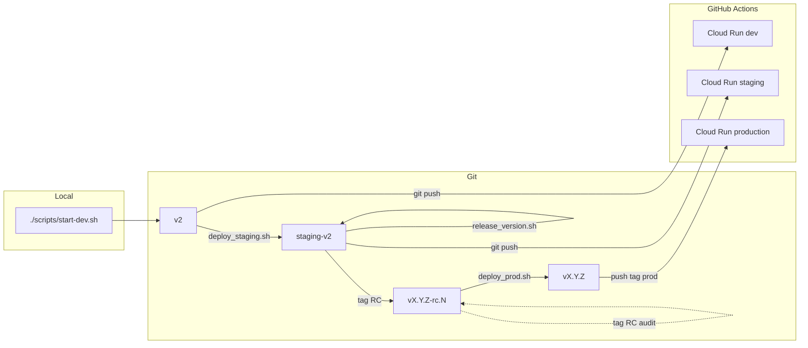

# Workflow Git / déploiement HatCast V2

Guide opérationnel pour le flux **développement local → dev Cloud Run → staging (recette) → production**. La configuration infra (Neon, secrets GitHub, OAuth) reste dans [DEPLOY_V2_CLOUD_RUN.md](DEPLOY_V2_CLOUD_RUN.md).

## Quick start développeur (OPS-11)

Quatre gestes — pas de manipulation manuelle de branches ni de tags :

```bash
git push origin v2                              # 1. dev cloud
./scripts/deploy_staging.sh                     # 2. staging + gate E2E smoke
./scripts/release_version.sh --patch            # 3. release (ou --minor / --major ; sans flag = RC+1)
./scripts/deploy_prod.sh                        # 4. prod (après recette staging)
```

Options utiles : `--dry-run` / `-n` sur chaque script ; `./scripts/deploy_prod.sh --redeploy` pour relancer la CI prod sans nouveau tag.

**Ne pas** utiliser [`scripts/release-version.sh`](../../../scripts/release-version.sh) pour V2 (flux V1 Firebase). V2 : [`scripts/release_version.sh`](../../../scripts/release_version.sh) (underscore).

Détail tags / branches / scripts bas niveau : sections suivantes et [`scripts/v2/`](../../../scripts/v2/).

## Schéma



| Étape | Branche git | Action | CI / service |
|-------|-------------|--------|----------------|
| Dev local | — | `./scripts/start-dev.sh` | Neon branche **`local`** (`.env`), pas de push requis |
| Dev cloud | `v2` | `git push origin v2` | Env GitHub `development` → `hatcast-v2-dev` |
| Staging | `staging-v2` | `./scripts/deploy_staging.sh` puis `./scripts/release_version.sh` | Env `staging` → `hatcast-v2-staging` ; **gate E2E smoke** avant deploy |
| Production | Tag `vX.Y.Z` | `./scripts/deploy_prod.sh` | Env `production` → `hatcast-v2` |

## Configuration des branches

Fichier central (scripts) : [`scripts/v2/branches.env`](../../../scripts/v2/branches.env) (modèle : [`branches.env.example`](../../../scripts/v2/branches.env.example)).

| Variable | Défaut |
|----------|--------|
| `HATCAST_V2_BRANCH_DEV` | `v2` |
| `HATCAST_V2_BRANCH_STAGING` | `staging-v2` |

**Renommer une branche** (cutover futur) :

1. Éditer `scripts/v2/branches.env`
2. Mettre à jour `branches:` dans [`.github/workflows/deploy-v2-cloud-run.yml`](../../../.github/workflows/deploy-v2-cloud-run.yml)
3. **Settings → Environments** → Deployment branches pour `development` / `staging` / `production`
4. Documenter le changement ici et dans [BRANCH_ENVIRONMENTS.md](../../shared/technical/BRANCH_ENVIRONMENTS.md)

Le workflow YAML est une **deuxième source de vérité** (limitation GitHub Actions).

## Développement local

- Stack : [`scripts/start-dev.sh`](../../../scripts/start-dev.sh) — API `http://127.0.0.1:8080`, front `https://localhost:4200`
- Base : Neon branche **`local`** — variables `HATCAST_DATASOURCE_*` dans **`.env`** à la racine (voir [`.env.example`](../../../.env.example), [DEVELOPMENT.md](../../../DEVELOPMENT.md)). **Ne pas** utiliser la branche **`development`** en local : elle est réservée à Cloud Run `hatcast-v2-dev` (profil `cloud`, sans seeds Flyway).
- Profil Spring **`dev`** : Flyway applique `db/migration` + `db/seed` + `db/seed-postgresql` (Les Improbots via `R__seed_improbots_dev_demo.sql`). Resets / regénération seed sur **`local`** sans impacter le déploiement cloud (`npm run generate:improbots-dev-seed`).
- Aucun push Git n’est requis pour travailler en local

## Déploiement dev (push sur `v2`)

Après commit :

```bash
git push origin v2
```

- Déclenche le workflow **Deploy V2 (Cloud Run)** uniquement si les fichiers modifiés correspondent aux `paths` du workflow (`apps/web/`, `services/api/`, `deploy/v2/`, `Dockerfile`, etc.). Un push qui ne touche que `docs/` ou `scripts/` **ne redéploie pas** — utiliser **workflow_dispatch** dans l’onglet Actions pour forcer un deploy si besoin.
- Environnement GitHub : **`development`**
- Service typique : **`hatcast-v2-dev`**
- Région Cloud Run par défaut : **`europe-west9`** (override possible via variable d’environnement GitHub `GCP_REGION`)
- Base Neon : branche **`development`** (secrets `HATCAST_DATASOURCE_*` de l’env GitHub — distincte de la branche **`local`** du `.env` poste)
- Suivi : onglet **Actions** du dépôt GitHub

Prérequis : environnement `development` autorise la branche `v2` ; secrets Neon/OAuth dev configurés ([DEPLOY_V2_CLOUD_RUN.md](DEPLOY_V2_CLOUD_RUN.md)).

## Promotion vers staging

Script façade : [`scripts/deploy_staging.sh`](../../../scripts/deploy_staging.sh) — implémentation [`scripts/v2/promote-to-staging.sh`](../../../scripts/v2/promote-to-staging.sh)

```bash
# Simulation
./scripts/deploy_staging.sh --dry-run

# Réel
./scripts/deploy_staging.sh
```

Comportement :

1. Arbre de travail propre, `git fetch origin`
2. Liste les commits `origin/staging-v2..origin/v2` ; si vide → exit 0
3. `checkout staging-v2`, `pull`, `merge origin/v2`, `push origin staging-v2`
4. CI : smoke E2E Playwright (recette 3.19 + E1 T1) puis deploy Cloud Run — le deploy staging **échoue** si le smoke est rouge
5. **Gate E1 préprod (T2)** : après deploy staging réussi, workflow [`e1-preprod-gate.yml`](../../../.github/workflows/e1-preprod-gate.yml) — health, PWA, assert migration structurel §6, Playwright mobile membre + desktop orga sur l’URL staging réelle (**sans** golden migration MIG-E2E)
6. Rappel URL Actions + service `hatcast-v2-staging`

**Ne pas** utiliser [`scripts/release-version.sh`](../../../scripts/release-version.sh) (flux V1 Firebase). V2 : [`scripts/release_version.sh`](../../../scripts/release_version.sh).

## Release assistée Cursor (recommandé)

Pour les releases depuis Cursor, utiliser la skill **[`.agents/skills/hatcast-v2-release/`](../../../.agents/skills/hatcast-v2-release/SKILL.md)** :

1. **Preview** (défaut) : `./scripts/v2/release-context.sh [--patch|--minor|--major]` — collecte commits, **aucune écriture disque**
2. **Gate A** : rédaction Argil bilingue dans le chat — `changes` (FR, PWA) + `changes_en` (EN, GitHub Release prod) ; retouches jusqu’à « OK pour les notes »
3. **Gate B** (optionnel) : `./scripts/release_version.sh … --dry-run` après écriture du cutover — preview CHANGELOG technique (sandbox, arbre de travail intact)
4. **Apply** : écriture `scripts/v2/changelog-entries/vX.Y.Z-cutover.json` (avec `changes_en`) puis `./scripts/release_version.sh` (sans `--dry-run`)
5. **Prod** (après recette) : `./scripts/deploy_prod.sh` crée le tag `vX.Y.Z` **et** la GitHub Release (notes EN + section technique `CHANGELOG.md`)

Principes éditoriaux : [Argil — product updates](https://www.argil.io/playbooks/product/writing-product-updates-and-releases). FR : `argil-editorial.md` ; EN : `argil-editorial-en.md`. Exemples : `v2/changelog-entries/v2.1.0-cutover.json`, `v2.2.0-cutover.json`.

**Pas de GitHub Release sur les tags RC** — uniquement sur `vX.Y.Z` lors de `deploy_prod.sh`. Prérequis : `gh` installé et authentifié (`gh auth login`).

## Release staging RC (V2)

Script façade : [`scripts/release_version.sh`](../../../scripts/release_version.sh) — implémentation [`scripts/v2/release-staging.sh`](../../../scripts/v2/release-staging.sh). Peut être lancé depuis `v2` (bascule automatique sur `staging-v2`).

```bash
# RC suivante (incrémente rc.N uniquement) :
./scripts/release_version.sh

# Bump semver + rc.1 :
./scripts/release_version.sh --patch

# Simulation
./scripts/release_version.sh --dry-run
./scripts/release_version.sh --dry-run --patch
```

Options avancées (script bas niveau uniquement) : `--version=X.Y.Z` (première RC cutover), `--no-user-changelog`.

### Règles tags RC

| Situation | Résultat |
|-----------|----------|
| Dernier tag `v2.0.0-rc.2`, sans option bump | Produit `2.0.0`, tag `v2.0.0-rc.3` |
| `--patch` après `v2.0.0-rc.5` | Produit `2.0.1`, tag `v2.0.1-rc.1` |
| Arbre en `2.0.0-SNAPSHOT`, aucun tag RC | **Obligatoire** `--version=2.0.0` (pas de release silencieuse) |

Étapes (réel) :

1. Arbre propre sur `staging-v2`, `git fetch origin` + tags
2. Résolution semver produit + numéro RC (helpers dans `scripts/lib/version-changelog.sh`)
3. Alignement `package.json` racine ↔ `apps/web/package.json` (racine legacy `0.x` → alignée sur web V2)
4. Écrit `apps/web/public/version.txt` via [`scripts/v2/lib/version-txt.sh`](../../scripts/v2/lib/version-txt.sh) — contrat **4 lignes** (semver · canal staging · hash git · horodatage build) ; ligne 1 = semver produit **sans** `-rc.N` ; ligne 2 = `Staging RC build - DATE`
5. Met à jour `CHANGELOG.md` (et `CHANGELOG_FR.md` si présent) depuis le tag RC précédent ou le dernier tag release
6. Met à jour **`apps/web/public/changelog.json`** (notes « Nouveautés » PWA, Story 10.3) depuis **`scripts/v2/changelog-entries/vX.Y.Z-cutover.json`** (cutover **obligatoire** ; skill `hatcast-v2-release` recommandée). Flag **`--no-user-changelog`** pour ne pas toucher ce fichier (RC technique, cutover déjà en place).
7. Commit `chore(v2): release staging vX.Y.Z-rc.N`, tag annoté `vX.Y.Z-rc.N`, push **branche + tag**
8. **Sync dev** : merge `origin/staging-v2` → `v2` + push (version.txt, changelog.json, package.json) pour que le dev local et les prochains `deploy_staging.sh` restent alignés

Le **déploiement** Cloud Run staging est déclenché par le **push sur `staging-v2`** uniquement (un run CI). Le tag RC `vX.Y.Z-rc.N` est poussé pour l’audit et `promote-tag-to-prod` ; il **ne** déclenche **pas** le workflow (évite un échec « environment protection » sur l’env `staging`).

### Flux opérateur staging

```
v2 → deploy_staging.sh → release_version.sh → tag vX.Y.Z-rc.N
→ push staging-v2 → sync staging-v2 → v2
→ CI deploy + smoke E2E → gate E1 préprod (T2) → recette
→ deploy_prod.sh
```

### 2.6 Gate E1 préprod (T2 — avant promote prod)

**Objectif :** bloquer `promote-tag-to-prod` si les parcours nominaux membre (mobile) et orga (desktop) échouent sur **staging Cloud Run** avec les données **La Malice** migrées.

| Palier | Workflow | Quand | Environnement |
|--------|----------|-------|---------------|
| **T1** | [`e2e-smoke.yml`](../../../.github/workflows/e2e-smoke.yml) | PR / push `v2`, **avant** deploy staging | API profil `e2e` + `localhost:4200` |
| **T2** | [`e1-preprod-gate.yml`](../../../.github/workflows/e1-preprod-gate.yml) | **Après** deploy staging (`staging-v2`) ; manuel `workflow_dispatch` | URL staging + Neon + Identity Platform |
| **T3** | [`migration-staging-gate.yml`](../../../.github/workflows/migration-staging-gate.yml) | **Après** replay migration Malice complet ; manuel `workflow_dispatch` | URL staging + Neon (golden KPIs MIG-E2E) |

Le job T2 est déclenché automatiquement par [`deploy-v2-cloud-run.yml`](../../../.github/workflows/deploy-v2-cloud-run.yml) à la fin d’un deploy **staging** réussi. Il est aussi lançable à la main (Actions → **E1 preprod gate (staging)** → **Run workflow**).

Le job **T3** n’est **pas** couplé au deploy : lancer après `./scripts/migrate-from-v1.sh` (ou `migrate:v2:run`) quand la base Neon staging contient la migration Malice complète. Permet de reset/rejouer la migration sans bloquer les pushes `staging-v2`.

**Bootstrap membre staging :** au setup Playwright (`auth-member.setup.ts`), l’orga E2E réactive automatiquement le compte `HATCAST_E2E_MEMBER_EMAIL` s’il est `INACTIVE` / `REMOVED` (PATCH adhésion troupe → `ACTIVE`, puis `POST …/participants/{id}/reinclude` si besoin). Désactiver : `HATCAST_E2E_SKIP_MEMBER_REACTIVATE=1`.

**Spectacles Malice :** `resolveE1Context` interroge l’API (`scope=all`) et retient un event avec `availabilityOpenedAt` — **à venir en priorité**, sinon **le plus récent passé** (navigation directe `/saison/…/event/{slug}`, pas dépendant de l’agenda « upcoming »). Override : `HATCAST_E2E_EVENT_DISPOS_SLUG` / `_DRAW_SLUG`.

**Critères de sortie (PO) :** 100 % P0 `e1-mobile-member` (échec = bloquant), incl. **E1-MEM-040** (onglet **Ma troupe** → hub) depuis 2026-06-12 ; 100 % P0 `e1-desktop-orga` ; `e1-staging-migration-assert.mjs` vert (seuils minimaux) ; `check-pwa.sh` vert. Les tests **MIG-E2E** (golden KPIs Patrice, historique archivé) sont dans le gate **T3** [`migration-staging-gate.yml`](../../../.github/workflows/migration-staging-gate.yml), pas T2.

**Assert migration §6 (sanity, pas comptes figés) :** saison trouvée ; roster actif ≥ 1 ; events non archivés ≥ 1 ; `seasons.event_count` = events non archivés ; ≥ 1 déplacement ; ≥ 1 spectacle avec dispos ouvertes. Les totaux (36 events, 4 déplacements, etc.) sont **loggés** mais ne bloquent pas — les chiffres V1 évoluent (archivage, nouveaux spectacles). Parité stricte optionnelle via `HATCAST_E2E_EVENTS_EXPECTED` (replay migration local uniquement).

#### Secrets / variables (environnement GitHub `staging`)

| Nom | Type | Rôle |
|-----|------|------|
| `HATCAST_E2E_STAGING_BASE_URL` | secret | Origine HTTPS Cloud Run (`PLAYWRIGHT_BASE_URL`) |
| `HATCAST_E2E_ORGA_EMAIL` / `HATCAST_E2E_ORGA_PASSWORD` | secrets | Login desktop orga (Identity Platform) |
| `HATCAST_E2E_MEMBER_EMAIL` / `HATCAST_E2E_MEMBER_PASSWORD` | secrets | Login mobile membre |
| `HATCAST_DATASOURCE_URL` | secret | JDBC Neon staging (assert migration §6) |
| `HATCAST_DATASOURCE_USERNAME` / `HATCAST_DATASOURCE_PASSWORD` | secrets | Credentials Neon (même paire que deploy Cloud Run ; requis par `pg` pour §6) |
| `HATCAST_E2E_TROUPE_SLUG` | variable | défaut `la-malice` |
| `HATCAST_E2E_SEASON_SLUG` | variable | slug saison Malice migrée (ex. `malice-2025-2026`) |
| `HATCAST_E2E_MEMBER_SLUG` | variable | slug utilisateur membre test (`/membre/{slug}`) |
| `HATCAST_E2E_EVENT_DISPOS_SLUG` | variable | **optionnel** — force un spectacle ; sinon auto (dispos ouvertes, à venir puis passé) |
| `HATCAST_E2E_EVENT_DRAW_SLUG` | variable | optionnel — tirage orga (défaut : premier non validé, sinon dispos) |
| `HATCAST_E2E_EVENT_ACTIVITE_SLUG` | variable | optionnel — défaut = spectacle dispos retenu |

#### Lancer le gate manuellement

**CI (recommandé)** — après un deploy staging ou pour re-valider sans redeploy :

1. GitHub → **Actions** → **E1 preprod gate (staging)** → **Run workflow** (branche `staging-v2` ou tag RC).
2. Vérifier le job vert ; en cas d’échec, télécharger l’artifact `e1-preprod-playwright-report`.

**Local (debug)** — avec comptes et slugs Malice dans l’environnement :

```bash
# Prérequis : secrets ci-dessus exportés (jamais commités)
export PLAYWRIGHT_STAGING_E2E=1
export PLAYWRIGHT_BASE_URL="https://hatcast-v2-staging-….run.app"
export PLAYWRIGHT_API_BASE_URL="$PLAYWRIGHT_BASE_URL"
export HATCAST_E2E_ORGA_EMAIL="…"
export HATCAST_E2E_ORGA_PASSWORD="…"
export HATCAST_E2E_MEMBER_EMAIL="…"
export HATCAST_E2E_MEMBER_PASSWORD="…"
export HATCAST_E2E_SEASON_SLUG="malice-2025-2026"
export HATCAST_E2E_MEMBER_SLUG="…"
# Slugs spectacle : optionnels — découverte API (dispos ouvertes ; passé OK si saison figée)

# §6 migration (Neon staging)
export HATCAST_DATASOURCE_URL="jdbc:postgresql://…"
export HATCAST_DATASOURCE_USERNAME="…"
export HATCAST_DATASOURCE_PASSWORD="…"
node scripts/v2/e1-staging-migration-assert.mjs

# PWA
BASE_URL="$PLAYWRIGHT_BASE_URL" ./scripts/check-pwa.sh

# Playwright E1 uniquement
cd apps/web
npx playwright install chromium
npm run test:e2e -- --project=e1-mobile-member --project=e1-desktop-orga
```

**Avant `deploy_prod.sh` :** confirmer qu’un run T2 récent est **vert** sur le commit RC cible (ou lancer `workflow_dispatch` juste avant promote). Après un replay migration, lancer aussi **T3** ([`migration-staging-gate.yml`](../../../.github/workflows/migration-staging-gate.yml)) si la parité Malice doit être attestée avant cutover.

#### Gate migration staging (T3 — après replay)

**Objectif :** valider la parité consultation Malice (KPIs golden, historique, stats orga) **sans** bloquer les deploys pendant un reset Neon ou un replay en cours.

1. GitHub → **Actions** → **Migration staging gate (Malice)** → **Run workflow**.
2. Option **strict parity** : active les asserts `HATCAST_E2E_EVENTS_EXPECTED` / `DEPLACEMENTS_EXPECTED` (variables env `staging`) en plus du Playwright golden.
3. En cas d’échec, artifact `migration-staging-playwright-report`.

**Local (debug)** — après migration complète :

```bash
export PLAYWRIGHT_STAGING_E2E=1
export PLAYWRIGHT_BASE_URL="https://hatcast-v2-staging-….run.app"
# … mêmes secrets que T2 (membre + Neon)
cd apps/web && npm run test:e2e:migration
```

Palier 1 (SQL/API, hors Playwright) : `npm run migrate:malice:post-smoke` — lancé automatiquement par `./scripts/migrate-from-v1.sh`.

## Release production V2 (tag-first OPS-5)

Script façade : [`scripts/deploy_prod.sh`](../../../scripts/deploy_prod.sh) — implémentation [`scripts/v2/promote-tag-to-prod.sh`](../../../scripts/v2/promote-tag-to-prod.sh). Détecte automatiquement le dernier RC distant.

```bash
# Simulation (inclut preview des notes GitHub Release)
./scripts/deploy_prod.sh --dry-run

# Réel (dernier vX.Y.Z-rc.N → vX.Y.Z + GitHub Release)
./scripts/deploy_prod.sh

# Tag prod sans GitHub Release (gh indisponible)
./scripts/deploy_prod.sh --no-github-release

# Re-déployer la prod sans nouveau tag
./scripts/deploy_prod.sh --redeploy
```

Si prod est déjà taguée sur un commit plus ancien que le dernier RC (ex. prod rc.3, staging rc.4), le script refuse et suggère `./scripts/release_version.sh --patch`.

Étapes (réel) :

1. Vérifie la version cible et récupère les tags distants (`git fetch --tags`).
2. Résout le tag RC source (`vX.Y.Z-rc.N`) et son commit.
3. Vérifie qu’un éventuel tag prod `vX.Y.Z` déjà présent pointe le même commit (sinon fail-fast).
4. Crée le tag annoté `vX.Y.Z` sur le commit RC source (si absent).
5. Push du tag prod vers `origin`.
6. Crée la **GitHub Release** `vX.Y.Z` : section « What's new » depuis `changes_en` du cutover (commit RC) + « Technical changes » depuis `CHANGELOG.md`. Idempotent si la release existe déjà.
7. Le workflow CI déploie la prod depuis le tag `vX.Y.Z` (pas besoin de branche de production dédiée).

Si le cutover n’a pas de `changes_en`, la release est créée avec la section technique uniquement (avertissement console). Compléter via la skill avant promote.

`release-production.sh` reste disponible en **flux legacy/transitoire**, mais le flux recommandé est désormais **tag-first**.

### Invariants OPS-8 (`hatcast.app`)

Le workflow CI applique des garde-fous explicites sur la cible **production** (tag `vX.Y.Z`) :

- `GCP_REGION` doit être `europe-west1` (domain mapping natif Cloud Run pour `hatcast.app`)
- `HATCAST_CORS_ALLOWED_ORIGINS` doit être exactement `https://hatcast.app`

Par défaut, sans override explicite :

- tag `vX.Y.Z` (prod) -> `europe-west1`
- `staging-v2` et `v2` -> `europe-west9`

### Versioning

- Fichier affiché / build : `apps/web/public/version.txt` (généré à chaque release staging ; **patch canal** au build Docker — voir ci-dessous)
- Override dev local (gitignored) : `apps/web/public/version.local.txt` — généré par `./scripts/start-dev.sh`, lu en **priorité** par le client (`AppVersionService`)
- Journal utilisateur PWA : `apps/web/public/changelog.json` (généré par `release-staging.sh`, consommé par le dialogue « Nouveautés »)
- Semver produit : `package.json` racine **et** `apps/web/package.json` doivent rester alignés
- Tags Git prod : `vX.Y.Z` sur le commit de release
- Tags Git staging RC : `vX.Y.Z-rc.N` (suffixe RC **uniquement** sur le tag, pas dans `package.json` / `version.txt`)
- Promotion prod (`promote-tag-to-prod.sh`) : **aucun** bump fichier dans git — le tag prod pointe le **même commit** RC qui contient déjà `version.txt` (`Staging RC build …`) et `changelog.json` ; l’artefact **production** affiche **`Production build …`** grâce au patch Docker (OPS-5)

#### Contrat `version.txt` (4 lignes)

Généré par `write_version_txt` dans [`scripts/v2/lib/version-txt.sh`](../../scripts/v2/lib/version-txt.sh) ; consommé par `AppVersionService` (semver + métadonnées build sur `/compte/a-propos`, story **10.3b**).

| Ligne | Contenu | Rôle |
|-------|---------|------|
| **1** | Semver produit (`X.Y.Z`, sans `-rc.N`) | Version affichée « Version X.Y.Z » |
| **2** | `{Canal} build - {DATE}` | **Canal de déploiement** (préfixe parsé côté client) |
| **3** | `Git: {hash court}` | Hash commit au moment de la génération |
| **4** | `Build: {ISO8601}` | **Horodatage build** (ex. `2026-06-13T12:49:32+0200`) ; UI About : compact `YYYYMMDDHHmm` |

Exemple (staging RC, tel que commité) :

```text
2.3.0
Staging RC build - 2026-06-13
Git: a0db03f7
Build: 2026-06-13T12:49:32+0200
```

**Préfixes ligne 2 → canal UI** (`AppVersionService` / onglet À propos) :

| Préfixe ligne 2 | Canal | Libellé UI |
|-----------------|-------|------------|
| `Production build` | `production` | production |
| `Staging RC build` | `staging` | staging |
| `Development build` | `development` | développement |
| `Local build` | `local` | local |

#### Patch canal au build Docker (`HATCAST_VERSION_CHANNEL`)

Le workflow [`.github/workflows/deploy-v2-cloud-run.yml`](../../.github/workflows/deploy-v2-cloud-run.yml) passe `--build-arg HATCAST_VERSION_CHANNEL=<target_env>` (`production` \| `staging` \| `development`) au `Dockerfile`. Avant `ng build`, [`apps/web/scripts/patch-version-txt-channel.mjs`](../../apps/web/scripts/patch-version-txt-channel.mjs) **réécrit uniquement la ligne 2** du `version.txt` copié depuis git — semver, hash et horodatage (l. 1, 3, 4) restent ceux du commit RC.

Conséquence OPS-5 : un déploiement **production** (tag `vX.Y.Z` sur le commit RC) **ne modifie pas** le fichier versionné dans git (l. 2 reste `Staging RC build …` dans l’historique), mais l’image servie expose `Production build …` → l’UI About affiche **canal production**.

#### Dev local — `start-dev.sh` → `Local build`

À chaque `./scripts/start-dev.sh`, `patch_local_version_txt` écrit **`apps/web/public/version.local.txt`** (gitignored) avec canal **`local`** (`Local build - DATE`), hash git courant et horodatage — **`version.txt` versionné inchangé**. Le client tente `/version.local.txt` puis `/version.txt` (`cache: no-store`).

**`changelog.json` (OPS-6)** : prérequis `jq` + **cutover** `scripts/v2/changelog-entries/vX.Y.Z-cutover.json`. Plage git CHANGELOG technique = tag RC précédent ou **dernier tag prod strictement antérieur** à la version cible pour `rc.1`. Référence éditoriale : [Argil — product updates](https://www.argil.io/playbooks/product/writing-product-updates-and-releases). `--no-user-changelog` : laisser le JSON existant. Smoke : `jq empty apps/web/public/changelog.json` et `check-pwa.sh` §5.

Les entrées `CHANGELOG.md` racine sont partagées avec le monorepo (V1 + V2) ; privilégier des messages de commit Conventional Commits explicites (`feat:`, `fix:`, …) et mentionner « V2 » dans le corps si utile pour le lecteur.

## Rollback

- **Tag-first (recommandé)** : redéployer un tag stable antérieur (`vX.Y.Z`) via un run manuel du workflow V2 ciblant ce tag (ou re-push contrôlé du tag si votre gouvernance l’autorise).
- **Cloud Run** : alternative rapide via re-déploiement d’une révision précédente dans la console GCP.
- **Git** : ne jamais réécrire un tag release distant (pas de force-push / history rewrite). En cas de correctif, repartir de `staging-v2`, valider, puis publier un **nouveau** tag semver.

## Checklist de test (avant cutover utilisateurs)

Ordre recommandé **sans impacter la prod V1** (`main` / Firebase) :

### 1. Dev

- [ ] Commit trivial sous `apps/web/` sur `v2`
- [ ] `git push origin v2`
- [ ] Job **Deploy V2** → environnement `development` vert
- [ ] Smoke : URL `hatcast-v2-dev`, login Google, `GET /v1/auth/me`

### 2. Staging

- [ ] `./scripts/v2/promote-to-staging.sh --dry-run` — commits attendus listés
- [ ] `./scripts/v2/promote-to-staging.sh` (réel)
- [ ] Sur `staging-v2` : `./scripts/v2/release-staging.sh --dry-run` puis `./scripts/v2/release-staging.sh --version=2.0.0` (première RC cutover) ou `./scripts/v2/release-staging.sh` (RC suivante)
- [ ] Job CI → environnement `staging`, service `hatcast-v2-staging`
- [ ] **Gate E1 préprod (T2)** vert sur ce deploy ([`e1-preprod-gate.yml`](../../../.github/workflows/e1-preprod-gate.yml) ou `workflow_dispatch`)
- [ ] **Gate migration (T3)** vert si replay Malice récent ([`migration-staging-gate.yml`](../../../.github/workflows/migration-staging-gate.yml))
- [ ] Recette fonctionnelle sur staging (parcours critique métier)

### 3. Release (simulation)

- [ ] Sur `staging-v2` : `./scripts/v2/promote-tag-to-prod.sh --dry-run --version=2.0.0`
- [ ] Vérifier que la simulation cible bien le dernier tag `v2.0.0-rc.N`

### 4. Production (première fois)

- [ ] Secrets Neon/OAuth/CORS **production** renseignés
- [ ] `./scripts/v2/promote-tag-to-prod.sh --version=2.0.0` (réel)
- [ ] Tag `v*` présent ; deploy Cloud Run prod vert
- [ ] Smoke test prod **sans** bascule DNS / utilisateurs tant que le cutover n’est pas décidé

## Actions manuelles GitHub (hors dépôt)

1. **Environments → staging → Deployment branches** : **`staging-v2`** (pas `staging` V1)
2. **Environments → development → Deployment branches** : **`v2`**
3. **Environments → production** : configurer une policy compatible **tags semver** (ex. selected branches and tags incluant `v*.*.*`) pour autoriser le flux tag-first OPS-5

## Références

- [DEPLOY_V2_CLOUD_RUN.md](DEPLOY_V2_CLOUD_RUN.md) — Neon, secrets, IAM, OAuth
- [BRANCH_ENVIRONMENTS.md](../../shared/technical/BRANCH_ENVIRONMENTS.md) — V1 vs V2
- [ADR-0009](../../adr/0009-neon-postgres-environments.md) — branches Neon
- [`scripts/v2/`](../../../scripts/v2/) — scripts promote / release
