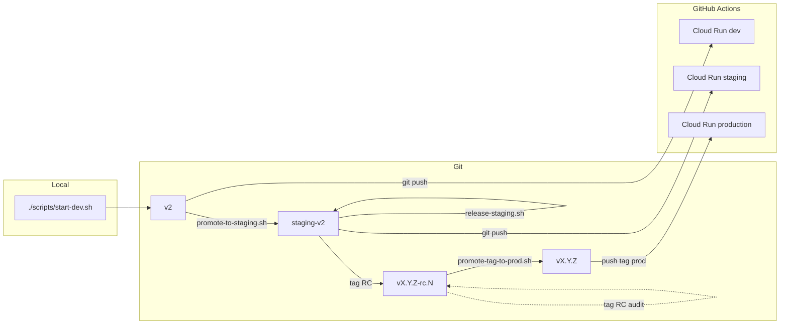

# Workflow Git / déploiement HatCast V2

Guide opérationnel pour le flux **développement local → `v2` (dev Cloud Run) → `staging-v2` (recette) → tags semver (`vX.Y.Z-rc.N` puis `vX.Y.Z`)**. La configuration infra (Neon, secrets GitHub, OAuth) reste dans [DEPLOY_V2_CLOUD_RUN.md](DEPLOY_V2_CLOUD_RUN.md).

## Schéma



| Étape | Branche git | Action | CI / service |
|-------|-------------|--------|----------------|
| Dev local | — | `./scripts/start-dev.sh` | Neon branche **`local`** (`.env`), pas de push requis |
| Dev cloud | `v2` | `git push origin v2` | Env GitHub `development` → `hatcast-v2-dev` |
| Staging | `staging-v2` | `./scripts/v2/promote-to-staging.sh` puis `./scripts/v2/release-staging.sh` | Env `staging` → `hatcast-v2-staging` ; **gate E2E smoke** avant deploy (pas sur `v2` dev cloud) |
| Production | Tag `vX.Y.Z` | `./scripts/v2/promote-tag-to-prod.sh --version=X.Y.Z` | Env `production` → `hatcast-v2` |

## Configuration des branches

Fichier central (scripts) : [`scripts/v2/branches.env`](../../../scripts/v2/branches.env) (modèle : [`branches.env.example`](../../../scripts/v2/branches.env.example)).

| Variable | Défaut |
|----------|--------|
| `HATCAST_V2_BRANCH_DEV` | `v2` |
| `HATCAST_V2_BRANCH_STAGING` | `staging-v2` |

**Renommer une branche** (cutover futur) :

1. Éditer `scripts/v2/branches.env`
2. Mettre à jour `branches:` dans [`.github/workflows/deploy-v2-cloud-run.yml`](../../../.github/workflows/deploy-v2-cloud-run.yml)
3. **Settings → Environments** → Deployment branches pour `development` / `staging` / `production`
4. Documenter le changement ici et dans [BRANCH_ENVIRONMENTS.md](../../shared/technical/BRANCH_ENVIRONMENTS.md)

Le workflow YAML est une **deuxième source de vérité** (limitation GitHub Actions).

## Développement local

- Stack : [`scripts/start-dev.sh`](../../../scripts/start-dev.sh) — API `http://127.0.0.1:8080`, front `https://localhost:4200`
- Base : Neon branche **`local`** — variables `HATCAST_DATASOURCE_*` dans **`.env`** à la racine (voir [`.env.example`](../../../.env.example), [DEVELOPMENT.md](../../../DEVELOPMENT.md)). **Ne pas** utiliser la branche **`development`** en local : elle est réservée à Cloud Run `hatcast-v2-dev` (profil `cloud`, sans seeds Flyway).
- Profil Spring **`dev`** : Flyway applique `db/migration` + `db/seed` (Les Improbots, recette MVP). Resets / regénération seed sur **`local`** sans impacter le déploiement cloud.
- Aucun push Git n’est requis pour travailler en local

## Déploiement dev (push sur `v2`)

Après commit :

```bash
git push origin v2
```

- Déclenche le workflow **Deploy V2 (Cloud Run)** uniquement si les fichiers modifiés correspondent aux `paths` du workflow (`apps/web/`, `services/api/`, `deploy/v2/`, `Dockerfile`, etc.). Un push qui ne touche que `docs/` ou `scripts/` **ne redéploie pas** — utiliser **workflow_dispatch** dans l’onglet Actions pour forcer un deploy si besoin.
- Environnement GitHub : **`development`**
- Service typique : **`hatcast-v2-dev`**
- Région Cloud Run par défaut : **`europe-west9`** (override possible via variable d’environnement GitHub `GCP_REGION`)
- Base Neon : branche **`development`** (secrets `HATCAST_DATASOURCE_*` de l’env GitHub — distincte de la branche **`local`** du `.env` poste)
- Suivi : onglet **Actions** du dépôt GitHub

Prérequis : environnement `development` autorise la branche `v2` ; secrets Neon/OAuth dev configurés ([DEPLOY_V2_CLOUD_RUN.md](DEPLOY_V2_CLOUD_RUN.md)).

## Promotion vers staging

Script : [`scripts/v2/promote-to-staging.sh`](../../../scripts/v2/promote-to-staging.sh)

```bash
# Simulation
./scripts/v2/promote-to-staging.sh --dry-run

# Réel (merge --no-ff par défaut)
./scripts/v2/promote-to-staging.sh

# Merge fast-forward uniquement
./scripts/v2/promote-to-staging.sh --ff-only
```

Comportement :

1. Arbre de travail propre, `git fetch origin`
2. Liste les commits `origin/staging-v2..origin/v2` ; si vide → exit 0
3. `checkout staging-v2`, `pull`, `merge origin/v2`, `push origin staging-v2`
4. CI : smoke E2E Playwright (recette 3.19) puis deploy Cloud Run — le deploy staging **échoue** si le smoke est rouge
5. Rappel URL Actions + service `hatcast-v2-staging`

**Ne pas** utiliser [`scripts/release-version.sh`](../../../scripts/release-version.sh) (flux V1 Firebase / `staging` → `main`).

## Release staging RC (V2)

Script : [`scripts/v2/release-staging.sh`](../../../scripts/v2/release-staging.sh) — **à lancer depuis `staging-v2`**, après promotion du code depuis `v2`.

```bash
git checkout staging-v2
git pull origin staging-v2

# Première RC cutover (arbre encore en X.Y.Z-SNAPSHOT, aucun tag RC) :
./scripts/v2/release-staging.sh --version=2.0.0

# RC suivante (incrémente rc.N uniquement) :
./scripts/v2/release-staging.sh

# Simulation
./scripts/v2/release-staging.sh --dry-run
./scripts/v2/release-staging.sh --dry-run --patch   # bump semver + rc.1
```

Options : `--patch`, `--minor`, `--major`, `--version=X.Y.Z`, `--dry-run`, `--help`.

### Règles tags RC

| Situation | Résultat |
|-----------|----------|
| Dernier tag `v2.0.0-rc.2`, sans option bump | Produit `2.0.0`, tag `v2.0.0-rc.3` |
| `--patch` après `v2.0.0-rc.5` | Produit `2.0.1`, tag `v2.0.1-rc.1` |
| Arbre en `2.0.0-SNAPSHOT`, aucun tag RC | **Obligatoire** `--version=2.0.0` (pas de release silencieuse) |

Étapes (réel) :

1. Arbre propre sur `staging-v2`, `git fetch origin` + tags
2. Résolution semver produit + numéro RC (helpers dans `scripts/lib/version-changelog.sh`)
3. Alignement `package.json` racine ↔ `apps/web/package.json` (racine legacy `0.x` → alignée sur web V2)
4. Écrit `apps/web/public/version.txt` (ligne 1 = semver produit **sans** `-rc.N` ; ligne 2 = `Staging RC build - DATE`)
5. Met à jour `CHANGELOG.md` (et `CHANGELOG_FR.md` si présent) depuis le tag RC précédent ou le dernier tag release
6. Met à jour **`apps/web/public/changelog.json`** (notes « Nouveautés » PWA, Story 10.3) : même plage git que le CHANGELOG technique, transformation OpenAI optionnelle (`scripts/generate-changelog.js`, principes Argil), ou entrée **curated** pour la version **`2.0.0`** (`scripts/v2/changelog-entries/v2.0.0-cutover.json`). Sans clé OpenAI ou en cas d’échec : entrée avec `"changes": []` (pas de sujets de commit). Flag **`--no-user-changelog`** pour ne pas toucher ce fichier.
7. Commit `chore(v2): release staging vX.Y.Z-rc.N`, tag annoté `vX.Y.Z-rc.N`, push **branche + tag**

Le **déploiement** Cloud Run staging est déclenché par le **push sur `staging-v2`** uniquement (un run CI). Le tag RC `vX.Y.Z-rc.N` est poussé pour l’audit et `promote-tag-to-prod` ; il **ne** déclenche **pas** le workflow (évite un échec « environment protection » sur l’env `staging`).

### Flux opérateur staging

```
v2 → promote-to-staging.sh → release-staging.sh → tag vX.Y.Z-rc.N
→ push staging-v2 → CI deploy + smoke E2E → recette (tag RC sans workflow)
→ promote-tag-to-prod.sh --version=X.Y.Z
```

## Release production V2 (tag-first OPS-5)

Script : [`scripts/v2/promote-tag-to-prod.sh`](../../../scripts/v2/promote-tag-to-prod.sh) — à lancer après validation d’un RC staging.

```bash
# Simulation
./scripts/v2/promote-tag-to-prod.sh --dry-run --version=2.0.0

# Réel (promote le dernier v2.0.0-rc.N vers v2.0.0)
./scripts/v2/promote-tag-to-prod.sh --version=2.0.0

# Variante avec RC explicite
./scripts/v2/promote-tag-to-prod.sh --version=2.0.0 --rc-tag=v2.0.0-rc.3
```

Options : `--version=X.Y.Z` (obligatoire), `--rc-tag=vX.Y.Z-rc.N` (optionnel), `--dry-run`, `--force`, `--help`.

Étapes (réel) :

1. Vérifie la version cible et récupère les tags distants (`git fetch --tags`).
2. Résout le tag RC source (`vX.Y.Z-rc.N`) et son commit.
3. Vérifie qu’un éventuel tag prod `vX.Y.Z` déjà présent pointe le même commit (sinon fail-fast).
4. Crée le tag annoté `vX.Y.Z` sur le commit RC source (si absent).
5. Push du tag prod vers `origin`.
6. Le workflow CI déploie la prod depuis le tag `vX.Y.Z` (pas besoin de branche de production dédiée).

`release-production.sh` reste disponible en **flux legacy/transitoire**, mais le flux recommandé est désormais **tag-first**.

### Invariants OPS-8 (`hatcast.app`)

Le workflow CI applique des garde-fous explicites sur la cible **production** (tag `vX.Y.Z`) :

- `GCP_REGION` doit être `europe-west1` (domain mapping natif Cloud Run pour `hatcast.app`)
- `HATCAST_CORS_ALLOWED_ORIGINS` doit être exactement `https://hatcast.app`

Par défaut, sans override explicite :

- tag `vX.Y.Z` (prod) -> `europe-west1`
- `staging-v2` et `v2` -> `europe-west9`

### Versioning

- Fichier affiché / build : `apps/web/public/version.txt` (généré à chaque release)
- Journal utilisateur PWA : `apps/web/public/changelog.json` (généré par `release-staging.sh`, consommé par le dialogue « Nouveautés »)
- Semver produit : `package.json` racine **et** `apps/web/package.json` doivent rester alignés
- Tags Git prod : `vX.Y.Z` sur le commit de release
- Tags Git staging RC : `vX.Y.Z-rc.N` (suffixe RC **uniquement** sur le tag, pas dans `package.json` / `version.txt`)
- Promotion prod (`promote-tag-to-prod.sh`) : **aucun** bump fichier — le tag prod pointe le commit RC qui contient déjà `version.txt` et `changelog.json`

**`changelog.json` (OPS-6)** : prérequis `jq` ; `OPENAI_API_KEY` dans `.env` / `.env.local` pour des puces utilisateur (sinon liste vide). Référence éditoriale : [Argil — product updates](https://www.argil.io/playbooks/product/writing-product-updates-and-releases). Cutover `2.0.0` : fichier curated, pas git/OpenAI. `--no-user-changelog` : laisser le JSON existant. Smoke : `jq empty apps/web/public/changelog.json` et `check-pwa.sh` §5.

Les entrées `CHANGELOG.md` racine sont partagées avec le monorepo (V1 + V2) ; privilégier des messages de commit Conventional Commits explicites (`feat:`, `fix:`, …) et mentionner « V2 » dans le corps si utile pour le lecteur.

## Rollback

- **Tag-first (recommandé)** : redéployer un tag stable antérieur (`vX.Y.Z`) via un run manuel du workflow V2 ciblant ce tag (ou re-push contrôlé du tag si votre gouvernance l’autorise).
- **Cloud Run** : alternative rapide via re-déploiement d’une révision précédente dans la console GCP.
- **Git** : ne jamais réécrire un tag release distant (pas de force-push / history rewrite). En cas de correctif, repartir de `staging-v2`, valider, puis publier un **nouveau** tag semver.

## Checklist de test (avant cutover utilisateurs)

Ordre recommandé **sans impacter la prod V1** (`main` / Firebase) :

### 1. Dev

- [ ] Commit trivial sous `apps/web/` sur `v2`
- [ ] `git push origin v2`
- [ ] Job **Deploy V2** → environnement `development` vert
- [ ] Smoke : URL `hatcast-v2-dev`, login Google, `GET /v1/auth/me`

### 2. Staging

- [ ] `./scripts/v2/promote-to-staging.sh --dry-run` — commits attendus listés
- [ ] `./scripts/v2/promote-to-staging.sh` (réel)
- [ ] Sur `staging-v2` : `./scripts/v2/release-staging.sh --dry-run` puis `./scripts/v2/release-staging.sh --version=2.0.0` (première RC cutover) ou `./scripts/v2/release-staging.sh` (RC suivante)
- [ ] Job CI → environnement `staging`, service `hatcast-v2-staging`
- [ ] Recette fonctionnelle sur staging (parcours critique métier)

### 3. Release (simulation)

- [ ] Sur `staging-v2` : `./scripts/v2/promote-tag-to-prod.sh --dry-run --version=2.0.0`
- [ ] Vérifier que la simulation cible bien le dernier tag `v2.0.0-rc.N`

### 4. Production (première fois)

- [ ] Secrets Neon/OAuth/CORS **production** renseignés
- [ ] `./scripts/v2/promote-tag-to-prod.sh --version=2.0.0` (réel)
- [ ] Tag `v*` présent ; deploy Cloud Run prod vert
- [ ] Smoke test prod **sans** bascule DNS / utilisateurs tant que le cutover n’est pas décidé

## Actions manuelles GitHub (hors dépôt)

1. **Environments → staging → Deployment branches** : **`staging-v2`** (pas `staging` V1)
2. **Environments → development → Deployment branches** : **`v2`**
3. **Environments → production** : configurer une policy compatible **tags semver** (ex. selected branches and tags incluant `v*.*.*`) pour autoriser le flux tag-first OPS-5

## Références

- [DEPLOY_V2_CLOUD_RUN.md](DEPLOY_V2_CLOUD_RUN.md) — Neon, secrets, IAM, OAuth
- [BRANCH_ENVIRONMENTS.md](../../shared/technical/BRANCH_ENVIRONMENTS.md) — V1 vs V2
- [ADR-0009](../../adr/0009-neon-postgres-environments.md) — branches Neon
- [`scripts/v2/`](../../../scripts/v2/) — scripts promote / release
