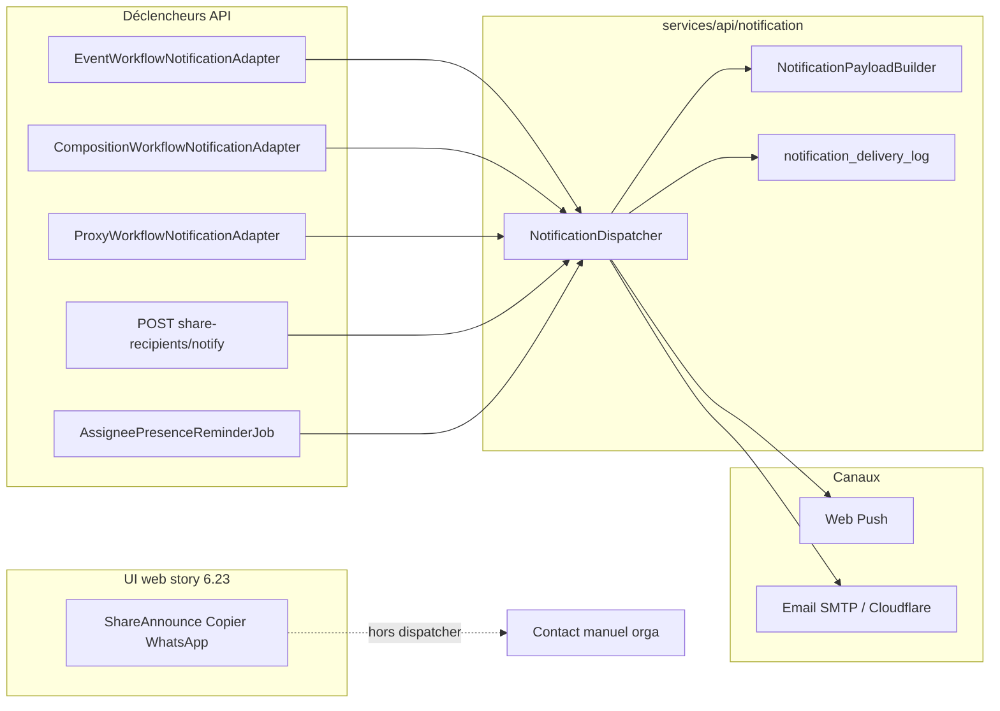

# HatCast V2 — Catalogue des notifications

**Statut :** Référence as-is (runtime V2)  
**Dernière mise à jour :** 2026-06-09 (story **6.23** — share UI Copier/WhatsApp ; **8.4b** — ops orga v2 : audiences par intent, `TEAM_REGRESSED`, promotion transactionnelle)  
**Prochaine revue :** story **6.10c** (`MANUAL_GAP_RECRUITMENT`) ou inbox `/accueil`  
**Brainstorm post-catalog :** `[brainstorming-session-2026-06-07-notifications-post-catalog.md](../../_bmad-output/brainstorming/brainstorming-session-2026-06-07-notifications-post-catalog.md)` (décisions PO 2026-06-08)  
**Investigation :** `[notifications-catalog-investigation.md](../../_bmad-output/implementation-artifacts/investigations/notifications-catalog-investigation.md)`  
**Lié à :** [ARCH.md](../../ARCH.md) § Notifications V2 · stories Epic 8 · [SCP notifications 2026-06-01](../../_bmad-output/planning-artifacts/sprint-change-proposal-2026-06-01-notifications-epic8-scope.md)

Ce document inventorie les messages **push** et **email** émis par la stack V2 (`services/api/` + Web Push côté client). Il couvre déclencheurs, audiences, préférences utilisateur et copy. Il **ne remplace pas** le PRD (FR29–FR31), DOMAIN ni SPEC — c’est le miroir **runtime** du code.

Il **ne décrit pas** l’**inbox** applicative (`GET /v1/me/inbox`) : surface **pull** dérivée de l’état domaine, pas un journal d’envoi.

Parité V1 (files Firestore, HTML riche) : `[legacy/src/services/notificationTemplates.js](../../legacy/src/services/notificationTemplates.js)`, [`docs/v1/technical/REMINDER_SYSTEM_README.md](../../docs/v1/technical/REMINDER_SYSTEM_README.md).

---

## Index maître


| Intent                                       | Statut                 | Déclenchement                                                               | Audience                                 | Préférence (catégorie)               | Story                   |
| -------------------------------------------- | ---------------------- | --------------------------------------------------------------------------- | ---------------------------------------- | ------------------------------------ | ----------------------- |
| `AVAILABILITY_OPENED`                        | **Actif**              | Auto — publication dispos                                                   | Roster concerné                          | `AVAILABILITY_REQUEST`               | 8.3, 3.21               |
| `MANUAL_AVAILABILITY_ANNOUNCE`               | **Actif** (API)        | Manuel — Share `event` *(dispatch API ; UI web 6.23 : Copier/WhatsApp seulement)* | Roster concerné                          | `AVAILABILITY_REQUEST`               | 6.10, 6.23              |
| `MANUAL_AVAILABILITY_NUDGE`                  | **Actif** (API)        | Manuel — Share `availability_nudge` *(idem — UI web n'appelle plus POST notify)* | Dispos `unknown`                         | `AVAILABILITY_REQUEST`               | 6.10b, 6.23             |
| `CONFIRMATION_REQUEST`                       | **Actif**              | Auto — validate compo                                                       | Assignés                                 | `CONFIRMATION_REQUEST`               | 8.3                     |
| `RECONFIRMATION_REQUEST`                     | **Actif**              | Auto — revalidate                                                           | Assignés pending                         | `CONFIRMATION_REQUEST`               | 8.5                     |
| `REMOVED_FROM_COMPOSITION`                   | **Actif**              | Auto — retrait slot (validée)                                               | Ancien assigné                           | `CONFIRMATION_REQUEST` *             | 8.5                     |
| `ASSIGNEE_PRESENCE_REMINDER`                 | **Actif**              | Programmé — J-7 / J-1                                                       | Assignés `confirmed`                     | `REMINDER_7_DAYS` / `REMINDER_1_DAY` | 8.5, 8.5b               |
| `PROXY_AVAILABILITY_RECORDED`                | **Actif**              | Auto — proxy dispo                                                          | Sujet lié                                | `AVAILABILITY_REQUEST`               | 8.6, 5.5                |
| `PROXY_CONFIRMATION_RECORDED`                | **Actif**              | Auto — proxy participation                                                  | Sujet lié                                | `CONFIRMATION_REQUEST`               | 8.6, 6.8                |
| `EVENT_DETAILS_CHANGED`                      | **Actif**              | Auto — delta date/lieu/format sur événement publié                          | Roster engagé (dispo ∪ participation)    | `EVENT_DETAILS_CHANGED`              | 8.8                     |
| `EVENT_ARCHIVED`                             | **Actif**              | Auto — archivage                                                            | Roster engagé actif                      | `EVENT_ARCHIVED`                     | 8.8                     |
| `TEAM_COMPLETE_MEMBER`                       | **Actif**              | Auto — lifecycle `→ COMPLETE`                                               | Orgas événement + assignés au complet    | `TEAM_CONFIRMED`                     | 8.9                     |
| `COMPOSITION_SHARED`                         | **Actif**              | Auto — publish brouillon compo                                              | Orgas **événement**                      | `ORG_DRAFT_COMPOSITION`              | 8.4b                    |
| `EVENT_DRAFT_CREATED`                        | **Actif**              | Auto — création brouillon                                                   | Orgas **saison**                         | `ORG_EVENT_DRAFT_CREATED`            | 8.4b                    |
| `SLA_OPEN_AVAILABILITY`                      | **Actif**              | Programmé — quotidien (~30j, **brouillons** `availabilityOpenedAt IS NULL`) | Orgas événement + saison (dédupe/tick)   | `ORG_SLA_OPEN_AVAILABILITY`          | 8.4b                    |
| `COMPOSITION_INCOMPLETE_WEEKLY`              | **Actif**              | Programmé — hebdo (compo validée, non `COMPLETE`)                           | Orgas événement + saison (escalade)      | `ORG_COMPOSITION_INCOMPLETE`         | 8.4b                    |
| `COMPOSITION_INCOMPLETE_DAILY_J7`            | **Actif**              | Programmé — J-7 civil (`Europe/Paris`)                                      | Orgas événement + saison (escalade)      | `ORG_COMPOSITION_INCOMPLETE`         | 8.4b                    |
| `TEAM_COMPLETE`                              | **Actif**              | Auto — lifecycle `→ COMPLETE`                                               | Orgas **événement**                      | `ORG_TEAM_COMPLETE`                  | 8.4b                    |
| `TEAM_REGRESSED`                             | **Actif**              | Auto — lifecycle `COMPLETE → ¬COMPLETE` (compo validée)                     | Orgas **événement**                      | `ORG_TEAM_REGRESSED`                 | 8.4b                    |
| `ASSIGNEE_DECLINED`                          | **Retiré**             | Remplacé par `TEAM_REGRESSED` (8.4b)                                        | —                                        | `ORG_ASSIGNEE_DECLINED` (retiré)     | 8.4                     |
| `ORGANIZER_SCOPE_GRANTED`                    | **Actif**              | Auto — grant orga spectacle / saison / admin troupe                         | Utilisateur promu (email transactionnel) | `ORG_SCOPE_GRANTED`                  | 8.4b                    |
| `TEAM_VALIDATED_FYI`                         | Câblé, **non émis**    | —                                                                           | —                                        | `TEAM_CONFIRMED` †                   | *(legacy — voir G-012)* |
| Intents **proposés** (brainstorm 2026-06-07) | **Backlog proposé**    | Voir § [Backlog proposé](#backlog-proposé--brainstorm-2026-06-07)           | —                                        | —                                    | G-012, 6.10c, Epic 7    |
| Share `draw` / `composition` / `event` / `availability_nudge` | Manuel hors dispatcher | Copie / WhatsApp (UI web)                                                   | —                                        | —                                    | 6.10, 6.23              |


 Voir [Tensions produit](#tensions-produit-documentées) — retrait mappé sur une catégorie opt-out.  
† **Préférence masquée en UI** — intent non émis (`TEAM_VALIDATED_FYI` dead path).  
‡ `**COMPOSITION_SHARED` (catégorie membre)** reste masquée en UI ; l’intent mappe sur `**ORG_DRAFT_COMPOSITION`** (opt-in orga).  
† **Runtime 8.4b** : audiences **par intent** (délégation explicite) — voir § [Ops organisateur](#messages-actifs--ops-organisateur-fr31b). Cascade/cercle 8.4 **retirés**.

---

## Résumé architecture



**Note (6.23) :** la modale web **`ShareAnnounceDialog`** n’appelle plus `MAPI` ; elle lit GET `share-recipients` pour la ligne compacte *déjà notifiés / reste à prévenir*, puis **Copier / WhatsApp** uniquement.


| Composant                   | Chemin                                                                                                              |
| --------------------------- | ------------------------------------------------------------------------------------------------------------------- |
| Intents & catégories        | `NotificationIntent.kt`                                                                                             |
| Copy (titre, corps, sujet)  | `NotificationPayloadBuilder.kt`                                                                                     |
| Destinataires & éligibilité | `NotificationDispatcher.kt`, `NotificationRecipientResolver.kt`                                                     |
| Push global                 | `PushNotificationEligibilityPort.kt`                                                                                |
| Préférences catégorie       | `UserNotificationPreferencesService.kt`, `GET/PATCH /v1/me/notification-preferences`                                |
| Enveloppe email             | `EmailNotificationSender.kt`                                                                                        |
| Rappels J-7 / J-1           | `AssigneePresenceReminderJob.kt` — cron `hatcast.notification.reminder-cron` (défaut `0 0 8 * * *`, `Europe/Paris`) |


---

## Contrat d’URL (deep links)


| Surface                     | Format                                                        | Exemple                                                  |
| --------------------------- | ------------------------------------------------------------- | -------------------------------------------------------- |
| **Canonique front (SPEC)**  | `/saison/{troupeSlug}/{seasonSlug}/event/{eventSlug}` + query | `/saison/la-malice/saison-2026/event/cabaret?tab=dispos` |
| **Payload API aujourd’hui** | `/saison/{seasonSlug}/event/{eventSlug}` + query              | `/saison/saison-2026/event/cabaret?tab=dispos`           |


- **Source API :** `NotificationPayloadBuilder.kt` n’injecte que le slug **saison** (pas le slug troupe).
- **Source front :** `apps/web/src/app/core/messaging/event-urls.ts` — builders Share/Announce et SPEC.
- **Compatibilité :** le client Angular expose des routes legacy `saison/:seasonSlug/event/:eventSlug` redirigées par `SaisonLegacyRedirect` vers la forme canonique à **trois segments** (`app.routes.ts`).

Les tableaux ci-dessous documentent le **chemin relatif émis par l’API** (copy as-shipped). Les emails concatènent l’origine absolue côté client ou lien tel que reçu ; en pratique la redirection legacy couvre les liens push/email à deux segments **tant que la saison est résolvable**.

**Dette connue :** aligner `NotificationPayloadBuilder` sur l’URL canonique à trois segments (story dédiée ou extension 17.x slugs).

---

## Corps email

### Runtime actuel (push)

Push : `NotificationPayload` (`title`, `body`, `url` relative). Email : HTML via `NotificationEmailBodyBuilder` (voir copy cible ci-dessous) — **plus** le même texte que le push depuis story copy email.

### Copy cible — emails dédiés *(runtime depuis story copy email)*

Corps **email dédiés** (distincts du push), CTA contextualisé, pied de page préférences. **Push inchangé** (cf. colonnes Push body ci-dessous). Implémentation : `NotificationEmailBodyBuilder` + `EmailNotificationSender`.

#### Placeholders & accords

| Placeholder | Source |
|-------------|--------|
| `{pseudo}` | Prénom ou `displayName` du destinataire (`NotificationRecipient.displayName`) |
| `{roleLabel}` | `RoleLabels` + genre destinataire |
| `{actor}` | Display name de l’acteur (proxy, draft, compo partagée…) |
| `{troupeName}`, `{seasonTitle}` | Contexte spectacle (ex. `EVENT_DRAFT_CREATED`) |
| `{eventTitle}`, `{eventDate}`, `{deltaPhrase}`, `{reasonSummary}`, … | Inchangé |

**Accord genre** (si `MemberGender` renseigné, même logique que `{roleLabel}`) — exemples :

| Forme épicène doc | Masculin | Féminin |
|-------------------|----------|---------|
| sélectionné·e | Tu es **sélectionné** | Tu es **sélectionnée** |
| inscrit·e | tu es **inscrit** | tu es **inscrite** |
| prêt·e | prêt | prête |

Salutation : **`Bonjour {pseudo},`** (virgule) partout.

Vocabulaire orga : **« Les orgas »** (pas « les organisateur·rices »).

#### Enveloppe HTML cible

```html
<p>Bonjour {pseudo},</p>
<p>{intro}</p>
<p>{détail optionnel}</p>
<p><a href="{urlAbsEvent}">{libellé CTA}</a></p>
<hr />
<p style="font-size: smaller; color: #666;">
  Pour ne plus recevoir ce type d’email ({libellé catégorie}),
  <a href="{origin}/compte/notifications">changez vos préférences de notification</a>.
</p>
```

**CTA par destination**

| Lien | Libellé CTA |
|------|-------------|
| `?tab=dispos` | Indiquer mes disponibilités |
| `?showConfirm=true` | Confirmer ma participation |
| `?tab=equipe` | Voir la composition |
| `?tab=infos` | Voir les infos du spectacle |
| `/compte/notifications` | Gérer mes notifications |

**Exception `ORGANIZER_SCOPE_GRANTED`** — email transactionnel ; pied de page :

> Cet email confirme un changement de rôle sur ton compte. Pour configurer tes alertes organisateur : **[Mon compte → Notifications]({origin}/compte/notifications)**

#### Copy par intent

##### Disponibilités

**`AVAILABILITY_OPENED`** · préf. *demandes de disponibilité*

> Les orgas ont ouvert la collecte des disponibilités pour le spectacle **{eventTitle}**, prévu le **{eventDate}**.
>
> Merci d’indiquer si tu es disponible ou non. ☝️ Même un « pas dispo » aide l’équipe à s’organiser.
>
> → **[Indiquer mes disponibilités]** (`?tab=dispos`)

**`MANUAL_AVAILABILITY_ANNOUNCE`** · idem · corps orga éditable en tête si fourni, sinon bloc `AVAILABILITY_OPENED`.

**`MANUAL_AVAILABILITY_NUDGE`** · préf. *demandes de disponibilité*

> Ta disponibilité n’est pas encore renseignée pour **{eventTitle}** le **{eventDate}**. Peux-tu répondre dès que possible ? Les orgas s’appuient sur ces réponses pour monter la composition.
>
> → **[Indiquer mes disponibilités]** (`?tab=dispos`)

**`AVAILABILITY_PENDING_REMINDER`** · préf. *rappels de disponibilité* · même corps que nudge, intro **« Rappel automatique — »** avant la première phrase.

##### Composition & participation (membres)

**`CONFIRMATION_REQUEST`** · préf. *demandes de confirmation*

> Tu es {sélectionné·e accord genre} comme **{roleLabel}** pour **{eventTitle}** le **{eventDate}**.
>
> La composition a été validée : merci de **confirmer** que tu es toujours partant·e, ou de **décliner** si tu n’es plus disponible.
>
> → **[Confirmer ma participation]** (`?showConfirm=true`)

**`RECONFIRMATION_REQUEST`** · idem

> La composition de **{eventTitle}** le **{eventDate}** a été modifiée après validation.
>
> Tu es toujours **{roleLabel}**, mais ta confirmation doit être **renouvelée**.
>
> → **[Confirmer ma participation]** (`?showConfirm=true`)

**`REMOVED_FROM_COMPOSITION`** · idem

> La composition de **{eventTitle}** le **{eventDate}** a été mise à jour : tu n’y figures plus en tant que **{roleLabel}**.
>
> Désolé pour ce changement. Tu peux consulter la composition actuelle sur HatCast.
>
> → **[Voir la composition]** (`?tab=equipe`)

**`ASSIGNEE_PRESENCE_REMINDER`** · préf. *rappels avant spectacle* (J-7 / J-1)

> Pour rappel, tu es {inscrit·e accord genre} comme **{roleLabel}** pour **{eventTitle}** le **{eventDate}** *(dans {7\|1} jour{s})*.
>
> Si tu es toujours disponible, tu n’as rien à faire. Sinon, merci de **décliner au plus vite** pour libérer ta place.
>
> → **[Voir la composition]** (`?tab=equipe`)

**`TEAM_COMPLETE_MEMBER`** · préf. *équipe au complet*

> Bonne nouvelle : tout le monde a confirmé pour **{eventTitle}** le **{eventDate}**.
>
> L’équipe est au complet. Bravo et merci à tou·tes !
>
> → **[Voir la composition]** (`?tab=equipe`)

##### Accusés proxy

**`PROXY_AVAILABILITY_RECORDED`** · préf. *demandes de disponibilité*

> **{actor}** a enregistré ta disponibilité pour **{eventTitle}** le **{eventDate}** :
>
> - Statut : **{before}** → **{after}**
> - Rôles : {roleKeysSummary ou « — »}
> - Commentaire : « {commentSnippet} » *(si présent)*
>
> Vérifie que tout est correct ; tu peux corriger depuis HatCast si besoin.
>
> → **[Indiquer mes disponibilités]** (`?tab=dispos`)

**`PROXY_CONFIRMATION_RECORDED`** · préf. *demandes de confirmation* · 3 variantes :

- **Confirmé :** **{actor}** a **confirmé** ta participation comme **{roleLabel}** pour **{eventTitle}** le **{eventDate}**. → **[Voir la composition]**
- **Refusé (déclinaison depuis pending) :** **{actor}** a **refusé** ta participation… → **[Voir la composition]**
- **Désisté (depuis confirmed) :** **{actor}** a **enregistré ton désistement**… → **[Voir la composition]**
- **Retrait (cause inconnue) :** **{actor}** a **enregistré ton retrait**… → **[Voir la composition]**
- **Pending :** **{actor}** a remis ta participation **à confirmer**… → **[Confirmer ma participation]**

##### Événement (membres engagés)

**`EVENT_DETAILS_CHANGED`** · préf. *changements sur un spectacle*

> Des informations importantes ont changé pour **{eventTitle}** le **{eventDate}** :
>
> {deltaPhrase en liste · date / lieu / format}
>
> Pense à vérifier que tu es toujours disponible au nouveau créneau ou au nouveau lieu.
>
> → **[Voir les infos du spectacle]** (`?tab=infos`)

**`EVENT_ARCHIVED`** · préf. *changements sur un spectacle*

> Le spectacle **{eventTitle}** prévu le **{eventDate}** a été **archivé** : il n’est plus accessible dans HatCast.
>
> Tu n’as rien à faire de plus ; cet email est une confirmation pour les personnes déjà engagées sur ce spectacle.
>
> → **[Voir les infos du spectacle]** (`?tab=infos`)

##### Ops organisateur *(opt-in ; libellé catégorie = libellé UI prefs)*

**`EVENT_DRAFT_CREATED`** · *Nouveau spectacle*

> **{actor}** vient d’ajouter un nouveau spectacle dans **{troupeName}** : **{seasonTitle}** :
>
> Le **{eventDate}** : **{eventTitle}**
>
> Quand tu seras {prêt·e accord genre}, pense bien à le publier pour lancer la collecte des dispos.
>
> → **[Voir les infos du spectacle]** (`?tab=infos`)

**`COMPOSITION_SHARED`** · *Compo proposée*

> **{actor}** a proposé une composition pour **{eventTitle}** le **{eventDate}**.
>
> En tant qu’orga, tu peux la consulter, la commenter ou la valider selon votre processus.
>
> → **[Voir la composition]** (`?tab=equipe`)

**`SLA_OPEN_AVAILABILITY`** · *Ouvrir les dispos*

> La date de **{eventTitle}** approche (**{eventDate}**), mais la collecte des disponibilités n’est pas encore ouverte sur HatCast.
>
> Pense à **publier** le spectacle (ou à ouvrir la collecte) pour que le roster puisse répondre.
>
> → **[Voir les infos du spectacle]** (`?tab=infos`)

**`COMPOSITION_INCOMPLETE_WEEKLY`** · *Compo incomplète*

> Rappel hebdomadaire : il manque encore des personnes pour boucler la composition de **{eventTitle}** le **{eventDate}**.
>
> Consulte les postes vacants et relance le roster si besoin.
>
> → **[Voir la composition]** (`?tab=equipe`)

**`COMPOSITION_INCOMPLETE_DAILY_J7`** · *Compo incomplète*

> Attention, on est à J-7 et la composition de **{eventTitle}** le **{eventDate}** n’est **toujours pas complète**.
>
> C’est le dernier rappel automatique avant le spectacle : vérifie les places à pourvoir et les confirmations en attente.
>
> → **[Voir la composition]** (`?tab=equipe`)

**`TEAM_COMPLETE`** · *Compo bouclée*

> Bonne nouvelle, toutes les confirmations attendues pour la compo de **{eventTitle}** ont été reçues.
>
> → **[Voir la composition]** (`?tab=equipe`)

**`TEAM_REGRESSED`** · *Équipe plus complète*

> Mauvaise nouvelle, la composition de l’équipe pour **{eventTitle}** le **{eventDate}** est de nouveau incomplète.
>
> **Motif :** {reasonSummary}
>
> Action suggérée : rouvrir la compo, combler le trou ou relancer les personnes concernées.
>
> → **[Voir la composition]** (`?tab=equipe`)

**`ORGANIZER_SCOPE_GRANTED`** · transactionnel

> Tu viens d’être nommé·e **{roleLabel}** pour **{scopeName}** sur HatCast.
>
> En tant qu’orga, tu peux activer les alertes qui t’intéressent depuis ton compte.
>
> → **[Gérer mes notifications]** (`/compte/notifications`) · pied de page exception (cf. ci-dessus)

---

Dans les tableaux intent ci-dessous, **Email body** = [Copy cible email](#corps-email) (runtime). Colonne **Push body** = push uniquement.

Configuration : `HATCAST_WEB_PUBLIC_ORIGIN` (défaut `https://localhost:4200`) pour liens absolus email + pied de page `/compte/notifications`.

---

## Modèle de préférences

### Niveau 1 — Opt-in push global (story 8.1)


| Gate       | Règle                                       |
| ---------- | ------------------------------------------- |
| Appareil   | Ligne active dans `user_push_subscriptions` |
| Compte     | `users.push_notifications_enabled = true`   |
| Navigateur | Permission accordée ; service worker abonné |


S’applique à **tous** les push. UI : `/compte/notifications` + invite post-install (story 10.6).

### Niveau 2 — Préférences par catégorie (story 8.2)

Modèle **opt-out** : clé JSON absente → **autorisé**. Toggles **push** et **email** indépendants.


| Clé catégorie                  | Groupe UI            | Libellé API (français)                                                                                       |
| ------------------------------ | -------------------- | ------------------------------------------------------------------------------------------------------------ |
| `AVAILABILITY_REQUEST`         | Notifications        | M'envoyer une notification lorsqu'un spectacle a besoin de personnes                                         |
| `COMPOSITION_SHARED`           | Notifications        | M'envoyer une notification lorsque je suis concerné par une composition (brouillon partagé)                  |
| `CONFIRMATION_REQUEST`         | Notifications        | M'envoyer une notification pour confirmer ma participation                                                   |
| `TEAM_CONFIRMED`               | Notifications        | M'envoyer une notification lorsque l'équipe est confirmée                                                    |
| `REMINDER_7_DAYS`              | Rappels automatiques | Rappel automatique 7 jours avant un spectacle                                                                |
| `REMINDER_1_DAY`               | Rappels automatiques | Rappel automatique 1 jour avant un spectacle                                                                 |
| `AVAILABILITY_WEEKLY_REMINDER` | Rappels automatiques | Rappels hebdomadaires si je n'ai pas indiqué mes disponibilités *(libellé « tous les 5 jours » — story 8.7)* |


**Préférences masquées en UI jusqu’au dispatch (décision PO 2026-06-08, D6:B) :**

- `COMPOSITION_SHARED` (catégorie membre) — toggle **masqué** ; dispatch orga via `**ORG_DRAFT_COMPOSITION`** (story **8.4**).

**Préférence visible depuis story 8.9 (G-012) :**

- `TEAM_CONFIRMED` — intent `**TEAM_COMPLETE_MEMBER`** ; toggle **visible** dans `/compte/notifications` (as-shipped copy « Équipe au complet »). Ne pas réutiliser `TEAM_VALIDATED_FYI` tel quel (D3:B).

### Niveau 3 — Hors préférences HatCast


| Type                                   | Fournisseur                    |
| -------------------------------------- | ------------------------------ |
| Reset mot de passe, vérification email | Google Cloud Identity Platform |
| (Futur) Email d’invitation troupe      | Transactionnel — TBD           |


### Mapping intent → catégorie


| Intent                                                                                                            | Catégorie                                                    |
| ----------------------------------------------------------------------------------------------------------------- | ------------------------------------------------------------ |
| `AVAILABILITY_OPENED`, `MANUAL_AVAILABILITY_ANNOUNCE`, `MANUAL_AVAILABILITY_NUDGE`, `PROXY_AVAILABILITY_RECORDED` | `AVAILABILITY_REQUEST`                                       |
| `CONFIRMATION_REQUEST`, `RECONFIRMATION_REQUEST`, `REMOVED_FROM_COMPOSITION`, `PROXY_CONFIRMATION_RECORDED`       | `CONFIRMATION_REQUEST`                                       |
| `COMPOSITION_SHARED` *(membre — masquée)*                                                                         | `COMPOSITION_SHARED`                                         |
| `TEAM_VALIDATED_FYI`                                                                                              | `TEAM_CONFIRMED`                                             |
| `TEAM_COMPLETE_MEMBER`                                                                                            | `TEAM_CONFIRMED`                                             |
| `ASSIGNEE_PRESENCE_REMINDER` (J-7)                                                                                | `REMINDER_7_DAYS`                                            |
| `ASSIGNEE_PRESENCE_REMINDER` (J-1)                                                                                | `REMINDER_1_DAY`                                             |
| `AVAILABILITY_PENDING_REMINDER`                                                                                   | `AVAILABILITY_WEEKLY_REMINDER`                               |
| `EVENT_DETAILS_CHANGED`                                                                                           | `EVENT_DETAILS_CHANGED`                                      |
| `EVENT_ARCHIVED`                                                                                                  | `EVENT_ARCHIVED`                                             |
| `EVENT_DRAFT_CREATED`                                                                                             | `ORG_EVENT_DRAFT_CREATED`                                    |
| `COMPOSITION_SHARED` *(dispatch orga)*                                                                            | `ORG_DRAFT_COMPOSITION`                                      |
| `SLA_OPEN_AVAILABILITY`                                                                                           | `ORG_SLA_OPEN_AVAILABILITY`                                  |
| `COMPOSITION_INCOMPLETE_WEEKLY`, `COMPOSITION_INCOMPLETE_DAILY_J7`                                                | `ORG_COMPOSITION_INCOMPLETE`                                 |
| `TEAM_COMPLETE`                                                                                                   | `ORG_TEAM_COMPLETE`                                          |
| `TEAM_REGRESSED`                                                                                                  | `ORG_TEAM_REGRESSED`                                         |
| `ORGANIZER_SCOPE_GRANTED`                                                                                         | `ORG_SCOPE_GRANTED` *(email transactionnel hors opt-in ops)* |


### Tensions produit documentées


| Sujet                      | Intention spec                           | Runtime / décision PO                                                                                                                                                         |
| -------------------------- | ---------------------------------------- | ----------------------------------------------------------------------------------------------------------------------------------------------------------------------------- |
| Retrait de composition     | SCP : alerte membre **obligatoire**      | Catégorie `CONFIRMATION_REQUEST` → **opt-out possible** ; **PO 2026-06-08 (D1:A)** : conserver opt-out, écart SCP accepté                                                     |
| Accusé proxy participation | Distinct d’une *demande* de confirmation | Même catégorie → opt-out bloque aussi l’accusé ; **PO 2026-06-08 (D2:A)** : statu quo 8.6                                                                                     |
| FYI roster au validate     | P1 auto retiré 2026-06-06                | `TEAM_VALIDATED_FYI` câblé mais **jamais publié** → **[G-012](../../_bmad-output/planning-artifacts/growth-backlog.md)** avec nouvel intent `**TEAM_COMPLETE_MEMBER`** (D3:B) |


---

## Types de déclenchement


| Type                         | Description                    | Exemples                                          |
| ---------------------------- | ------------------------------ | ------------------------------------------------- |
| **Automatique**              | Jalon domaine, après commit DB | Publication dispos, validate, proxy, retrait slot |
| **Manuel**                   | Envoi explicite orga (API POST notify) | Share/Announce `event`, `availability_nudge` — **conservé API, non appelé UI web 6.23** |
| **Programmé**                | Cron Spring `@Scheduled`       | Rappels présence J-7 / J-1                        |
| **Manuel (hors dispatcher)** | Copie / WhatsApp uniquement    | Share `draw`, `composition`, `event`, `availability_nudge` (UI web) |


---

## Messages actifs — catalogue copy (V2)

Placeholders : `{eventTitle}`, `{eventDate}` (format long français, ex. *samedi 7 juin 2026 à 20h00*), `{roleLabel}`, `{actor}`, `{seasonSlug}`, `{eventSlug}`.

Deep links : **format API** (deux segments) — voir [Contrat d’URL](#contrat-durl-deep-links). Query documentée en relatif (`?tab=dispos`, etc.).

### Disponibilités

#### `AVAILABILITY_OPENED`


| Champ             | Valeur                                                                            |
| ----------------- | --------------------------------------------------------------------------------- |
| **Déclenchement** | Automatique — publication / ouverture dispos (`availabilityOpenedAt`, story 3.21) |
| **Audience**      | Roster concerné (participants saison + événement, exclusions)                     |
| **Préférence**    | `AVAILABILITY_REQUEST` + push global                                              |
| **Push title**    | `🎯 Disponibilité demandée`                                                       |
| **Push body**     | `Donne tes dispos pour {eventTitle} le {eventDate} !`                             |
| **Email subject** | `🎯 Disponibilité demandée · {eventTitle} ({eventDate})`                          |
| **Email body**    | As-shipped (= push body) · [Copy cible email](#corps-email)                                    |
| **Deep link**     | `/saison/{seasonSlug}/event/{eventSlug}?tab=dispos`                               |


#### `MANUAL_AVAILABILITY_ANNOUNCE`


| Champ             | Valeur                                               |
| ----------------- | ---------------------------------------------------- |
| **Déclenchement** | Manuel — Share/Announce, intent `event` *(POST notify API ; UI web 6.23 : Copier/WhatsApp seulement)* |
| **Audience**      | Roster concerné                                      |
| **Préférence**    | `AVAILABILITY_REQUEST`                               |
| **Push title**    | `📢 Annonce spectacle`                               |
| **Push body**     | Éditable orga ; défaut = corps `AVAILABILITY_OPENED` |
| **Email subject** | `📢 Annonce spectacle · {eventTitle} ({eventDate})`  |
| **Email body**    | As-shipped (= push body) · [Copy cible email](#corps-email)       |
| **Deep link**     | `?tab=dispos`                                        |


Texte défaut front : `buildAvailabilityAnnouncementMessage` dans `share-announce-messages.ts`.

#### `MANUAL_AVAILABILITY_NUDGE`


| Champ             | Valeur                                                                                   |
| ----------------- | ---------------------------------------------------------------------------------------- |
| **Déclenchement** | Manuel — intent `availability_nudge` (story 6.10b) *(POST notify API ; UI web 6.23 : Copier/WhatsApp seulement)* |
| **Audience**      | Roster avec dispos **unknown** uniquement                                                |
| **Préférence**    | `AVAILABILITY_REQUEST`                                                                   |
| **Push title**    | `⏰ Rappel disponibilité`                                                                 |
| **Push body**     | Éditable ; défaut : `N'oublie pas de donner tes dispos pour {eventTitle} le {eventDate}` |
| **Email subject** | `⏰ Rappel disponibilité · {eventTitle} ({eventDate})`                                    |
| **Email body**    | As-shipped (= push body) · [Copy cible email](#corps-email)                                           |
| **Deep link**     | `?tab=dispos`                                                                            |


Anti-spam : avertissement UI si envoi récent (6.10b).

#### `AVAILABILITY_PENDING_REMINDER`


| Champ             | Valeur                                                               |
| ----------------- | -------------------------------------------------------------------- |
| **Déclenchement** | Programmé — quotidien, dispos `unknown`, cadence 5 j (story 8.7)     |
| **Audience**      | Roster avec dispos **unknown**                                       |
| **Préférence**    | `AVAILABILITY_WEEKLY_REMINDER`                                       |
| **Push title**    | `⏰ Rappel disponibilité`                                             |
| **Push body**     | `N'oublie pas de donner tes dispos pour {eventTitle} le {eventDate}` |
| **Email subject** | `⏰ Rappel disponibilité · {eventTitle} ({eventDate})`                |
| **Email body**    | As-shipped (= push body) · [Copy cible email](#corps-email)                       |
| **Deep link**     | `?tab=dispos`                                                        |


---

### Composition & participation

#### `CONFIRMATION_REQUEST`


| Champ             | Valeur                                                                                                |
| ----------------- | ----------------------------------------------------------------------------------------------------- |
| **Déclenchement** | Automatique — **validate** (assignés non déjà `confirmed`)                                            |
| **Audience**      | Assignés uniquement                                                                                   |
| **Préférence**    | `CONFIRMATION_REQUEST`                                                                                |
| **Push title**    | `👍 Confirme ta participation !`                                                                      |
| **Push body**     | `{role} pour {eventTitle} le {eventDate}`                                                             |
| **Email subject** | `👍 Confirmation requise · {roleLabel} pour {eventTitle} le {eventDate}` *(orthographe alignée code)* |
| **Email body**    | As-shipped (= push body) · [Copy cible email](#corps-email)                                                        |
| **Deep link**     | `?showConfirm=true`                                                                                   |


#### `RECONFIRMATION_REQUEST`


| Champ             | Valeur                                                       |
| ----------------- | ------------------------------------------------------------ |
| **Déclenchement** | Automatique — **revalidate** après unlock ; assignés pending |
| **Audience**      | IDs assignés ciblés                                          |
| **Préférence**    | `CONFIRMATION_REQUEST`                                       |
| **Push title**    | `🔄 Reconfirme ta participation`                             |
| **Push body**     | `La composition a changé pour {eventTitle} le {eventDate}.`  |
| **Email subject** | `🔄 Reconfirmation requise · {eventTitle} ({eventDate})`     |
| **Email body**    | As-shipped (= push body) · [Copy cible email](#corps-email)               |
| **Deep link**     | `?showConfirm=true`                                          |


#### `REMOVED_FROM_COMPOSITION`


| Champ             | Valeur                                                                                     |
| ----------------- | ------------------------------------------------------------------------------------------ |
| **Déclenchement** | Automatique — retrait assigné sur compo **validée** (pas auto-déclin)                      |
| **Audience**      | Ancien assigné (compte lié)                                                                |
| **Préférence**    | `CONFIRMATION_REQUEST` *(tension — voir ci-dessus)*                                        |
| **Push title**    | `😔 Composition mise à jour`                                                               |
| **Push body**     | `Désolé, tu n'es plus dans la composition ({roleLabel}) pour {eventTitle} le {eventDate}.` |
| **Email subject** | `😔 Composition mise à jour · {eventTitle}`                                                |
| **Email body**    | As-shipped (= push body) · [Copy cible email](#corps-email)                                             |
| **Deep link**     | `?tab=equipe`                                                                              |
| **Dédoublonnage** | Une fois par (intent, event, user) via `notification_reminder_marks` (`ONCE`)              |


Éditions brouillon post-unlock : silencieuses jusqu’à revalidation.

#### `ASSIGNEE_PRESENCE_REMINDER`


| Champ             | Valeur                                                                   |
| ----------------- | ------------------------------------------------------------------------ |
| **Déclenchement** | Programmé — **08:00** Paris ; J-7 et J-1 (jours civils)                  |
| **Audience**      | Assignés liés, slot `CONFIRMED`, non waived ; événements validés ouverts |
| **Préférence**    | `REMINDER_7_DAYS` ou `REMINDER_1_DAY`                                    |
| **Push title**    | `📅 Rappel spectacle`                                                    |
| **Push body**     | `Toujours OK ? {roleLabel} pour {eventTitle} le {eventDate}.`            |
| **Email subject** | `📅 Rappel · {roleLabel} pour {eventTitle} le {eventDate}`               |
| **Email body**    | As-shipped (= push body) · [Copy cible email](#corps-email)                           |
| **Deep link**     | `?tab=equipe`                                                            |
| **Exclusions**    | Pending / declined / removed / membership inactive (8.5b)                |


---

### Accusés proxy (story 8.6)

Uniquement si **acteur ≠ sujet** et `user_id` lié. Pas d’envoi pour actions self-service.

#### `PROXY_AVAILABILITY_RECORDED`


| Champ             | Valeur                                                                                                                  |
| ----------------- | ----------------------------------------------------------------------------------------------------------------------- |
| **Déclenchement** | Automatique — écriture proxy dispo avec changement réel (5.5)                                                           |
| **Audience**      | Membre sujet                                                                                                            |
| **Préférence**    | `AVAILABILITY_REQUEST`                                                                                                  |
| **Push title**    | `✅ Disponibilité enregistrée`                                                                                           |
| **Push body**     | `{actor} a enregistré ta disponibilité pour {eventTitle} le {eventDate} : {before} → {after} · Rôles : … · « comment »` |
| **Email subject** | `✅ Disponibilité enregistrée · {eventTitle} ({eventDate})`                                                              |
| **Email body**    | As-shipped (= push body) · [Copy cible email](#corps-email)                                                                          |
| **Deep link**     | `?tab=dispos`                                                                                                           |


Report si dispo « available » sans delta rôles/commentaire (`ProxyNotificationLabels.shouldDeferProxyAvailabilityNotification`).

---

### Événement — détails & archivage (story 8.8)

Audience **engagée** = dispo `available`/`unavailable` **ou** participation compo (`pending`/`confirmed`) **ou** retrait enregistré (`event_composition_declines`). Roster `unknown` sans engagement compo : **exclu**.

#### `EVENT_DETAILS_CHANGED`


| Champ             | Valeur                                                                                                 |
| ----------------- | ------------------------------------------------------------------------------------------------------ |
| **Déclenchement** | Automatique — PATCH `startsAt`, `location` et/ou `templateType` sur événement **publié** (non archivé) |
| **Audience**      | Roster engagé (voir ci-dessus)                                                                         |
| **Préférence**    | `EVENT_DETAILS_CHANGED` (opt-out, défaut ON)                                                           |
| **Push title**    | `📅 Spectacle modifié`                                                                                 |
| **Push body**     | `{eventTitle} le {eventDate} — {deltaPhrase}` (date/lieu/format old→new)                               |
| **Email subject** | `📅 Spectacle modifié · {eventTitle} ({eventDate})`                                                    |
| **Email body**    | As-shipped (= push body) · [Copy cible email](#corps-email)                                                         |
| **Deep link**     | `?tab=infos`                                                                                           |
| **Exclusions**    | Brouillon ; description/titre/slug/rôles/catégorie seuls ; roster non engagé                           |


#### `EVENT_ARCHIVED`


| Champ             | Valeur                                                           |
| ----------------- | ---------------------------------------------------------------- |
| **Déclenchement** | Automatique — transition `archived: false → true`                |
| **Audience**      | Roster engagé + participant/membership **actifs** (8.5b)         |
| **Préférence**    | `EVENT_ARCHIVED` (opt-out D1:A, défaut ON)                       |
| **Push title**    | `🚫 Spectacle archivé`                                           |
| **Push body**     | `{eventTitle} le {eventDate} n'a plus lieu (archivé).`           |
| **Email subject** | `🚫 Spectacle archivé · {eventTitle} ({eventDate})`              |
| **Email body**    | As-shipped (= push body) · [Copy cible email](#corps-email)                   |
| **Deep link**     | `?tab=infos`                                                     |
| **Exclusions**    | Désarchivage ; roster non engagé ; REMOVED / membership inactive |


---

#### `PROXY_CONFIRMATION_RECORDED`


| Champ             | Valeur                                                                                                         |
| ----------------- | -------------------------------------------------------------------------------------------------------------- |
| **Déclenchement** | Automatique — proxy confirm / decline / pending (6.8)                                                          |
| **Audience**      | Membre sujet                                                                                                   |
| **Préférence**    | `CONFIRMATION_REQUEST`                                                                                         |
| **Push title**    | `👍 Participation confirmée` / `👎 Déclinaison enregistrée` / `👎 Désistement enregistré` / `👎 Retrait enregistré` / `⏳ Participation à confirmer` |
| **Push body**     | `{actor} a confirmé/refusé/enregistré ton désistement/enregistré ton retrait/remis à confirmer ta participation pour {eventTitle} ({roleLabel}) le {eventDate}` |
| **Email subject** | `{titre push} · {eventTitle} · ({eventDate})`                                                                  |
| **Email body**    | As-shipped (= push body) · [Copy cible email](#corps-email)                                                                 |
| **Deep link**     | `?showConfirm=true` si pending ; sinon `?tab=equipe`                                                           |


---

## Câblés mais non émis


| Intent                       | État runtime                                                           | Copy déjà définie (payload builder)                                                                                                                                          | Piste livraison                                                               |
| ---------------------------- | ---------------------------------------------------------------------- | ---------------------------------------------------------------------------------------------------------------------------------------------------------------------------- | ----------------------------------------------------------------------------- |
| `TEAM_VALIDATED_FYI`         | Listener sans publisher (`TeamValidatedFyiRequestedEvent` jamais émis) | Push title `✅ Équipe validée` · body `L'équipe pour {eventTitle} le {eventDate} a été validée.` · subject `✅ Équipe validée · {eventTitle} ({eventDate})` · link `?tab=equipe` | Dead path — **ne pas réactiver** ; G-012 livré via `**TEAM_COMPLETE_MEMBER`** |
| Share `draw` / `composition` / `event` / `availability_nudge` (UI web) | Pas d’appel dispatcher depuis la modale (**6.23**) — Copier / WhatsApp seulement | Textes : `share-announce-messages.ts` | GET `share-recipients` pour transparence ; POST notify **deprecated UI** |
| Share `event` / `availability_nudge` (API POST) | Dispatch actif si appel direct | Idem `MANUAL_AVAILABILITY_*` | Hors UI web ; conservé pour callers API |


**G-012 (growth backlog) :** notification **« équipe au complet »** lorsque le lifecycle composition passe à `**COMPLETE`** — annonce collective orgas événement + assignés confirmés ou waived ; distinct de `CONFIRMATION_REQUEST` (demande individuelle) et de l’ancien FYI roster auto au validate (retiré 2026-06-06). **Livré** story **8.9** via intent `**TEAM_COMPLETE_MEMBER`**.

---

## Messages actifs — `TEAM_COMPLETE_MEMBER` (story 8.9)


| Champ             | Valeur                                                                                                                                   |
| ----------------- | ---------------------------------------------------------------------------------------------------------------------------------------- |
| **Déclenchement** | Automatique — edge lifecycle `before != COMPLETE && after == COMPLETE` (`CompositionLifecycleAuditRecorder`)                             |
| **Audience**      | Union orgas **événement** (`event_organizers`) + assignés sur slots requis au complet (`CONFIRMED` ou `waived`) ; dédoublonnage `userId` |
| **Préférence**    | `TEAM_CONFIRMED` (opt-out, défaut ON push + email)                                                                                       |
| **Push title**    | `🎉 Équipe au complet`                                                                                                                   |
| **Push body**     | `Tous les participant·es ont confirmé pour {eventTitle} le {eventDate}.`                                                                 |
| **Email subject** | `🎉 Équipe au complet · {eventTitle} ({eventDate})`                                                                                      |
| **Email body**    | As-shipped (= push body) · [Copy cible email](#corps-email)                                                                                           |
| **Deep link**     | `?tab=equipe`                                                                                                                            |
| **Hors scope**    | Pas de guest-email ; régression lifecycle orga = intent `**TEAM_REGRESSED`** (v2, voir § Ops organisateur)                               |


---

## Messages actifs — ops organisateur (FR31b)

**Spec cible :** `[spec-notifications-orga-v2](../../_bmad-output/specs/spec-notifications-orga-v2/SPEC.md)` · companions : `[orga-notification-catalog.md](../../_bmad-output/specs/spec-notifications-orga-v2/orga-notification-catalog.md)`, `[orga-recipient-rules.md](../../_bmad-output/specs/spec-notifications-orga-v2/orga-recipient-rules.md)`.

> **Runtime v2 (story 8.4b)** : audiences par intent (délégation explicite, pas de cascade ni cercle orga) ; `TEAM_REGRESSED` remplace `ASSIGNEE_DECLINED` ; email transactionnel sur promotion orga (`ORGANIZER_SCOPE_GRANTED`).

**Distinction critique :** sur l’edge lifecycle `→ COMPLETE`, `**TEAM_COMPLETE`** (orga, opt-in `ORG_*`) et `**TEAM_COMPLETE_MEMBER`** (membre, opt-out `TEAM_CONFIRMED`) restent dispatchés **indépendamment**.

### Délégation explicite (v2 — domaine événement)

À la **création** d’un événement :

1. Copier les **organisateurs saison** → **organisateurs événement** ;
2. S’il n’y a pas d’orga saison : les **admins troupe** actifs deviennent orgas saison, puis sont copiés ;
3. **Invariant** : ≥1 orga événement à tout moment ; le **dernier** orga ne peut pas se retirer sans nommer un remplaçant ;
4. Liste visible pour les **membres** (contact orga).

Après création : ajout/retrait/co-orga **manuel** — pas de resync auto saison ↔ événement.

### Audiences par intent (v2 — remplace cascade et cercle)


| Intent                     | Audience                     | Notes                                             |
| -------------------------- | ---------------------------- | ------------------------------------------------- |
| `EVENT_DRAFT_CREATED`      | Orgas **saison**             | Spectacle = fait de saison                        |
| `COMPOSITION_SHARED`       | Orgas **événement**          | Fin du « cercle » 8.4                             |
| `TEAM_COMPLETE`            | Orgas **événement**          |                                                   |
| `TEAM_REGRESSED`           | Orgas **événement**          | Edge `COMPLETE → ¬COMPLETE` ; cause dans le corps |
| `SLA_OPEN_AVAILABILITY`    | Orgas événement **+** saison | Escalade ; dédupe 1 envoi/user/tick               |
| `COMPOSITION_INCOMPLETE_*` | Orgas événement **+** saison | Idem                                              |
| `ORGANIZER_SCOPE_GRANTED`  | Utilisateur promu            | Email **transactionnel** (hors opt-in ops)        |


Dédoublonnage `userId` ; pas de guest-email ; exclusion de l’**acteur** quand `actorUserId` est fourni.

**Jobs planifiés (inchangé) :**

- `**SLA_OPEN_AVAILABILITY`** : brouillons non archivés dont `startsAt` ∈ [aujourd’hui ; +30j] (`OrganizerSlaOpenAvailabilityJob`).
- **Prefs** : groupe `ORGANIZER_ALERTS` opt-in (défaut OFF) ; catégorie membre `COMPOSITION_SHARED` masquée API/UI — intent mappe `ORG_DRAFT_COMPOSITION`.
- `**hasOrganizerScope`** : admin troupe actif **ou** orga saison/événement avec adhésion troupe `ACTIVE`.

### Préférences orga (opt-in)


| Catégorie API                | Libellé UI (v2)      | Intents                                                            | Défaut absent JSON  |
| ---------------------------- | -------------------- | ------------------------------------------------------------------ | ------------------- |
| `ORG_EVENT_DRAFT_CREATED`    | Nouveau spectacle    | `EVENT_DRAFT_CREATED`                                              | push OFF, email OFF |
| `ORG_DRAFT_COMPOSITION`      | Compo proposée       | `COMPOSITION_SHARED`                                               | push OFF, email OFF |
| `ORG_SLA_OPEN_AVAILABILITY`  | Ouvrir les dispos    | `SLA_OPEN_AVAILABILITY`                                            | push OFF, email OFF |
| `ORG_COMPOSITION_INCOMPLETE` | Compo incomplète     | `COMPOSITION_INCOMPLETE_WEEKLY`, `COMPOSITION_INCOMPLETE_DAILY_J7` | push OFF, email OFF |
| `ORG_TEAM_COMPLETE`          | Compo bouclée        | `TEAM_COMPLETE`                                                    | push OFF, email OFF |
| `ORG_TEAM_REGRESSED`         | Équipe plus complète | `TEAM_REGRESSED`                                                   | push OFF, email OFF |
| `ORG_SCOPE_GRANTED`          | Nouveau rôle orga    | `ORGANIZER_SCOPE_GRANTED` (push optionnel)                         | push OFF, email OFF |


`ORG_ASSIGNEE_DECLINED` / intent `ASSIGNEE_DECLINED` : **retirés** au profit de `ORG_TEAM_REGRESSED` / `TEAM_REGRESSED`.

`GET /v1/me/notification-preferences` expose `**hasOrganizerScope`** ; section **Alertes organisateur** sur `/compte/notifications` (règle **A1**). Brief : `[ux-notification-prefs-orga-section-brief.md](../../_bmad-output/planning-artifacts/ux-notification-prefs-orga-section-brief.md)`.

### Copy normative (v2)

Règle : le **même emoji** préfixe le titre push et le sujet email (sauf `ORGANIZER_SCOPE_GRANTED` — email transactionnel sans emoji).


| Intent                            | Push title                              | Email subject (préfixe emoji identique)                                                                                          | Push body (motif)                                                                                                                                                                                                                            |
| --------------------------------- | --------------------------------------- | -------------------------------------------------------------------------------------------------------------------------------- | -------------------------------------------------------------------------------------------------------------------------------------------------------------------------------------------------------------------------------------------- |
| `EVENT_DRAFT_CREATED`             | `📝 Nouveau spectacle`                  | `📝 Nouveau spectacle (brouillon) · {eventTitle} ({eventDate})`                                                                  | `« {eventTitle} » a été créé en brouillon ({eventDate}).`                                                                                                                                                                                    |
| `COMPOSITION_SHARED`              | `👥 Compo proposée`                     | `👥 Compo proposée · {eventTitle} ({eventDate})`                                                                                 | `Composition proposée pour {eventTitle} le {eventDate}.`                                                                                                                                                                                     |
| `SLA_OPEN_AVAILABILITY`           | `⏰ Ouvrir les dispos`                   | `⏰ Ouvrir les dispos · {eventTitle} ({eventDate})`                                                                               | `{eventTitle} le {eventDate} approche. Penser à publier pour ouvrir la collecte des disponibilités.`                                                                                                                                         |
| `COMPOSITION_INCOMPLETE_WEEKLY`   | `⚠️ Compo à compléter`                  | `⚠️ Compo à compléter · {eventTitle} ({eventDate})`                                                                               | `Il manque encore du monde pour {eventTitle} le {eventDate}.`                                                                                                                                                                                |
| `COMPOSITION_INCOMPLETE_DAILY_J7` | `⚠️⚠️ Compo incomplète (J-7)`            | `⚠️⚠️ Compo incomplète (J-7) · {eventTitle} ({eventDate})`                                                                       | `Attention, on est à J-7 de {eventTitle} et la composition n'est pas complète.`                                                                                                                                                              |
| `TEAM_COMPLETE`                   | `✅ Compo bouclée`                       | `✅ Compo bouclée · {eventTitle} ({eventDate})`                                                                                   | `Tout le monde a confirmé pour {eventTitle} le {eventDate}.`                                                                                                                                                                                 |
| `TEAM_REGRESSED`                  | `⚠️ L'équipe n'est plus complète !`     | `⚠️ L'équipe n'est plus complète · {eventTitle} ({eventDate})`                                                                    | `Attention, l'équipe confirmée n'est plus complète pour {eventTitle} le {eventDate} : ({reasonSummary})`                                                                                                                                     |
| `ORGANIZER_SCOPE_GRANTED`         | `🤴 Nouveau rôle orga` (push optionnel) | `Tu es désormais {roleLabel} sur HatCast` *(sans emoji — transactionnel)* · body : `Tu viens d'être nommé·e {roleLabel} pour {scopeName}. Active les alertes organisateur qui t'intéressent dans Mon compte → Notifications.` · lien `/compte/notifications` |


`reasonSummary` (ex.) : `déclinaison de {name}`, `désistement de {name}`, `confirmation à renouveler`, `composition déverrouillée`, `place à pourvoir`. **Une alerte par edge** lifecycle (pas de dédupe journalière).

Deep links : `?tab=equipe` (compo, régression, équipe bouclée) ; `?tab=infos` (brouillon / SLA).

---

## Backlog — messages prévus

### Story 8.7 — `AVAILABILITY_PENDING_REMINDER` *(livré)*

Voir § [Disponibilités](#disponibilités) — intent **actif** depuis story 8.7.

### Backlog proposé — brainstorm 2026-06-07

Décisions PO **2026-06-08** : `[brainstorming-session-2026-06-07-notifications-post-catalog.md](../../_bmad-output/brainstorming/brainstorming-session-2026-06-07-notifications-post-catalog.md)`.


| Intent proposé             | Déclenchement               | Audience                            | Préférence                           | P   | Story      |
| -------------------------- | --------------------------- | ----------------------------------- | ------------------------------------ | --- | ---------- |
| `MANUAL_GAP_RECRUITMENT`   | Manuel — orga post-déclin   | Roster `available` pour rôle vacant | `AVAILABILITY_REQUEST` + garde 6.10b | P2  | **6.10c**  |
| `TROUPE_MEMBERSHIP_INVITE` | Transactionnel — invitation | Invité (email)                      | Hors prefs app                       | P2  | Epic **7** |


**Champs exclus du déclencheur N1 (D4:B) :** `description`, titre, catégorie, rôles, etc. — seuls date, lieu et format.

**D5:B révisé (2026-06-08, spec v2) :** `TEAM_REGRESSED` remplace `ASSIGNEE_DECLINED` pour les orgas — alerte sur tout recul `COMPLETE → ¬COMPLETE` avec cause dans le message. Voir `[spec-notifications-orga-v2](../../_bmad-output/specs/spec-notifications-orga-v2/SPEC.md)`.

### Autres pistes produit


| Idée                          | Notes                                           |
| ----------------------------- | ----------------------------------------------- |
| Badge inbox PWA               | Affordance pull, pas push (Epic 10, P2)         |
| Email groupé multi-événements | V1 batch ; defer 8.7                            |
| Email invitation membre       | Couvert par `TROUPE_MEMBERSHIP_INVITE` (Epic 7) |


---

## Référence parité V1 (legacy prod)

V1 : `**pushQueue`** / `**reminderQueue`** + Cloud Functions. Push alignés V2 sur les flux cœur ; emails **HTML riche**.


| Reason V1                          | Équivalent V2                | Push title V1                    | Push body (motif)          |
| ---------------------------------- | ---------------------------- | -------------------------------- | -------------------------- |
| `availability_request`             | `AVAILABILITY_OPENED`        | `🎯 Nouvel événement !`          | = V2                       |
| `availability_reminder`            | Manuel nudge / futur 8.7     | `⏰ Rappel disponibilité`         | `{name}, {title} ({date})` |
| `selection` (confirm)              | `CONFIRMATION_REQUEST`       | `🎭 Confirme ta participation !` | = V2                       |
| `selection` (équipe confirmée)     | *Pas d’équivalent auto*      | `🎉 Équipe confirmée !`          | Liste joueurs              |
| `reminder_7days` / `reminder_1day` | `ASSIGNEE_PRESENCE_REMINDER` | `📅` / `⏰ Rappel événement`      | `{name}, {title} dans {7   |


Cron dispos hebdo V1 : `functions/index.js` → `processAvailabilityReminders`.

---

## Principes (résumé)

1. Inbox ≠ journal d’envoi.
2. Intent → audience → canaux.
3. Publish before ping (membres).
4. Orga tôt, membre tard (FR31b).
5. Silence après confirm, sauf présence / retrait / reconfirm.
6. Envois manuels gardés (6.10b).

Détail : [brainstorm 2026-06-01](../../_bmad-output/brainstorming/brainstorming-session-2026-06-01-notifications-epic8.md), [SCP 2026-06-01](../../_bmad-output/planning-artifacts/sprint-change-proposal-2026-06-01-notifications-epic8-scope.md).

---

## Maintenance


| Événement                                     | Action                                                                    |
| --------------------------------------------- | ------------------------------------------------------------------------- |
| Nouveau `NotificationIntent`                  | Mettre à jour ce fichier + index maître + `NotificationPayloadBuilder.kt` |
| Stories 8.4 / 8.7 livrées                     | Déplacer lignes Backlog → Actif ; date **Prochaine revue**                |
| Spec **notifications-orga-v2** shippée (8.4b) | § Ops organisateur + index à jour ; pas de note d’écart runtime           |
| Changement prefs (ex. retrait obligatoire)    | § Tensions + DOMAIN/SPEC via `bmad-spec`                                  |
| Alignement URL canonique API                  | § Contrat d’URL + dette                                                   |
| Upgrade HTML email                            | Documenter emplacement templates                                          |


**Déclencheur de revue :** toute modification sous `services/api/src/main/kotlin/com/hatcast/api/notification/`.