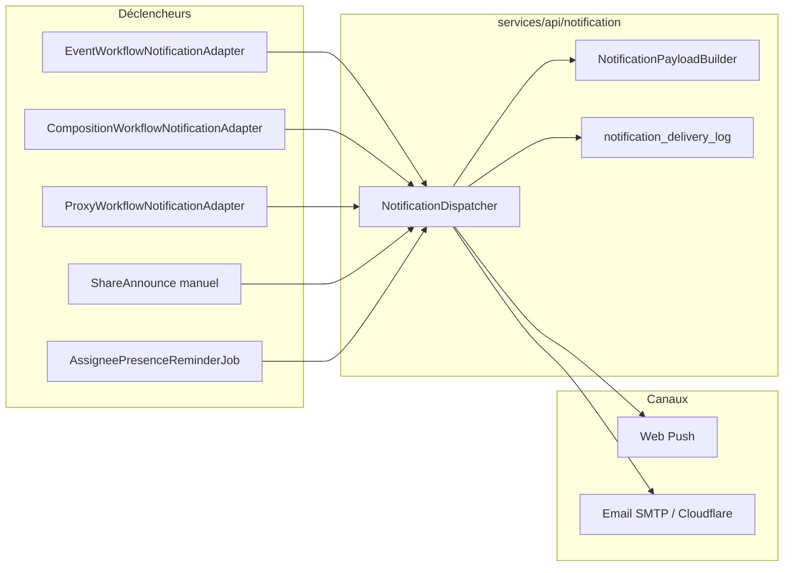

# HatCast V2 — Catalogue des notifications

**Statut :** Référence as-is (runtime V2)  
**Dernière mise à jour :** 2026-06-08  
**Prochaine revue :** après story **8.4** (ops orga)  
**Brainstorm post-catalog :** [`brainstorming-session-2026-06-07-notifications-post-catalog.md`](../../_bmad-output/brainstorming/brainstorming-session-2026-06-07-notifications-post-catalog.md) (décisions PO 2026-06-08)  
**Investigation :** [`notifications-catalog-investigation.md`](../../_bmad-output/implementation-artifacts/investigations/notifications-catalog-investigation.md)  
**Lié à :** [ARCH.md](../../ARCH.md) § Notifications V2 · stories Epic 8 · [SCP notifications 2026-06-01](../../_bmad-output/planning-artifacts/sprint-change-proposal-2026-06-01-notifications-epic8-scope.md)

Ce document inventorie les messages **push** et **email** émis par la stack V2 (`services/api/` + Web Push côté client). Il couvre déclencheurs, audiences, préférences utilisateur et copy. Il **ne remplace pas** le PRD (FR29–FR31), DOMAIN ni SPEC — c’est le miroir **runtime** du code.

Il **ne décrit pas** l’**inbox** applicative (`GET /v1/me/inbox`) : surface **pull** dérivée de l’état domaine, pas un journal d’envoi.

Parité V1 (files Firestore, HTML riche) : [`legacy/src/services/notificationTemplates.js`](../../legacy/src/services/notificationTemplates.js), [`docs/v1/technical/REMINDER_SYSTEM_README.md](../../docs/v1/technical/REMINDER_SYSTEM_README.md).

---

## Index maître

| Intent | Statut | Déclenchement | Audience | Préférence (catégorie) | Story |
|--------|--------|---------------|----------|------------------------|-------|
| `AVAILABILITY_OPENED` | **Actif** | Auto — publication dispos | Roster concerné | `AVAILABILITY_REQUEST` | 8.3, 3.21 |
| `MANUAL_AVAILABILITY_ANNOUNCE` | **Actif** | Manuel — Share `event` | Roster concerné | `AVAILABILITY_REQUEST` | 6.10 |
| `MANUAL_AVAILABILITY_NUDGE` | **Actif** | Manuel — Share `availability_nudge` | Dispos `unknown` | `AVAILABILITY_REQUEST` | 6.10b |
| `CONFIRMATION_REQUEST` | **Actif** | Auto — validate compo | Assignés | `CONFIRMATION_REQUEST` | 8.3 |
| `RECONFIRMATION_REQUEST` | **Actif** | Auto — revalidate | Assignés pending | `CONFIRMATION_REQUEST` | 8.5 |
| `REMOVED_FROM_COMPOSITION` | **Actif** | Auto — retrait slot (validée) | Ancien assigné | `CONFIRMATION_REQUEST` * | 8.5 |
| `ASSIGNEE_PRESENCE_REMINDER` | **Actif** | Programmé — J-7 / J-1 | Assignés `confirmed` | `REMINDER_7_DAYS` / `REMINDER_1_DAY` | 8.5, 8.5b |
| `PROXY_AVAILABILITY_RECORDED` | **Actif** | Auto — proxy dispo | Sujet lié | `AVAILABILITY_REQUEST` | 8.6, 5.5 |
| `PROXY_CONFIRMATION_RECORDED` | **Actif** | Auto — proxy participation | Sujet lié | `CONFIRMATION_REQUEST` | 8.6, 6.8 |
| `EVENT_DETAILS_CHANGED` | **Actif** | Auto — delta date/lieu/format sur événement publié | Roster engagé (dispo ∪ participation) | `EVENT_DETAILS_CHANGED` | 8.8 |
| `EVENT_ARCHIVED` | **Actif** | Auto — archivage | Roster engagé actif | `EVENT_ARCHIVED` | 8.8 |
| `COMPOSITION_SHARED` | Câblé, **non émis** | — | — | `COMPOSITION_SHARED` † | 8.4 |
| `TEAM_VALIDATED_FYI` | Câblé, **non émis** | — | — | `TEAM_CONFIRMED` † | *(legacy — voir G-012)* |
| Intents FR31b (ops orga) | **Backlog** | Auto / cron | Cascade orga | Catégories orga TBD | 8.4 |
| Intents **proposés** (brainstorm 2026-06-07) | **Backlog proposé** | Voir § [Backlog proposé](#backlog-proposé--brainstorm-2026-06-07) | — | — | G-012, 6.10c, Epic 7 |
| Share `draw` / `composition` | Manuel hors dispatcher | Copie / WhatsApp | — | — | 6.10 |

\* Voir [Tensions produit](#tensions-produit-documentées) — retrait mappé sur une catégorie opt-out.  
† **Préférence visible en UI** (`/compte/notifications`) mais **aucun dispatch membre automatique** tant que l’intent n’est pas câblé (8.4 / [G-012](../../_bmad-output/planning-artifacts/growth-backlog.md)).

---

## Résumé architecture



| Composant | Chemin |
|-----------|--------|
| Intents & catégories | `NotificationIntent.kt` |
| Copy (titre, corps, sujet) | `NotificationPayloadBuilder.kt` |
| Destinataires & éligibilité | `NotificationDispatcher.kt`, `NotificationRecipientResolver.kt` |
| Push global | `PushNotificationEligibilityPort.kt` |
| Préférences catégorie | `UserNotificationPreferencesService.kt`, `GET/PATCH /v1/me/notification-preferences` |
| Enveloppe email | `EmailNotificationSender.kt` |
| Rappels J-7 / J-1 | `AssigneePresenceReminderJob.kt` — cron `hatcast.notification.reminder-cron` (défaut `0 0 8 * * *`, `Europe/Paris`) |

---

## Contrat d’URL (deep links)

| Surface | Format | Exemple |
|---------|--------|---------|
| **Canonique front (SPEC)** | `/saison/{troupeSlug}/{seasonSlug}/event/{eventSlug}` + query | `/saison/la-malice/saison-2026/event/cabaret?tab=dispos` |
| **Payload API aujourd’hui** | `/saison/{seasonSlug}/event/{eventSlug}` + query | `/saison/saison-2026/event/cabaret?tab=dispos` |

- **Source API :** `NotificationPayloadBuilder.kt` n’injecte que le slug **saison** (pas le slug troupe).
- **Source front :** `apps/web/src/app/core/messaging/event-urls.ts` — builders Share/Announce et SPEC.
- **Compatibilité :** le client Angular expose des routes legacy `saison/:seasonSlug/event/:eventSlug` redirigées par `SaisonLegacyRedirect` vers la forme canonique à **trois segments** (`app.routes.ts`).

Les tableaux ci-dessous documentent le **chemin relatif émis par l’API** (copy as-shipped). Les emails concatènent l’origine absolue côté client ou lien tel que reçu ; en pratique la redirection legacy couvre les liens push/email à deux segments **tant que la saison est résolvable**.

**Dette connue :** aligner `NotificationPayloadBuilder` sur l’URL canonique à trois segments (story dédiée ou extension 17.x slugs).

---

## Corps email (format commun V2)

Sauf mention contraire, **email body** = HTML minimal :

```html
<p>{corps du payload — même texte que push body}</p>
<p><a href="{url relative du payload}">Ouvrir dans HatCast</a></p>
```

Implémentation : `EmailNotificationSender.buildHtmlBody`. Pas de template HTML riche (boutons Dispo/Pas dispo) — contraste avec la V1.

---

## Modèle de préférences

### Niveau 1 — Opt-in push global (story 8.1)

| Gate | Règle |
|------|-------|
| Appareil | Ligne active dans `user_push_subscriptions` |
| Compte | `users.push_notifications_enabled = true` |
| Navigateur | Permission accordée ; service worker abonné |

S’applique à **tous** les push. UI : `/compte/notifications` + invite post-install (story 10.6).

### Niveau 2 — Préférences par catégorie (story 8.2)

Modèle **opt-out** : clé JSON absente → **autorisé**. Toggles **push** et **email** indépendants.

| Clé catégorie | Groupe UI | Libellé API (français) |
|---------------|-----------|------------------------|
| `AVAILABILITY_REQUEST` | Notifications | M'envoyer une notification lorsqu'un spectacle a besoin de personnes |
| `COMPOSITION_SHARED` | Notifications | M'envoyer une notification lorsque je suis concerné par une composition (brouillon partagé) |
| `CONFIRMATION_REQUEST` | Notifications | M'envoyer une notification pour confirmer ma participation |
| `TEAM_CONFIRMED` | Notifications | M'envoyer une notification lorsque l'équipe est confirmée |
| `REMINDER_7_DAYS` | Rappels automatiques | Rappel automatique 7 jours avant un spectacle |
| `REMINDER_1_DAY` | Rappels automatiques | Rappel automatique 1 jour avant un spectacle |
| `AVAILABILITY_WEEKLY_REMINDER` | Rappels automatiques | Rappels hebdomadaires si je n'ai pas indiqué mes disponibilités *(libellé « tous les 5 jours » — story 8.7)* |

**Préférences masquées en UI jusqu’au dispatch (décision PO 2026-06-08, D6:B) :**

- `COMPOSITION_SHARED` — intent non émis (story **8.4**) ; toggle **retiré de l’UI** jusqu’au ship.
- `TEAM_CONFIRMED` — intent cible **`TEAM_COMPLETE_MEMBER`** (G-012) ; toggle **retiré de l’UI** jusqu’au ship. Ne pas réutiliser `TEAM_VALIDATED_FYI` tel quel (D3:B).

**Préférence sans dispatch auto auparavant documentée :** les deux clés ci-dessus restent dans l’API/OpenAPI pour compatibilité ; l’UI ne les expose plus tant que le dispatcher n’émet pas ces intents.

### Niveau 3 — Hors préférences HatCast

| Type | Fournisseur |
|------|-------------|
| Reset mot de passe, vérification email | Google Cloud Identity Platform |
| (Futur) Email d’invitation troupe | Transactionnel — TBD |

### Mapping intent → catégorie

| Intent | Catégorie |
|--------|-----------|
| `AVAILABILITY_OPENED`, `MANUAL_AVAILABILITY_ANNOUNCE`, `MANUAL_AVAILABILITY_NUDGE`, `PROXY_AVAILABILITY_RECORDED` | `AVAILABILITY_REQUEST` |
| `CONFIRMATION_REQUEST`, `RECONFIRMATION_REQUEST`, `REMOVED_FROM_COMPOSITION`, `PROXY_CONFIRMATION_RECORDED` | `CONFIRMATION_REQUEST` |
| `COMPOSITION_SHARED` | `COMPOSITION_SHARED` |
| `TEAM_VALIDATED_FYI` | `TEAM_CONFIRMED` |
| `ASSIGNEE_PRESENCE_REMINDER` (J-7) | `REMINDER_7_DAYS` |
| `ASSIGNEE_PRESENCE_REMINDER` (J-1) | `REMINDER_1_DAY` |
| `AVAILABILITY_PENDING_REMINDER` | `AVAILABILITY_WEEKLY_REMINDER` |
| `EVENT_DETAILS_CHANGED` | `EVENT_DETAILS_CHANGED` |
| `EVENT_ARCHIVED` | `EVENT_ARCHIVED` |

### Tensions produit documentées

| Sujet | Intention spec | Runtime / décision PO |
|-------|----------------|----------------------|
| Retrait de composition | SCP : alerte membre **obligatoire** | Catégorie `CONFIRMATION_REQUEST` → **opt-out possible** ; **PO 2026-06-08 (D1:A)** : conserver opt-out, écart SCP accepté |
| Accusé proxy participation | Distinct d’une *demande* de confirmation | Même catégorie → opt-out bloque aussi l’accusé ; **PO 2026-06-08 (D2:A)** : statu quo 8.6 |
| FYI roster au validate | P1 auto retiré 2026-06-06 | `TEAM_VALIDATED_FYI` câblé mais **jamais publié** → **[G-012](../../_bmad-output/planning-artifacts/growth-backlog.md)** avec nouvel intent **`TEAM_COMPLETE_MEMBER`** (D3:B) |

---

## Types de déclenchement

| Type | Description | Exemples |
|------|-------------|----------|
| **Automatique** | Jalon domaine, après commit DB | Publication dispos, validate, proxy, retrait slot |
| **Manuel** | Envoi explicite orga | Share/Announce (`event`, `availability_nudge`) |
| **Programmé** | Cron Spring `@Scheduled` | Rappels présence J-7 / J-1 |
| **Manuel (hors dispatcher)** | Copie / WhatsApp uniquement | Share `draw`, `composition` |

---

## Messages actifs — catalogue copy (V2)

Placeholders : `{eventTitle}`, `{eventDate}` (format long français, ex. *samedi 7 juin 2026 à 20h00*), `{roleLabel}`, `{actor}`, `{seasonSlug}`, `{eventSlug}`.

Deep links : **format API** (deux segments) — voir [Contrat d’URL](#contrat-durl-deep-links). Query documentée en relatif (`?tab=dispos`, etc.).

### Disponibilités

#### `AVAILABILITY_OPENED`

| Champ | Valeur |
|-------|--------|
| **Déclenchement** | Automatique — publication / ouverture dispos (`availabilityOpenedAt`, story 3.21) |
| **Audience** | Roster concerné (participants saison + événement, exclusions) |
| **Préférence** | `AVAILABILITY_REQUEST` + push global |
| **Push title** | `🎯 Nouvel événement !` |
| **Push body** | `🎭 On a besoin de toi pour {eventTitle} le {eventDate} !` |
| **Email subject** | `Disponibilité demandée · {eventTitle} ({eventDate})` |
| **Email body** | [Format commun](#corps-email-format-commun-v2) |
| **Deep link** | `/saison/{seasonSlug}/event/{eventSlug}?tab=dispos` |

#### `MANUAL_AVAILABILITY_ANNOUNCE`

| Champ | Valeur |
|-------|--------|
| **Déclenchement** | Manuel — Share/Announce, intent `event` |
| **Audience** | Roster concerné |
| **Préférence** | `AVAILABILITY_REQUEST` |
| **Push title** | `📢 Annonce spectacle` |
| **Push body** | Éditable orga ; défaut = corps `AVAILABILITY_OPENED` |
| **Email subject** | `Annonce spectacle · {eventTitle} ({eventDate})` |
| **Email body** | [Format commun](#corps-email-format-commun-v2) |
| **Deep link** | `?tab=dispos` |

Texte défaut front : `buildAvailabilityAnnouncementMessage` dans `share-announce-messages.ts`.

#### `MANUAL_AVAILABILITY_NUDGE`

| Champ | Valeur |
|-------|--------|
| **Déclenchement** | Manuel — intent `availability_nudge` (story 6.10b) |
| **Audience** | Roster avec dispos **unknown** uniquement |
| **Préférence** | `AVAILABILITY_REQUEST` |
| **Push title** | `⏰ Rappel disponibilité` |
| **Push body** | Éditable ; défaut : `N'oublie pas de répondre pour {eventTitle} le {eventDate} !` |
| **Email subject** | `Rappel disponibilité · {eventTitle} ({eventDate})` |
| **Email body** | [Format commun](#corps-email-format-commun-v2) |
| **Deep link** | `?tab=dispos` |

Anti-spam : avertissement UI si envoi récent (6.10b).

---

### Composition & participation

#### `CONFIRMATION_REQUEST`

| Champ | Valeur |
|-------|--------|
| **Déclenchement** | Automatique — **validate** (assignés non déjà `confirmed`) |
| **Audience** | Assignés uniquement |
| **Préférence** | `CONFIRMATION_REQUEST` |
| **Push title** | `🎭 Confirme ta participation !` |
| **Push body** | `🕺 Prépares-toi à briller pour {eventTitle} le {eventDate}!` |
| **Email subject** | `🎭 Equipe pour {eventTitle}` *(orthographe alignée code)* |
| **Email body** | [Format commun](#corps-email-format-commun-v2) |
| **Deep link** | `?showConfirm=true` |

#### `RECONFIRMATION_REQUEST`

| Champ | Valeur |
|-------|--------|
| **Déclenchement** | Automatique — **revalidate** après unlock ; assignés pending |
| **Audience** | IDs assignés ciblés |
| **Préférence** | `CONFIRMATION_REQUEST` |
| **Push title** | `🔄 Reconfirme ta participation` |
| **Push body** | `La composition a changé pour {eventTitle} le {eventDate}. Merci de reconfirmer ta participation.` |
| **Email subject** | `Reconfirmation · {eventTitle} ({eventDate})` |
| **Email body** | [Format commun](#corps-email-format-commun-v2) |
| **Deep link** | `?showConfirm=true` |

#### `REMOVED_FROM_COMPOSITION`

| Champ | Valeur |
|-------|--------|
| **Déclenchement** | Automatique — retrait assigné sur compo **validée** (pas auto-déclin) |
| **Audience** | Ancien assigné (compte lié) |
| **Préférence** | `CONFIRMATION_REQUEST` *(tension — voir ci-dessus)* |
| **Push title** | `Composition mise à jour` |
| **Push body** | `Tu n'es plus dans la composition ({roleLabel}) pour {eventTitle} le {eventDate}.` |
| **Email subject** | `Composition mise à jour · {eventTitle}` |
| **Email body** | [Format commun](#corps-email-format-commun-v2) |
| **Deep link** | `?tab=equipe` |
| **Dédoublonnage** | Une fois par (intent, event, user) via `notification_reminder_marks` (`ONCE`) |

Éditions brouillon post-unlock : silencieuses jusqu’à revalidation.

#### `ASSIGNEE_PRESENCE_REMINDER`

| Champ | Valeur |
|-------|--------|
| **Déclenchement** | Programmé — **08:00** Paris ; J-7 et J-1 (jours civils) |
| **Audience** | Assignés liés, slot `CONFIRMED`, non waived ; événements validés ouverts |
| **Préférence** | `REMINDER_7_DAYS` ou `REMINDER_1_DAY` |
| **Push title** | `📅 Rappel spectacle` |
| **Push body** | `Tu es attendu·e en tant que {roleLabel} pour {eventTitle} le {eventDate}. Décline si tu n'es plus disponible.` |
| **Email subject** | `Rappel · {eventTitle} ({eventDate})` |
| **Email body** | [Format commun](#corps-email-format-commun-v2) |
| **Deep link** | `?tab=equipe` |
| **Exclusions** | Pending / declined / removed / membership inactive (8.5b) |

---

### Accusés proxy (story 8.6)

Uniquement si **acteur ≠ sujet** et `user_id` lié. Pas d’envoi pour actions self-service.

#### `PROXY_AVAILABILITY_RECORDED`

| Champ | Valeur |
|-------|--------|
| **Déclenchement** | Automatique — écriture proxy dispo avec changement réel (5.5) |
| **Audience** | Membre sujet |
| **Préférence** | `AVAILABILITY_REQUEST` |
| **Push title** | `Disponibilité enregistrée` |
| **Push body** | `{actor} a enregistré ta disponibilité pour {eventTitle} le {eventDate} : {before} → {after} · Rôles : … · « comment »` |
| **Email subject** | `Disponibilité enregistrée · {eventTitle} ({eventDate})` |
| **Email body** | [Format commun](#corps-email-format-commun-v2) |
| **Deep link** | `?tab=dispos` |

Report si dispo « available » sans delta rôles/commentaire (`ProxyNotificationLabels.shouldDeferProxyAvailabilityNotification`).

---

### Événement — détails & archivage (story 8.8)

Audience **engagée** = dispo `available`/`unavailable` **ou** participation compo (`pending`/`confirmed`) **ou** déclin enregistré (`event_composition_declines`). Roster `unknown` sans engagement compo : **exclu**.

#### `EVENT_DETAILS_CHANGED`

| Champ | Valeur |
|-------|--------|
| **Déclenchement** | Automatique — PATCH `startsAt`, `location` et/ou `templateType` sur événement **publié** (non archivé) |
| **Audience** | Roster engagé (voir ci-dessus) |
| **Préférence** | `EVENT_DETAILS_CHANGED` (opt-out, défaut ON) |
| **Push title** | `📅 Spectacle modifié` |
| **Push body** | `{eventTitle} le {eventDate} — {deltaPhrase}` (date/lieu/format old→new) |
| **Email subject** | `Spectacle modifié · {eventTitle} ({eventDate})` |
| **Email body** | [Format commun](#corps-email-format-commun-v2) |
| **Deep link** | `?tab=infos` |
| **Exclusions** | Brouillon ; description/titre/slug/rôles/catégorie seuls ; roster non engagé |

#### `EVENT_ARCHIVED`

| Champ | Valeur |
|-------|--------|
| **Déclenchement** | Automatique — transition `archived: false → true` |
| **Audience** | Roster engagé + participant/membership **actifs** (8.5b) |
| **Préférence** | `EVENT_ARCHIVED` (opt-out D1:A, défaut ON) |
| **Push title** | `🚫 Spectacle archivé` |
| **Push body** | `{eventTitle} le {eventDate} n'a plus lieu (archivé).` |
| **Email subject** | `Spectacle archivé · {eventTitle} ({eventDate})` |
| **Email body** | [Format commun](#corps-email-format-commun-v2) |
| **Deep link** | `?tab=infos` |
| **Exclusions** | Désarchivage ; roster non engagé ; REMOVED / membership inactive |

---

#### `PROXY_CONFIRMATION_RECORDED`

| Champ | Valeur |
|-------|--------|
| **Déclenchement** | Automatique — proxy confirm / decline / pending (6.8) |
| **Audience** | Membre sujet |
| **Préférence** | `CONFIRMATION_REQUEST` |
| **Push title** | `Participation confirmée` / `Participation déclinée` / `Participation à reconfirmer` |
| **Push body** | `{actor} a confirmé/décliné/remis à confirmer ta participation pour {eventTitle} ({roleLabel}) le {eventDate}` |
| **Email subject** | `{titre push} · {eventTitle} ({eventDate})` |
| **Email body** | [Format commun](#corps-email-format-commun-v2) |
| **Deep link** | `?showConfirm=true` si pending ; sinon `?tab=equipe` |

---

## Câblés mais non émis

| Intent | État runtime | Copy déjà définie (payload builder) | Piste livraison |
|--------|--------------|-------------------------------------|-----------------|
| `COMPOSITION_SHARED` | Destinataires vides ; hook publish log skip | *Throws* si build appelé — story 8.4 | Story **8.4** — cercle orga uniquement |
| `TEAM_VALIDATED_FYI` | Listener sans publisher (`TeamValidatedFyiRequestedEvent` jamais émis) | Push title `✅ Équipe validée` · body `L'équipe pour {eventTitle} le {eventDate} a été validée.` · subject `Équipe validée · {eventTitle} ({eventDate})` · link `?tab=equipe` | **[G-012](../../_bmad-output/planning-artifacts/growth-backlog.md)** ou modale Annoncer orga |
| Share `draw` / `composition` | Log debug ; pas de dispatcher | Textes WhatsApp : `share-announce-messages.ts` | Epic 6 — pas de push/email auto |

**G-012 (growth backlog) :** notification **« équipe confirmée »** lorsque **tous** les assignés ont confirmé (lifecycle complete) — annonce collective orgas + sélectionnés ; distinct de `CONFIRMATION_REQUEST` (demande individuelle) et de l’ancien FYI roster auto au validate (retiré 2026-06-06). Voir [`growth-backlog.md` § G-012](../../_bmad-output/planning-artifacts/growth-backlog.md).

---

## Backlog — messages prévus

### Story 8.7 — `AVAILABILITY_PENDING_REMINDER` *(livré)*

Voir § [Disponibilités](#disponibilités) — intent **actif** depuis story 8.7.

### Story 8.4 (backlog P2) — FR31b ops organisateurs

| Intent proposé | Déclenchement | Audience | Préférence |
|----------------|---------------|----------|------------|
| `EVENT_DRAFT_CREATED` | Création brouillon | Cascade orga | Nouvelle catégorie opt-in orga |
| `DRAFT_COMPOSITION_SHARED` | Publish brouillon compo | Cercle orga | Opt-in orga |
| `SLA_OPEN_AVAILABILITY` | T-1 mois, dispos fermées | Cascade orga | Opt-in orga |
| `COMPOSITION_INCOMPLETE_WEEKLY` | Date approche | Cascade orga | Opt-in orga |
| `COMPOSITION_INCOMPLETE_DAILY_J7` | J-7 compo incomplète | Cascade orga | Opt-in orga |
| `TEAM_COMPLETE` | Toutes confirmations (FR28) | Cascade orga | Opt-in orga |
| `ASSIGNEE_DECLINED` | Assigné décline (compo validée) | Cascade orga | Opt-in orga *(brainstorm 2026-06-07, D5:B — signal immédiat ; pas de notif « régression équipe complète » séparée)* |

Copy **non implémentée** — à définir dans les AC story 8.4.

### Backlog proposé — brainstorm 2026-06-07

Décisions PO **2026-06-08** : [`brainstorming-session-2026-06-07-notifications-post-catalog.md`](../../_bmad-output/brainstorming/brainstorming-session-2026-06-07-notifications-post-catalog.md).

| Intent proposé | Déclenchement | Audience | Préférence | P | Story |
|----------------|---------------|----------|------------|---|-------|
| `TEAM_COMPLETE_MEMBER` | Auto — lifecycle `complete` (tous assignés confirmés) | Orgas + assignés confirmés | Opt-out `TEAM_CONFIRMED` *(UI masquée jusqu’au ship — D6:B)* | P1 | **[G-012](../../_bmad-output/planning-artifacts/growth-backlog.md)** |
| `MANUAL_GAP_RECRUITMENT` | Manuel — orga post-déclin | Roster `available` pour rôle vacant | `AVAILABILITY_REQUEST` + garde 6.10b | P2 | **6.10c** |
| `TROUPE_MEMBERSHIP_INVITE` | Transactionnel — invitation | Invité (email) | Hors prefs app | P2 | Epic **7** |

**Champs exclus du déclencheur N1 (D4:B) :** `description`, titre, catégorie, rôles, etc. — seuls date, lieu et format.

**Non retenu (D5:B) :** `TEAM_REGRESSED_INCOMPLETE` — `ASSIGNEE_DECLINED` (8.4) suffit pour les orgas.

### Autres pistes produit

| Idée | Notes |
|------|-------|
| Badge inbox PWA | Affordance pull, pas push (Epic 10, P2) |
| Email groupé multi-événements | V1 batch ; defer 8.7 |
| Email invitation membre | Couvert par `TROUPE_MEMBERSHIP_INVITE` (Epic 7) |

---

## Référence parité V1 (legacy prod)

V1 : **`pushQueue`** / **`reminderQueue`** + Cloud Functions. Push alignés V2 sur les flux cœur ; emails **HTML riche**.

| Reason V1 | Équivalent V2 | Push title V1 | Push body (motif) |
|-----------|---------------|---------------|-------------------|
| `availability_request` | `AVAILABILITY_OPENED` | `🎯 Nouvel événement !` | = V2 |
| `availability_reminder` | Manuel nudge / futur 8.7 | `⏰ Rappel disponibilité` | `{name}, {title} ({date})` |
| `selection` (confirm) | `CONFIRMATION_REQUEST` | `🎭 Confirme ta participation !` | = V2 |
| `selection` (équipe confirmée) | *Pas d’équivalent auto* | `🎉 Équipe confirmée !` | Liste joueurs |
| `reminder_7days` / `reminder_1day` | `ASSIGNEE_PRESENCE_REMINDER` | `📅` / `⏰ Rappel événement` | `{name}, {title} dans {7\|1} jour(s) !` |

Cron dispos hebdo V1 : `functions/index.js` → `processAvailabilityReminders`.

---

## Principes (résumé)

1. Inbox ≠ journal d’envoi.  
2. Intent → audience → canaux.  
3. Publish before ping (membres).  
4. Orga tôt, membre tard (FR31b).  
5. Silence après confirm, sauf présence / retrait / reconfirm.  
6. Envois manuels gardés (6.10b).  

Détail : [brainstorm 2026-06-01](../../_bmad-output/brainstorming/brainstorming-session-2026-06-01-notifications-epic8.md), [SCP 2026-06-01](../../_bmad-output/planning-artifacts/sprint-change-proposal-2026-06-01-notifications-epic8-scope.md).

---

## Maintenance

| Événement | Action |
|-----------|--------|
| Nouveau `NotificationIntent` | Mettre à jour ce fichier + index maître + `NotificationPayloadBuilder.kt` |
| Stories 8.4 / 8.7 livrées | Déplacer lignes Backlog → Actif ; date **Prochaine revue** |
| Changement prefs (ex. retrait obligatoire) | § Tensions + DOMAIN/SPEC via `bmad-spec` |
| Alignement URL canonique API | § Contrat d’URL + dette |
| Upgrade HTML email | Documenter emplacement templates |

**Déclencheur de revue :** toute modification sous `services/api/src/main/kotlin/com/hatcast/api/notification/`.
