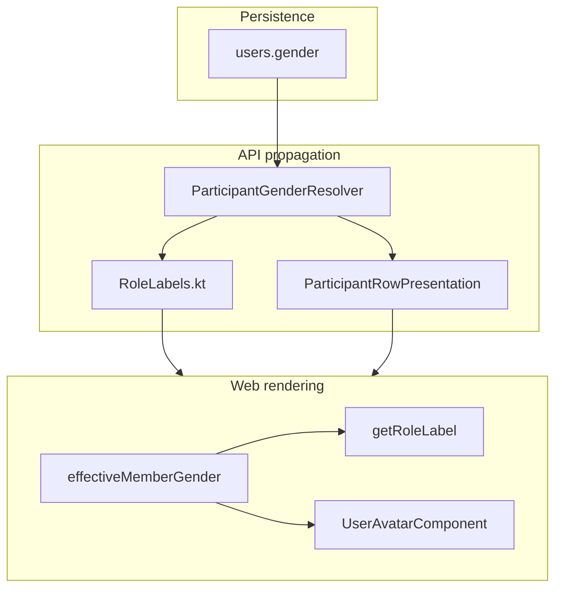

# Member gender — implementation surface registry

**Status:** Living document (2026-06-05)  
**Audience:** Developers, reviewers, BMad agents implementing stories **2.12**, **2.12b**, **6.21**, **16.3**  
**Normative rules:** [_member-gender.md_](../../_bmad-output/specs/spec-member-gender-parity/member-gender.md) · [DOMAIN.md](../../../DOMAIN.md) · [ux-design-member-gender-parity.md](../../_bmad-output/planning-artifacts/ux-design-member-gender-parity.md)

This document is the **where** and **how** companion to the spec’s **what**. It lists every user-visible surface that must apply gender-aware **role labels**, **participation/troupe role labels**, **selection status**, or **avatar tone** (letter fallback + `--hatcast-member-gender-*` — not V1 emoji), and tracks implementation status.

---

## How to use this registry

1. **Before shipping** a UI or API change that shows a person’s name next to a role: find the surface below; confirm label + avatar columns.
2. **After adding a new surface:** add a row here in the same PR.
3. **Regression (story 2.12b):** walk all rows marked ✅ or ⚠️ with a user whose gender is `female` and `male`.
4. **Do not duplicate** label tables here — they live in `member-gender.md`.

### Status legend

| Symbol | Meaning |
|--------|---------|
| ✅ | Implemented and covered by tests (unit or integration) |
| ⚠️ | Partial — known gap (see Notes) |
| ❌ | Not implemented / backlog story |
| N/A | Inclusive-only by design (no participant gender context) |

### Treatment types

| Type | Description | Canonical helpers |
|------|-------------|-------------------|
| `role_event` | Event role keys (`player`, `stage_manager`, …) | Web: `getRoleLabel()` · API: `RoleLabels.label()` |
| `role_participation` | Participant / Organisateur (season or event scope) | `participantRoleLabel()` · `organizerRoleLabel()` |
| `role_troupe` | Membre / Administrateur·ice de troupe | `troupeBaselineRoleLabel()` |
| `selection_status` | Draw winner prefix only | `drawSelectionStatusLabel()` |
| `avatar` | Letter fallback tone + optional photo URL | `app-user-avatar` + `[gender]` · API `ParticipantRowPresentation.avatarUrl()` |
| `parity` | Team gender ratio (player role) | Stories **6.21** / **16.3** — not in 2.12b |

### Gender source

| Source | When |
|--------|------|
| `users.gender` via API field | Linked account on participant/member row |
| Viewer `/v1/me/preferences` | Self row when DTO omits `participantGender` (e.g. own participation dialog) |
| `non_specified` | NULL, unknown wire value, unlinked participant, empty slot |
| Live preview | Unsaved Mon profil toggle → `MemberDisplayNameService` |

---

## Architecture

**Web entry points**

| Module | Path |
|--------|------|
| Gender enum + normalization | `apps/web/src/app/core/account/member-gender.ts` |
| Event role labels | `apps/web/src/app/shared/event-roles/event-roles.ts` |
| Participation admin labels | `apps/web/src/app/shared/admin-organizer-row/organizer-row.helper.ts` |
| Troupe baseline labels | `apps/web/src/app/shared/troupe/troupe-baseline-role-labels.ts` |
| Avatar component | `apps/web/src/app/shared/user-avatar/user-avatar.ts` |

**API entry points**

| Module | Path |
|--------|------|
| Role labels | `services/api/src/main/kotlin/com/hatcast/api/role/RoleLabels.kt` |
| Gender resolution | `services/api/src/main/kotlin/com/hatcast/api/user/ParticipantGenderResolver.kt` |
| Avatar URL guard | `services/api/src/main/kotlin/com/hatcast/api/participant/ParticipantRowPresentation.kt` |

---

## Surface inventory — Mon compte & chrome

| Surface | Type | Gender source | Avatar | API | Status | Tests / notes |
|---------|------|---------------|--------|-----|--------|---------------|
| Mon profil — gender toggle | — (editor) | Self | ✅ live preview on avatar | `PATCH /v1/me/preferences` `gender` | ✅ | `account-profile-tab.spec.ts` |
| Mon profil — avatar | `avatar` | Self (saved + preview) | ✅ `[gender]` on `app-user-avatar` | `GET /v1/me/preferences` | ✅ | UX frozen Screen 1 |
| Member account menu / rail avatar | `avatar` | `MemberDisplayNameService.avatarGender()` | ✅ | preferences | ✅ | Preview updates before save |
| Seasons list header — menu compte | `avatar` | `MemberDisplayNameService.avatarGender()` | ✅ | preferences | ✅ | `seasons-list` (story **2.12c**) |
| Member preferences form (rôles préférés) | `role_event` | Viewer preferences | N/A | preferences | ✅ | `member-preferences-form.ts` |

---

## Surface inventory — Disponibilités

| Surface | Type | Gender source | Avatar | API | Status | Tests / notes |
|---------|------|---------------|--------|-----|--------|---------------|
| Subject selector (Moi / autre participant) | `avatar` | Row `gender` | ✅ | availability summary participants | ✅ | `availability-subject-selector.html` |
| Moi panel — role checkboxes | `role_event` | `subject().gender` | N/A | summary | ✅ | `availability-form.ts` |
| Tous panel — participant column | `avatar` | `p.gender` | ✅ | summary | ✅ | `availability-tous-panel` |
| Tous panel — role candidate cells | `avatar` | per-participant lookup | ✅ | summary | ✅ | `participantGender(id)` |
| Share announce message builder | `role_event` | `participantGenders[]` per role line | N/A | composition rows | ✅ | `share-announce-messages.ts` |

**API:** `AvailabilityService` exposes `gender` on summary participants ; `avatarUrl` via `ParticipantRowPresentation.avatarUrl()` (storage guard — story **2.12c**).

---

## Surface inventory — Composition & équipe

| Surface | Type | Gender source | Avatar | API | Status | Tests / notes |
|---------|------|---------------|--------|-----|--------|---------------|
| Équipe tab — slot rows | `role_event` + `avatar` | `slot.participantGender` | ✅ | composition GET | ✅ | Role pill genré quand slot rempli ; inclusif si vide (`event-equipe-tab`) |
| Équipe tab — decline rows | `avatar` | `decline.participantGender` | ✅ | composition GET | ✅ | |
| Équipe tab — participation confirm dialog | `role_event` | slot gender or viewer prefs for self | N/A | preferences fallback | ✅ | `event-equipe-tab.spec.ts` |
| Composition slot picker dialog | `avatar` | `candidate.gender` | ✅ | draw candidates DTO | ✅ | |
| Draw animation winner line | `selection_status` | `candidate.gender` | N/A | draw steps | ✅ | **Only** surface for Sélectionné·e prefix |
| Multi-role on event warning | `role_event` | assignee gender | N/A | client-side | ✅ | |
| Consecutive show warning | `role_event` | assignee gender | N/A | client-side | ✅ | |
| Équipe — guidances composition (team-level) | `guidance` | — | N/A | client | ✅ | `composition-guidances` strip ; mixité pill (**6.21**) ; extensible futurs signaux équipe |
| Team gender parity indicator | `parity` | slot genders | N/A | composition | ✅ | Pill inside guidances ; `composition-player-gender-parity.ts` ; copy **Mixité** ; **not** lifecycle status badge |

---

## Surface inventory — Agenda & participation chips

| Surface | Type | Gender source | Avatar | API | Status | Tests / notes |
|---------|------|---------------|--------|-----|--------|---------------|
| Agenda participation status chip | `role_event` | Viewer gender (loaded prefs) | N/A | optional override input | ✅ | `agenda-participation-status.utils.ts` |
| Season agenda cards | — | — | N/A | — | N/A | Event-level badges only |
| Member home todo participation | `role_event` | Same as agenda chip | N/A | — | ✅ | Reuses `agenda-participation-status` |
| User agenda | `role_event` | Same | N/A | — | ✅ | |

---

## Surface inventory — Statistiques & filtres

| Surface | Type | Gender source | Avatar | API | Status | Tests / notes |
|---------|------|---------------|--------|-----|--------|---------------|
| Season statistics grid — row avatars | `avatar` | `row.gender` | ✅ | `SeasonStatisticsService` | ✅ | `season-statistics.spec.ts` |
| Season statistics — event cell tooltip | `role_event` | `row.gender` | N/A | API tooltip + client `genderStatisticsEventCell` | ✅ | `season-statistics.utils.spec.ts` |
| Filter participant picker | `avatar` | `option.gender` | ✅ | participant list DTO | ✅ | `filter-participant-picker.html` |
| Season participant focus snack | `role_event` | — | N/A | — | ⚠️ | Uses `roleLabelSingular()` (inclusive) — low visibility |
| Season gender parity aggregate card | `parity` | aggregate | N/A | stats API | ❌ | Story **16.3** |

---

## Surface inventory — Membre / profil saison

| Surface | Type | Gender source | Avatar | API | Status | Tests / notes |
|---------|------|---------------|--------|-----|--------|---------------|
| Member profile dialog | `avatar` | `profile.gender` | ✅ | member profile GET | ✅ | `member-profile-dialog.html` |
| Member profile panel — favorite roles | `role_event` | `profile.gender` | N/A | member profile | ✅ | `member-profile-panel` |
| Member profile panel — chart tooltips | `role_event` | `profile.gender` | N/A | glance/profile | ✅ | |
| Member profile panel — preferred roles (self) | `role_event` | `profile.gender` | N/A | preferences | ✅ | |
| `/membre/:slug` season glance | `role_event` | API `gender` on profile | N/A in header | `MemberSeasonGlanceService` | ✅ | Privacy: gender not in public header copy |
| Member season glance filter bar | `avatar` | filter options | ✅ | glance participants | ✅ | passes gender into filter types |

---

## Surface inventory — Admin participants & membres

| Surface | Type | Gender source | Avatar | API | Status | Tests / notes |
|---------|------|---------------|--------|-----|--------|---------------|
| Admin participants (saison) | `role_participation` + `avatar` | `p.gender` | ✅ | `SeasonParticipantService` | ✅ | `organizer-row.helper` |
| Admin event participants (spectacle) | `role_participation` + `avatar` | `p.gender` | ✅ | `EventRosterService` | ✅ | |
| Participation role chips & menus | `role_participation` | row gender | N/A | DTO `gender` | ✅ | Participant / Organisateur genré |
| Membres tab — admin chip | `role_troupe` | N/A | N/A | — | N/A | Inclusive `Administrateur·ice` / `Membre` only (2.12b non-goal) |
| Membres tab — promote menu | `role_troupe` | N/A | N/A | — | N/A | Inclusive menu label |
| Add member dialog | — | — | N/A | — | N/A | No gender display |

---

## Surface inventory — Audit & journal

| Surface | Type | Gender source | Avatar | API | Status | Tests / notes |
|---------|------|---------------|--------|-----|--------|---------------|
| Audit line — actor avatar | `avatar` | `actor.gender` | ✅ | `AuditIdentityResolver` | ✅ | |
| Audit line — subject avatar | `avatar` | `subject.gender` | ✅ | audit DTO | ✅ | |
| Audit line — role mentions in text | `role_event` | N/A | N/A | — | N/A | `audit-display-labels.ts` uses inclusive `roleLabelSingular` (event-level) |

---

## Surface inventory — Notifications & server copy

| Surface | Type | Gender source | Avatar | API | Status | Tests / notes |
|---------|------|---------------|--------|-----|--------|---------------|
| Me inbox item copy | `role_event` | Viewer `users.gender` | N/A | `MeInboxService` | ✅ | `MeInboxIntegrationTest` |
| Push / email payload role list | `role_event` | Recipient gender | N/A | `NotificationPayloadBuilder` | ✅ | |
| Proxy workflow notification | `role_event` | Subject user gender | N/A | `ProxyWorkflowNotificationAdapter` | ✅ | |
| Proxy notification role list (no subject) | `role_event` | — | N/A | `ProxyNotificationLabels` | N/A | Inclusive `RoleLabels.label(key)` only |

---

## Surface inventory — Intentionally inclusive / backlog

| Surface | Type | Status | Notes |
|---------|------|--------|-------|
| Empty composition slot placeholder | `role_event` | N/A | `roleLabelSingular` / inclusive headers |
| Event type role headers & admin event-type config | `role_event` | N/A | No participant context per EXPERIENCE.md |
| Event infos tab — « Organisateur·ices » section label | `role_participation` | ⚠️ | Section title inclusive; per-person rows TBD |
| Event infos tab — organizer add/remove snacks | `role_participation` | ⚠️ | « Organisateur·ice ajouté·e » — not per-user gender |
| Season home export menu — « Organisateur·ices » | `role_participation` | ⚠️ | Menu label inclusive |
| Legacy V1 (`legacy/`) | all | ❌ | Separate stack; reference `storage.js` only |
| CSV export columns | — | N/A | No gendered copy in export headers |
| User import CSV `gender` column | — | ✅ | Migration only — `UserImportService` |

---

## API DTO fields — quick reference

| Endpoint / DTO | `gender` field | `avatarUrl` guard |
|----------------|----------------|-------------------|
| `GET composition` slots / declines | `participantGender` | via composition services |
| `GET availability` summary participants | `gender` | ✅ `ParticipantRowPresentation` |
| `GET season statistics` rows | `gender` | N/A (grid avatars from row) |
| `GET season/event participants` admin | `gender` | ✅ `ParticipantRowPresentation` |
| `GET troupe members` admin | — | N/A (no gender on admin list — 2.12b) |
| `GET member profile` / glance | `gender` | profile role pills + avatar tone |
| `GET audit` identities | `gender` | avatar from identity |
| Draw step candidates | `gender` | picker avatar |

---

## Regression checklist (manual)

Use one account with gender **Féminin** and one with **Masculin** (and optionally **Non spéc.**):

- [ ] Mon profil: toggle changes avatar tone before save; save persists
- [ ] Dispos Moi: role labels match gender
- [ ] Dispos Tous: avatars + tones on grid
- [ ] Équipe: slot labels (Comédienne / Comédien) + avatars
- [ ] Participation dialog: role label in confirm popup
- [ ] Draw animation: Sélectionnée / Sélectionné prefix
- [ ] Agenda chip: role text matches viewer gender
- [ ] Stats grid: tooltip on event cell (e.g. Comédienne)
- [ ] Filter participant picker: avatar tones
- [ ] Admin participants + event participants: chips Participant/Organisateur + avatars
- [ ] Membres: Administratrice / Administrateur chip
- [ ] `/membre/:slug`: favorite role pills genré
- [ ] Account menu avatar tone matches saved gender

---

## Maintenance

| Action | Owner |
|--------|-------|
| Update row when touching a listed component | PR author |
| Bump **Status** after fixing ⚠️ | PR author |
| Add row for new UI showing person + role | PR author |
| Sync with story **2.12b** acceptance criteria | Reviewer |

**Related implementation stories:** `2-12-genre-optionnel-profil-membre-api-mon-compte.md`, `2-12b-libelles-roles-adaptes-genre.md`, `2-12c-avatars-repli-selon-genre.md`, `mig-7-backfill-users-gender-from-v1.md`
